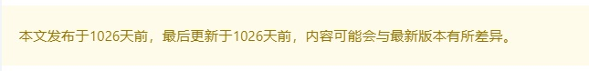

# 个人网站博客仓库


## 主题说明

该博客使用`hexo`搭建的静态博客内容，应用的主题为`hexo-theme-kaze`，并经过了一些改造。原始主题链接：[hexo-theme-kaze](https://github.com/theme-kaze/hexo-theme-kaze)


## 仓库说明

该仓库用于编写文章，存放文章`md`文件和图片资源等，并加入自动化部署脚本，当该仓库有提交后，会自动运行`hexo`命令生成静态博客，并推送到博客仓库。


## 目录说明

```
NoteBook
├─.
├─.github
│  
├─hexo-theme-kaze
│  ├─...
│  └─_config.yml
└─source
    └─_posts
        ├─img
        └─xxx.md
```

1. `.github`目录下有部署文件`deploy.xml`，定义的规则是该仓库触发提交时，会执行`hexo`等一系列的命令，生成静态网站，然后部署到对应的博客仓库中。请自行查阅如何使用`Github Action`。
2. `hexo-theme-kaze\_config.yml`中是整个网页的配置文件，可以通过该文件适配自己的博客。
3. `source`目录是存放文章的目录，文章在`_post`目录下，对应的图片可以放在`_post\img`下，实测`github`访问较慢，可以将图片上传在其他平台上，然后在文章中通过`url`引用效果比较好

## 使用方式

1. 安装`nodejs` ： [https://nodejs.org/en](https://nodejs.org/en)

2. 安装`hexo`:

   ```bash
   npm init -f
   npm install -g hexo-cli
   npm install
   ```

3. 初始化博客目录，并将博客内容移动到对应的位置。

   ```bash
   # 初始化博客目录
   hexo init blog
   
   # 移除默认生成的hello world文章
   rm -rf blog/source
   
   # 将自己的博客移动到对应的目录
   mv -f source blog/source
   
   # 将图片移动到上一层，当前放在同一目录下是为了方便本地编写调试
   mv -f blog/source/_posts/img blog/source/img
   
   # 覆盖博客的配置文件
   cp _config.yml blog/_config.yml
   
   # 将主题移动到主题目录下
   cp -r hexo-theme-kaze blog/themes/
   ```

4. 安装所需的插件。如果在`hexo-theme-kaze\_config.yml`中将`minify`设为`false`，则不需要安装这些插件了

   ```bash
    npm install clean-css --save
    npm install uglify-js --save
    npm install html-minifier --save
   ```

5. 编译出静态网页，会生成一个`public`目录，这个目录的内容就是整个静态网站了。

   ```bash
   hexo g
   ```

6. 本地部署调试

   ```bash
   hexo s
   ```

7. 部署

   由于是静态网站，直接将生成的`public`目录全部复制到站点目录就行了。我这里使用的是`Github Page`，优点是不需要整服务器和域名了，缺点是访问较慢，尤其是有图片资源的时候。

   主要就是创建一个仓库，名字叫做`xxx.github.io`，注意这里的`xxx`必须和**账号名**保持一致，然后将`public`目录下的内容全部`push`到这个仓库就行了，访问链接是：`https://xxx.github.io`

8. 博客预览

   点击进入我的博客主页，查看博客预览：[https://pgaofeng/github.io](https://pgaofeng.github.io)

## 其他内容



上图是文章的`footer`，由于博客是静态网站，所以无法存储日期等信息，这里默认会使用文章的发布日期作为更新日期，方便调试。

解决方案是使用`github`的提交记录来记录更新时间，仓库下的`update_date.sh`脚本就是解决该问题的。该脚本会遍历`_posts`下的文章，并根据`git log`查询该文章的最近一次提交时间，然后将时间插入到文章的`header`中。此时再去执行`hexo g`命令就有最后更新时间了。

注意这个脚本会直接改变文章的内容，因此本地调试最好不要执行脚本，当需要部署博客前再执行脚本，部署后记得恢复该内容，避免污染博客内容。

正确的执行过程是：编写博客 => 提交 => 执行脚本 => 发布`publish`目录文件 ==> 恢复文章`git reset --hard`

