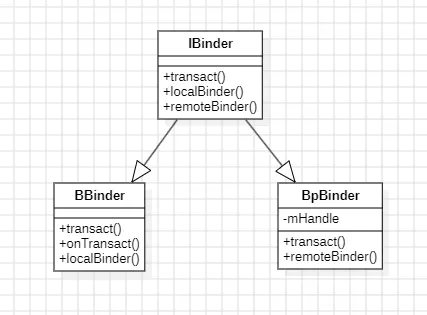
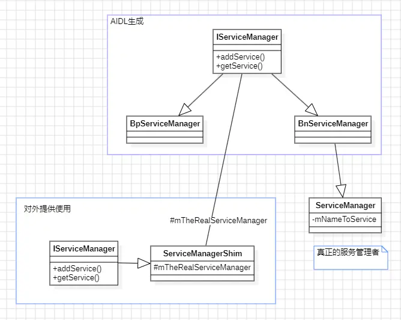
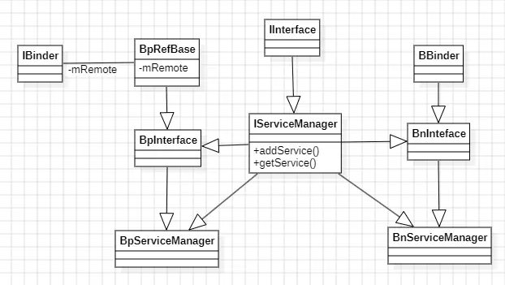

Binder是Android中非常非常重要的一个部分，它实现了进程间高效安全的通信。整个Binder系统大体上分为三个部分，一部分是Binder驱动，运行在内核中，是跨进程的基石；一部分是Binder实体，封装了通信的逻辑，主要用来进行通信的；最后一部分是系统的一个服务ServiceManager，它本质上也是一个Binder实体，但它比较特殊，因为它管理着所有的Binder实体。

学习Binder能够让我们对Android系统的理解更加深刻，更加清晰各个层级之间的关联。虽然在实际应用中我们几乎很难遇到裸用Binder的，但是想要在Framework上走的更深，Binder是必不可少的一环。并且实际面试中更是经常被问到，因此就算是为了应付面试，我们也应该仔细阅读Binder的实现。

## Binder
Binder整体是CS结构的，即有对应的客户端和服务端，通常情况下Binder实体作为服务端提供服务支持，而应用端则是获取到Binder的引用然后将其包装成代理类。本地Binder的实现类为BBinder，远程代理Binder的实现类为BpBinder。下面先介绍下各个类的定义，方便后续的理解。

### IBinder

```c++
//frameworks/native/include/binder/IBinder.h

class [[clang::lto_visibility_public]] IBinder : public virtual RefBase
{
public:
    IBinder();
    // 实际的交互方法
     virtual status_t  transact(uint32_t code,
                                const Parcel& data,
                                Parcel* reply,
                                uint32_t flags = 0) = 0;

     // 返回本地binder和远程binder
     virtual BBinder*        localBinder();
     virtual BpBinder*       remoteBinder();

protected:
     virtual          ~IBinder();
}
```
IBinder定义了一些Binder的基础能力，所有的Binder都必须实现IBinder的接口，而IBinder又是继承自RefBase，因此可以使用智能指针去引用Binder。BBinder和BpBinder都是IBinder的实现类，从方法名字也能看到，他们分别代表本地Binder和远程Binder。它的这些方法都有默认的实现，也都是默认的空方法实现。

### BBinder
```c++
// frameworks/native/libs/binder/Binder.cpp

class BBinder : public IBinder
{
public:
    BBinder();
    // 实际的交互方法
    virtual status_t transact(uint32_t code,
                              const Parcel& data,
                              Parcel* reply,
                              uint32_t flags = 0) final;

    virtual BBinder*  localBinder();
protected:
     virtual ~BBinder();
     // 收到的交互信息
     virtual status_t onTransact(uint32_t code,
                                 const Parcel& data,
                                 Parcel* reply,
                                 uint32_t flags = 0);

private:
      BBinder(const BBinder& o);
      BBinder& operator=(const BBinder& o);
};
```
BBinder是本地实体Binder，它继承自IBinder，本身又定义了一个onTranscat方法。通常情况下，通过Binder发送消息时是通过transact方法发送，然后接收消息是在onTransact方法中接收。也就是说，在BBinder中应该主要处理onTransact方法来实现具体的功能，而BpBinder应该处理transact俩实现请求的细节。当然，这些实现的方法都是与具体的业务相关联的，因此这些方法也只实现了一些与业务无关的逻辑。
```c++
// frameworks/native/libs/binder/Binder.cpp

BBinder* BBinder::localBinder()
{
    return this;
}

status_t BBinder::transact(
    uint32_t code, const Parcel& data, Parcel* reply, uint32_t flags)
{
    ...
    status_t err = NO_ERROR;
    switch (code) {
        ...
        default:
            err = onTransact(code, data, reply, flags);
            break;
    }
    ...
    return err;
}

status_t BBinder::onTransact(
    uint32_t code, const Parcel& data, Parcel* reply, uint32_t /*flags*/)
{
    switch (code) {
        case INTERFACE_TRANSACTION:
            reply->writeString16(getInterfaceDescriptor());
            return NO_ERROR;
        case DUMP_TRANSACTION: {
            ...
            return dump(fd, args);
        }
        case SHELL_COMMAND_TRANSACTION: {
            ...
            return NO_ERROR;
        }
        case SYSPROPS_TRANSACTION: {
            report_sysprop_change();
            return NO_ERROR;
        }
        default:
            return UNKNOWN_TRANSACTION;
    }
}
```
对于本地Binder，localBinder返回的就是它本身，而remoteBinder则是默认的返回nullptr。同样的，在transact方法中，会直接走到onTransact中。这是因为它是本地实体，当通过实体Binder的transact方法发送消息的时候，实际是不需要经过跨进程的而是直接就能获取到消息，因此不需要处理发送的细节，而是直接将请求发回给onTransact中进行处理即可。

### BpBinder
```c++
// frameworks/native/libs/binder/include/binder/BpBinder.h

class BpBinder : public IBinder
{
public:
    // 实际的交互方法
    virtual status_t transact(uint32_t code,
                              const Parcel& data,
                              Parcel* reply,
                              uint32_t flags = 0) final;

    virtual BpBinder*   remoteBinder();

private:
     static sp<BpBinder> create(int32_t handle);
     virtual             ~BpBinder();
};
```
BpBinder是远程Binder的代理类，当客户端和服务端处于不同的进程时，客户端会获取到服务端BBinder实体的引用，然后将其包装成BpBinder，通过对BpBinder方法的调用来访问具体的业务，而这些方法最终会走到transact方法中去进行具体的跨进程逻辑。

```c++
// frameworks/native/libs/binder/BpBinder.cpp

BpBinder* BpBinder::remoteBinder()
{
    return this;
}

status_t BpBinder::transact(
    uint32_t code, const Parcel& data, Parcel* reply, uint32_t flags)
{
    if (mAlive) {
        ...
        status_t status;
        if (CC_UNLIKELY(isRpcBinder())) {
            // 远程调用，可以是别的虚拟机
            status = rpcSession()->transact(sp<IBinder>::fromExisting(this), code, data, reply,flags);
        } else {
            // 交给IPCThreadState处理
            status = IPCThreadState::self()->transact(binderHandle(), code, data, reply, flags);
        }
        ...
        return status;
    }
    return DEAD_OBJECT;
}
```

实际上BpBinder也没做什么操作，而是将transact方法的参数重新转给了IPCThreadState去处理。



### ServiceManager

上面看了Binder的相关定义，实际上就是IBinder接口定义了一系列的公共方法，然后将Binder分为本地Binder和远程Binder，并且实现了他们自己相关的逻辑等。因此，发起跨进程调用的实际是BpBinder，它是客户端的一个对象，但它包装了远程BBinder的引用mHandle，跨进程调用就是通过handle进行区分是要调用哪一个服务BBinder的。

当然，这里先不去看IPCThreadState的发送逻辑，而是直接先看ServiceManager，它是所有服务的大管家。正常情况下，BBinder都需要注册在ServiceManager中，方便后续其他进程从ServiceManager中查询。而BBinder服务和ServiceManager是在不同的进程中的，正常也是无法进行访问的。因此，为了ServiceManager能够被所有的进程都访问到，它的handle被定义为0，这样其他进程就可以通过这个handler构建BpBinder，然后进行跨进程访问将自己注册在ServiceManager中了。

```c++
// frameworks/native/cmds/servicemanager/main.cpp

int main(int argc, char** argv) {
    // binder驱动的路径
    const char* driver = argc == 2 ? argv[1] : "/dev/binder";
    // 初始化ProcessState
    sp<ProcessState> ps = ProcessState::initWithDriver(driver);
    ps->setThreadPoolMaxThreadCount(0);
    ps->setCallRestriction(ProcessState::CallRestriction::FATAL_IF_NOT_ONEWAY);
    // 构建ServiceManager对象
    sp<ServiceManager> manager = sp<ServiceManager>::make(std::make_unique<Access>());
    // 将自己也注册到Service集合中
    if (!manager->addService("manager", manager, false /*allowIsolated*/, IServiceManager::DUMP_FLAG_PRIORITY_DEFAULT).isOk()) {
        LOG(ERROR) << "Could not self register servicemanager";
    }
    // 将自己设置为管理服务
    IPCThreadState::self()->setTheContextObject(manager);
    ps->becomeContextManager();

    // 启用looper机制
    sp<Looper> looper = Looper::prepare(false /*allowNonCallbacks*/);
    // 注册eventfd，当唤醒后处理对应的消息。这里实际注册的是驱动的fd
    BinderCallback::setupTo(looper);
    ClientCallbackCallback::setupTo(looper, manager);
    // 开始循环进入阻塞，驱动有消息时才会通过epoll唤醒
    while(true) {
        looper->pollAll(-1);
    }
    return EXIT_FAILURE;
}
```

开机时ServiceManager就会启动，它的启动逻辑就是上述逻辑。概述下来就是创建ServiceManager对象，然后注册到自身中，然后将自己设置为binder的管理者，然后开始进入阻塞等待Binder驱动的epoll唤醒，唤醒后再去处理相关的业务。

下面具体看下实现的细节，首先是ProcessState，它的定义在frameworks/native/libs/binder/include/binder/ProcessState.h，这里只是定义了它的一些方法，没什么可看的，直接看它的逻辑部分：

```c++
// frameworks/native/libs/binder/ProcessState.cpp

sp<ProcessState> ProcessState::initWithDriver(const char* driver)
{
    return init(driver, true /*requireDefault*/);
}

// 创建ProcessState，通过静态变量实现进程唯一单例
[[clang::no_destroy]] static sp<ProcessState> gProcess;
[[clang::no_destroy]] static std::mutex gProcessMutex;
sp<ProcessState> ProcessState::init(const char *driver, bool requireDefault)
{
    [[clang::no_destroy]] static std::once_flag gProcessOnce;
    std::call_once(gProcessOnce, [&](){
        ...
        std::lock_guard<std::mutex> l(gProcessMutex);
        gProcess = sp<ProcessState>::make(driver);
    });
    ...
    verifyNotForked(gProcess->mForked);
    return gProcess;
}
```

也就是在initWithDriver的时候，会通过智能指针的sp::make创建ProcessState对象，并且这个对象是进程中的唯一单例对象。

```c++
ProcessState::ProcessState(const char* driver)
      : mDriverName(String8(driver)),// 驱动的名字，默认是/dev/binder
        mDriverFD(-1),// 驱动的fd
        mVMStart(MAP_FAILED),
        mThreadCountLock(PTHREAD_MUTEX_INITIALIZER),
        mThreadCountDecrement(PTHREAD_COND_INITIALIZER),
        mExecutingThreadsCount(0),
        mWaitingForThreads(0),
        mMaxThreads(DEFAULT_MAX_BINDER_THREADS),// 最大的线程数：15
        mStarvationStartTimeMs(0),
        mForked(false),
        mThreadPoolStarted(false),
        mThreadPoolSeq(1),
        mCallRestriction(CallRestriction::NONE) {
    // 打开驱动
    base::Result<int> opened = open_driver(driver);

    if (opened.ok()) {
        // 进行内存映射，将当前进程中的一部分内存与内核的内存进行映射，大小为1M-2*page
        mVMStart = mmap(nullptr, BINDER_VM_SIZE, PROT_READ, MAP_PRIVATE | MAP_NORESERVE,
                        opened.value(), 0);
    }
	// 记录驱动的fd
    if (opened.ok()) {
        mDriverFD = opened.value();
    }
}

static base::Result<int> open_driver(const char* driver) {
    // 打开驱动
    int fd = open(driver, O_RDWR | O_CLOEXEC);
    // 查询binder的版本
    int vers = 0;
    status_t result = ioctl(fd, BINDER_VERSION, &vers);
    // 设置最大的线程数：默认是15
    size_t maxThreads = DEFAULT_MAX_BINDER_THREADS;
    result = ioctl(fd, BINDER_SET_MAX_THREADS, &maxThreads);
    // 是否允许单向的binder垃圾检测
    uint32_t enable = DEFAULT_ENABLE_ONEWAY_SPAM_DETECTION;
    result = ioctl(fd, BINDER_ENABLE_ONEWAY_SPAM_DETECTION, &enable);
    return fd;
}
```

在ProcessState的构造方法中，做了以下一些操作：打开驱动、查询版本、设置最大线程数、设置单向垃圾检测、建立内存映射。总的来说就是ProcessState是进程内单例的，用于和binder驱动建立连接的一个对象。它是通用的，因此在构造方法中就直接打开驱动并做了一些通用的设置，如设置最大线程数。继续回到启动ServiceManager的main方法中，在initWithDriver后，又重新设置了最大线程数为0：ps->setThreadPoolMaxThreadCount(0)，也就是说ServiceManager中只会出现一个主线程，而不会再去创建线程。

在上面我们看到，打开驱动用的是open方法，对驱动进行设置用的是ioctl方法，这些都是系统方法，调用这些方法后会经过一系列的系统调用，最终走到驱动中设置的对应方法中。下面的是binder驱动中的对应的一些方法，驱动基于common-android13-5.10-2024-04版本，注意它不在aosp目录下：

```c++
// common/drivers/android/binder.c

const struct file_operations binder_fops = {
	.owner = THIS_MODULE,
	.poll = binder_poll,
	.unlocked_ioctl = binder_ioctl, // ioctl最终会走到这里来
	.compat_ioctl = compat_ptr_ioctl,
	.mmap = binder_mmap,
	.open = binder_open,
	.flush = binder_flush,
	.release = binder_release,
};
```

当然，这里先不去看驱动的实现过程，先把驱动作为一个黑盒来理解。接下来继续回到main方法中，然后看ServiceManager的构造：

```c++
// frameworks/native/cmds/servicemanager/ServiceManager.h

class ServiceManager : public os::BnServiceManager, public IBinder::DeathRecipient {
public:
    ServiceManager(std::unique_ptr<Access>&& access);
    ~ServiceManager();

    binder::Status getService(const std::string& name, sp<IBinder>* outBinder) override;
    binder::Status checkService(const std::string& name, sp<IBinder>* outBinder) override;
    binder::Status addService(const std::string& name, const sp<IBinder>& binder,
                              bool allowIsolated, int32_t dumpPriority) override;
    binder::Status listServices(int32_t dumpPriority, std::vector<std::string>* outList) override;
    ...
private:
    struct Service {
        sp<IBinder> binder; // not null
        ...
    };
    using ServiceMap = std::map<std::string, Service>;
    ServiceMap mNameToService;
    ...
};
```

ServiceManager是为了成为binder服务的管理者，它所相关的方法都是用户查询和添加服务的，它的一个私有的属性ServiceMap，用于存储注册的服务。可以看到它只是继承自BnServiceManager，这是AIDL生成的类，通常情况下我们使用AIDL都是在Java层中使用的，可以省下很多跨进程逻辑的编码。而在C++层也是可以使用AIDL的，它会生成对应的BnServiceManager和BpServiceManager，我们的本地实体服务继承自BnServiceManager，然后实现对应的逻辑。然后BpServiceManager中的逻辑是跨进程交互的逻辑，由AIDL直接生成。文件目录在：frameworks/native/libs/binder/aidl/android/os/IServiceManager.aidl

然后继续看构造方法和添加服务的方法：

```c++
// frameworks/native/cmds/servicemanager/ServiceManager.cpp

ServiceManager::ServiceManager(std::unique_ptr<Access>&& access) : mAccess(std::move(access)) {
}

Status ServiceManager::addService(const std::string& name, const sp<IBinder>& binder, bool allowIsolated, int32_t dumpPriority) {
    ...
    // 添加到ServiceMap中
    mNameToService[name] = Service {
        .binder = binder,
        .allowIsolated = allowIsolated,
        .dumpPriority = dumpPriority,
        .debugPid = ctx.debugPid,
    };
    ...
    return Status::ok();
}
```

这里仅是将自身添加到ServiceMap中存储下来，逻辑比较简单，因为这里也没有发生跨进程的调用，都是发生在ServiceManager的进程中的。添加服务后，它还会注册自己成为服务管理者，`IPCThreadState::self()->setTheContextObject(manager)`。

```c++
// frameworks/native/libs/binder/IPCThreadState.cpp

// 创建线程中单例对象
IPCThreadState* IPCThreadState::self()
{
    if (gHaveTLS.load(std::memory_order_acquire)) {
restart:
        const pthread_key_t k = gTLS;
        // 从线程局部变量中读取，读不到则直接创建
        IPCThreadState* st = (IPCThreadState*)pthread_getspecific(k);
        if (st) return st;
        return new IPCThreadState;
    }
    ...
    goto restart;
}

IPCThreadState::IPCThreadState()
      : mProcess(ProcessState::self()),// 获取到ProcessState
        mServingStackPointer(nullptr),
        mServingStackPointerGuard(nullptr),
        mWorkSource(kUnsetWorkSource),
        mPropagateWorkSource(false),
        mIsLooper(false),
        mIsFlushing(false),
        mStrictModePolicy(0),
        mLastTransactionBinderFlags(0),
        mCallRestriction(mProcess->mCallRestriction) {
    pthread_setspecific(gTLS, this);// 将自己存入到线程局部变量中
    clearCaller();
    mIn.setDataCapacity(256);// 从binder驱动读取的容量
    mOut.setDataCapacity(256); // 向binder驱动写入的容量
}

void IPCThreadState::setTheContextObject(const sp<BBinder>& obj)
{
    the_context_object = obj;
}
```

对于ProcessState，它是进程单例；对于IPCThreadState，它是线程单例。但是由于ServiceManager的线程池设置的为0，因此它们两个实际上都可以算是进程内单例的。然后IPCThreadState#setTheContextObject将自己设置为了服务管理者，对于其他进程的IPCThreadState，他们的the_context_obj实际上是空，因此他们会通过值为0的handle去直接获取到BpBinder，也即是BpServiceManager。

```c++
// frameworks/native/libs/binder/ProcessState.cpp

bool ProcessState::becomeContextManager()
{
    flat_binder_object obj {
        .flags = FLAT_BINDER_FLAG_TXN_SECURITY_CTX,
    };
    // 新的注册指令
    int result = ioctl(mDriverFD, BINDER_SET_CONTEXT_MGR_EXT, &obj);
    
    if (result != 0) {
        int unused = 0;
        // 老的注册指令
        result = ioctl(mDriverFD, BINDER_SET_CONTEXT_MGR, &unused);
    }
    return result == 0;
}
```

到这里ServiceManager的启动流程基本上已经完成了，首先就是通过ProcessState的初始化来打开binder驱动并建立内存映射，然后初始化IPCThreadState用于准备与驱动进行数据交互。最后就是启用looper循环了，然后将驱动的fd添加到epoll中监听binder的变化。[native looper](https://pgaofeng.github.io/2022/03/07/handler/#Native%E5%B1%82%E6%BA%90%E7%A0%81)， [epoll机制](https://pgaofeng.github.io/2022/02/23/eventfd-epoll/)

```c++
// frameworks/native/cmds/servicemanager/main.cpp

class BinderCallback : public LooperCallback {
public:
    static sp<BinderCallback> setupTo(const sp<Looper>& looper) {
        sp<BinderCallback> cb = sp<BinderCallback>::make();

        int binder_fd = -1;
        // 告知驱动自己进入了looper循环
        IPCThreadState::self()->setupPolling(&binder_fd);
        // 将驱动的fd添加到looper监听中
        int ret = looper->addFd(binder_fd,
                                Looper::POLL_CALLBACK,
                                Looper::EVENT_INPUT,
                                cb,
                                nullptr /*data*/);
        return cb;
    }

    // 当驱动发生了变化后，会走到这里来
    int handleEvent(int /* fd */, int /* events */, void* /* data */) override {
        // 最终交给IPCThreadState处理消息
        IPCThreadState::self()->handlePolledCommands();
        return 1;
    }
};

int main(int argc, char** argv) {
    ...
    // 进入循环前，将驱动fd添加到looper中，然后回调转发到IPCThreadState中处理
    BinderCallback::setupTo(looper);
    ...
}
```

在进入looper循环时，将驱动的fd添加到了looper中，这样每次驱动发生变化后，就会通知到ServiceManager，然后由ServiceManager的IPCThreadState去处理消息。

```c++
// frameworks/native/libs/binder/IPCThreadState.cpp

status_t IPCThreadState::setupPolling(int* fd)
{
    // 写入BC_ENTER_LOOPER命令，然后刷新
    mOut.writeInt32(BC_ENTER_LOOPER);
    flushCommands();
    *fd = mProcess->mDriverFD;
    return 0;
}

void IPCThreadState::flushCommands()
{
    // 与驱动进行交互
    talkWithDriver(false);
    // 还有待写入的内容，再次与驱动进行交互
    if (mOut.dataSize() > 0) {
        talkWithDriver(false);
    }
}
```

在通知到驱动自己进入循环时，实际上就是与驱动进行的一个交互。先向mOut写入数据，然后再往驱动中进行写入，在前面看IPCThreadState的时候我们知道它有两个私有属性mIn和mOut。其中mIn用于存储驱动发送来的数据，而mOut用来存储向驱动写入的数据。最终的写入实际是talkWithDriver中完成的：

```c++
// frameworks/native/libs/binder/IPCThreadState.cpp

status_t IPCThreadState::talkWithDriver(bool doReceive)
{
    // 向驱动写入的数据的结构体
    binder_write_read bwr;

    // mIn中的数据是否已经被读取过了
    const bool needRead = mIn.dataPosition() >= mIn.dataSize();
    // 如果doReceive为false说明是不是接收，而是发送，因此记录mOut的数据大小
    const size_t outAvail = (!doReceive || needRead) ? mOut.dataSize() : 0;
    // 设置写入的大小和缓存指针
    bwr.write_size = outAvail;
    bwr.write_buffer = (uintptr_t)mOut.data();

    // 如果需要读取，则设置读取的容量和缓存指针
    if (doReceive && needRead) {
        bwr.read_size = mIn.dataCapacity();
        bwr.read_buffer = (uintptr_t)mIn.data();
    } else {
        bwr.read_size = 0;
        bwr.read_buffer = 0;
    }

    // 没有可读和可写的内容
    if ((bwr.write_size == 0) && (bwr.read_size == 0)) return NO_ERROR;

    bwr.write_consumed = 0;
    bwr.read_consumed = 0;
    status_t err;
    do {
        // 通过ioctl将结构体写入到驱动中
        if (ioctl(mProcess->mDriverFD, BINDER_WRITE_READ, &bwr) >= 0)
            err = NO_ERROR;
        else
            err = -errno;
    } while (err == -EINTR);

    // 写入成功之后
    if (err >= NO_ERROR) {
        if (bwr.write_consumed > 0) {
            if (bwr.write_consumed < mOut.dataSize())
                // 驱动没有将mOut中的数据读完
            else {
                // 驱动读完了mOut的数据
                mOut.setDataSize(0);
                processPostWriteDerefs();
            }
        }
        // 驱动有往bwr写入内容，或者上次的内容还没读取完
        if (bwr.read_consumed > 0) {
            mIn.setDataSize(bwr.read_consumed);
            mIn.setDataPosition(0);
        } 
        return NO_ERROR;
    }
    return err;
}
```

talkWithDriver如其名字一样，与驱动进行交互。这个方法可以看到它不仅向驱动写入内容，也从驱动读取内容。当有内容需要写入到驱动的时候，先往mOut中写入，然后调用talkWithDriver写入到驱动中。如果想从驱动读取数据，需要先将mIn清空，然后调用talkWithDriver，然后就可以从mIn中读取到驱动写入的内容了。

然后看looper的回调，正常当向驱动发送数据后，驱动处理完之后会通知到epoll唤醒，进而回到looper中注册的回调，然后再走到IPCThreadState中处理：

```c++
// frameworks/native/libs/binder/IPCThreadState.cpp

status_t IPCThreadState::handlePolledCommands()
{
    status_t result;
    do {
        // 获取并处理命令
        result = getAndExecuteCommand();
    // 命令处理完之后这里会是false，就会跳出循环了
    } while (mIn.dataPosition() < mIn.dataSize());
    // 再次talkWithDriver，查看是否有需要交互的
    flushCommands();
    return result;
}

status_t IPCThreadState::getAndExecuteCommand()
{
    status_t result;
    int32_t cmd;
    // 与驱动交互，此时驱动正常会向mIn中写入数据
    result = talkWithDriver();
    if (result >= NO_ERROR) {
        // 读取交互的命令
        cmd = mIn.readInt32();
        // 处理命令
        result = executeCommand(cmd);
        ...
    }
    return result;
}
```

重新整理下交互逻辑：ServiceManager实例化之后，将自己设置成为服务管理者，并通知到驱动。ProcessState负责打开驱动建立映射，IPCThreadState负责向驱动发送数据。首先向mOut写入数据，然后talkWithDriver将数据发送给驱动，然后驱动读取数据并处理后通过epoll机制回调到looper进而再次走到IPCThreadState，然后再次talkWithDriver让驱动把数据写入到mIn中，然后在executeCommand方法中处理mIn中的数据。

到这里ServiceManager的启动逻辑基本上已经清楚了，与驱动交互的逻辑也基本上已经清楚了，这里我们没去关注驱动内部的实现，而是将其作为黑盒看待的。接下来我们看下具体的跨进程调用实际是怎么发生的。首先，当开机的时候，ServiceManager就启动了，并且它是运行在单独的进程中的，那么，如果我们别的服务想要将自己注册到ServiceManager，也就是跨进程的调用了。

#### IServiceManager

前面我们看到的ServiceManager都是定义在frameworks/native/cmds/servicemanager下的，然后继承的BnServiceManager是aidl生成的。在Android10及以前，ServiceManager是用c语言实现的，为了提供给外部的其他模块使用，在frameworks/native/libs/binder/include/binder下定义了IServiceManager.h，并且在frameworks/native/libs/binder/目录下定义了IServiceManager.cpp实现了BpServiceManager类。

在Android11及以后，ServiceManager采用的AIDL的方式实现，声明文件在：frameworks/native/libs/binder/aidl/android/os/IServiceManager.aidl

生成的文件在：ut/soong/.intermediates/frameworks/native/libs/binder/libbinder/android_x86_64_shared/gen/aidl/android/os目录下，注意该目录必须编译后才会生成，默认是没有这个文件的。一共是四个文件： 

- IServiceManager.h：根据IServiceManager.aidl生成的接口

- IServiceManager.cpp：实现了BpServiceManager类的方法，通过Parcel中添加参数标记自己要调用的方法以及参数；实现了BnServiceManager中的onTransact方法，解析Parcel中的方法和参数，然后调用到自己本地的方法，然后将返回值再塞进Parcel中返回。
- BnServiceManager.h：定义了一系列方法的命令
- BpServiceManager.h：定义了一系列方法的命令

通过AIDL实现的ServiceManager更加易于阅读，同时也更容易管理，整个逻辑和Java层的AIDL也是一致的。但是，原本的IServiceManager怎么办？不能废弃了吧，因为很多的地方都在使用IServiceManager，如果直接废弃了使用AIDL的IServiceManager改动就太多了。因此，对IServiceManager进行修改，其原本的方法声明都不变，但是其实现都改成AIDL的实现。

```c++
// frameworks/native/libs/binder/include/binder/IServiceManager.h

namespace android {

// 方法基本上与AIDL的IServiceManager一致，但是返回值有一些差异，使用了智能指针包裹
class IServiceManager : public IInterface
{
public:
    virtual const String16& getInterfaceDescriptor() const;
    IServiceManager();
    virtual ~IServiceManager();
    virtual sp<IBinder>         getService( const String16& name) const = 0;
    virtual sp<IBinder>         checkService( const String16& name) const = 0;
    virtual status_t addService(const String16& name, const sp<IBinder>& service,
                                bool allowIsolated = false,
                                int dumpsysFlags = DUMP_FLAG_PRIORITY_DEFAULT) = 0;    
    virtual Vector<String16> listServices(int dumpsysFlags = DUMP_FLAG_PRIORITY_ALL) = 0;
};

// 在android命名空间中定义了一个获取默认ServiceManager的方法
sp<IServiceManager> defaultServiceManager();
}
```

原本的IServiceManager和AIDL的方法整体是一致的，但是方法的返回值有一些差异，大体上差异不大。同时在IServiceManager中，在android的命名空间中增加了一个defaultServiceManager，用于获取到ServiceManager。

```c++
namespace android {

// 给AIDL的IServiceManager起了个别名AidlServiceManager
using AidlServiceManager = android::os::IServiceManager;


const String16& IServiceManager::getInterfaceDescriptor() const {
    return AidlServiceManager::descriptor;
}
IServiceManager::IServiceManager() {}
IServiceManager::~IServiceManager() {}

// 老的ServiceManager的实现
class ServiceManagerShim : public IServiceManager
{
public:
    // 构造方法中传入AIDL的实现
    explicit ServiceManagerShim (const sp<AidlServiceManager>& impl);

    sp<IBinder> getService(const String16& name) const override;
    sp<IBinder> checkService(const String16& name) const override;
    status_t addService(const String16& name, const sp<IBinder>& service,
                        bool allowIsolated, int dumpsysPriority) override;
    Vector<String16> listServices(int dumpsysPriority) override;

protected:
    // 真实的IServiceManager，也就是AIDL的实现
    sp<AidlServiceManager> mTheRealServiceManager;
};

[[clang::no_destroy]] static std::once_flag gSmOnce;
[[clang::no_destroy]] static sp<IServiceManager> gDefaultServiceManager;

sp<IServiceManager> defaultServiceManager()
{
    std::call_once(gSmOnce, []() {
        sp<AidlServiceManager> sm = nullptr;
        while (sm == nullptr) {
            // 通过ProcessState.getContextObject获取到ServiceManager
            sm = interface_cast<AidlServiceManager>(ProcessState::self()->getContextObject(nullptr));
            if (sm == nullptr) {
                sleep(1);
            }
        }
        // 构造IServiceManager，并传入AIDL的ServiceManager实现
        gDefaultServiceManager = sp<ServiceManagerShim>::make(sm);
    });
    return gDefaultServiceManager;
}
// ----------------------------------------------------------------------

ServiceManagerShim::ServiceManagerShim(const sp<AidlServiceManager>& impl)
 : mTheRealServiceManager(impl)
{}

sp<IBinder> ServiceManagerShim::getService(const String16& name) const
{ 
    // 从AIDL实现的ServiceManager中查询服务
    sp<IBinder> svc = checkService(name);
    if (svc != nullptr) return svc;
    // 未查询到，则循环5次，每秒查询一次
    int n = 0;
    while (uptimeMillis() - startTime < timeout) {
        n++;
        usleep(1000*sleepTime);

        sp<IBinder> svc = checkService(name);
        if (svc != nullptr) {
            return svc;
        }
    }
    return nullptr;
}

// 从AIDL实现的ServiceManager中查询服务
sp<IBinder> ServiceManagerShim::checkService(const String16& name) const
{
    sp<IBinder> ret;
    if (!mTheRealServiceManager->checkService(String8(name).c_str(), &ret).isOk()) {
        return nullptr;
    }
    return ret;
}

// 通过AIDL实现的ServiceManager添加服务
status_t ServiceManagerShim::addService(const String16& name, const sp<IBinder>& service,
                                        bool allowIsolated, int dumpsysPriority)
{
    Status status = mTheRealServiceManager->addService(
        String8(name).c_str(), service, allowIsolated, dumpsysPriority);
    return status.exceptionCode();
}

// 通过AIDL实现的ServiceManager列出所有服务，并将数组转换成集合
Vector<String16> ServiceManagerShim::listServices(int dumpsysPriority)
{
    std::vector<std::string> ret;
    if (!mTheRealServiceManager->listServices(dumpsysPriority, &ret).isOk()) {
        return {};
    }

    Vector<String16> res;
    res.setCapacity(ret.size());
    for (const std::string& name : ret) {
        res.push(String16(name.c_str()));
    }
    return res;
}
```

在IServiceManager的实现类实际是ServiceManagerShim，它只是个包装类，实际的方法实现仍然是由AIDL的ServiceManager实现的，它只是起到中转的作用，并且修改了方法返回值等，以适配原本的IServiceManager。同时，它还额外添加了一个方法defaultServiceManager来获取默认的AIDL的ServiceManager，该方法返回的值仍然是进程单例的，在当前进程中只会存在一个ServiceManager。该方法实际是获取到ServiceManager的IBinder对象，然后转成IServiceManager的。

```c++
// frameworks/native/libs/binder/ProcessState.cpp

sp<IBinder> ProcessState::getContextObject(const sp<IBinder>& /*caller*/)
{
    // handle传的值为0，也就是ServiceManager的默认handle
    sp<IBinder> context = getStrongProxyForHandle(0);
    return context;
}

// 根据handle从已注册的服务中查找
sp<IBinder> ProcessState::getStrongProxyForHandle(int32_t handle)
{
    sp<IBinder> result;
    // 如果handle对应的没有handle_entry就创建一个返回
    handle_entry* e = lookupHandleLocked(handle);

    if (e != nullptr) {
        IBinder* b = e->binder;
        // 新创建的entry是没有binder的
        if (b == nullptr || !e->refs->attemptIncWeak(this)) {
            if (handle == 0) {
                // handle为0，说明创建的是ServiceManager
                IPCThreadState* ipc = IPCThreadState::self();
                // 需要检测ServiceManager是否是可用的
                Parcel data;
                status_t status = ipc->transact(
                        0, IBinder::PING_TRANSACTION, data, nullptr, 0);
                if (status == DEAD_OBJECT)
                   return nullptr;
            }
            // 创建BpBinder返回
            sp<BpBinder> b = BpBinder::PrivateAccessor::create(handle);
            e->binder = b.get();
            if (b) e->refs = b->getWeakRefs();
            result = b;
        } else {
            result.force_set(b);
            e->refs->decWeak(this);
        }
    }
    return result;
}
```

通过ProcessState拿到的是BpBinder，因此转换成的也是BpServiceManager，后续就可以通过BpServiceManager与远程的ServiceManager进行交互啦。




#### 注册查找服务

我们简单看下SurfaceFlinger的注册流程，我们不关注它具体的实现，只是通过它查看服务是如何注册的：

```c++
// frameworks/native/services/surfaceflinger/main_surfaceflinger.cpp

int main(int, char**) {
    ...
    // publish surface flinger
    sp<IServiceManager> sm(defaultServiceManager());
    sm->addService(String16(SurfaceFlinger::getServiceName()), flinger, false,
                   IServiceManager::DUMP_FLAG_PRIORITY_CRITICAL | IServiceManager::DUMP_FLAG_PROTO);
    ...
    return 0;
}
```

简单明了，获取到BpServiceManager，然后调用addService将服务添加到ServiceManager中。

```c++
// out/soong/.intermediates/frameworks/native/libs/binder/libbinder/
// android_x86_64_shared/gen/aidl/android/os/IServiceManager.cpp

::android::binder::Status BpServiceManager::addService(const ::std::string& name, const ::android::sp<::android::IBinder>& service, bool allowIsolated, int32_t dumpPriority) {
  ::android::Parcel _aidl_data;
  _aidl_data.markForBinder(remoteStrong());
  ::android::Parcel _aidl_reply;
  ::android::status_t _aidl_ret_status = ::android::OK;
  ::android::binder::Status _aidl_status;
    // 向parcel中写入要传递的数据
  _aidl_ret_status = _aidl_data.writeInterfaceToken(getInterfaceDescriptor());
  _aidl_ret_status = _aidl_data.writeUtf8AsUtf16(name);
  _aidl_ret_status = _aidl_data.writeStrongBinder(service);
  _aidl_ret_status = _aidl_data.writeBool(allowIsolated);
  _aidl_ret_status = _aidl_data.writeInt32(dumpPriority);
  // 跨进程调用方法
  _aidl_ret_status = remote()->transact(BnServiceManager::TRANSACTION_addService, _aidl_data, &_aidl_reply, 0);
  // 检查远程的ServiceManager的回复是否是OK
  _aidl_ret_status = _aidl_status.readFromParcel(_aidl_reply);
  return _aidl_status;
}
```

首先是往Parcel中写入数据，如服务的名字，服务的本体等。然后通过remote().transact方法进行跨进程的调用，其中remote()方法是定义在BpRefBase中的，它的返回值是IBinder*，而BpServiceManager是继承自BpInterface，又继承自BpRefBase。

```c++
// frameworks/native/libs/binder/include/binder/Binder.h

class BpRefBase : public virtual RefBase
{
protected:
    explicit                BpRefBase(const sp<IBinder>& o);
    virtual                 ~BpRefBase();
    virtual void            onFirstRef();
    virtual void            onLastStrongRef(const void* id);
    virtual bool            onIncStrongAttempted(uint32_t flags, const void* id);
    // 获取到远程Binder
    inline IBinder* remote() const { return mRemote; }
    // 使用强引用来访问远程Binder
    inline sp<IBinder> remoteStrong() const { return sp<IBinder>::fromExisting(mRemote); }

private:
                            BpRefBase(const BpRefBase& o);
    BpRefBase&              operator=(const BpRefBase& o);

    IBinder* const          mRemote;
    RefBase::weakref_type*  mRefs;
    std::atomic<int32_t>    mState;
};
```

也就是说，最终走的是IBinder.transact方法，即BpBinder.transact方法，前面我们看过BpBinder的源码，它的transact实现实际是调用IPCThreadState的transact方法，所以只要是跨进程的逻辑，最终都是走到了IPCThreadState中。

```c++
// frameworks/native/libs/binder/IPCThreadState.cpp

status_t IPCThreadState::transact(int32_t handle,
                                  uint32_t code, const Parcel& data,
                                  Parcel* reply, uint32_t flags)
{
    status_t err;
    // 写入要传输的数据
    err = writeTransactionData(BC_TRANSACTION, flags, handle, code, data, nullptr);
    
    if ((flags & TF_ONE_WAY) == 0) {
        // 非单向消息，需要等待回复
        if (reply) {
            // 等待回复
            err = waitForResponse(reply);
        } else {
            // reply为空，需要构建一个新的Parcel来接收回复
            Parcel fakeReply;
            err = waitForResponse(&fakeReply);
        }
    } else {
        // 单向消息不需要回复
        err = waitForResponse(nullptr, nullptr);
    }
    return err;
}

status_t IPCThreadState::writeTransactionData(int32_t cmd, uint32_t binderFlags,
    int32_t handle, uint32_t code, const Parcel& data, status_t* statusBuffer)
{
    binder_transaction_data tr;
    ..
    // 将参数写入到tr中之后，再将命令和数据写入到mOut中
    mOut.writeInt32(cmd);
    mOut.write(&tr, sizeof(tr));

    return NO_ERROR;
}
```

接下来就进入到驱动了，驱动中会进行一系列的处理，这里也暂时先不去看。反正最后就会走到ServiceManager的onTransact方法中：

```c++
// out/soong/.intermediates/frameworks/native/libs/binder/libbinder/
// android_x86_64_shared/gen/aidl/android/os/IServiceManager.cpp

::android::status_t BnServiceManager::onTransact(uint32_t _aidl_code, const ::android::Parcel& _aidl_data, ::android::Parcel* _aidl_reply, uint32_t _aidl_flags) {
  switch (_aidl_code) {
  ...
  case BnServiceManager::TRANSACTION_addService:
  {
    ...
    // 读取客户端传递过来的消息
    _aidl_ret_status = _aidl_data.readUtf8FromUtf16(&in_name);
    _aidl_ret_status = _aidl_data.readStrongBinder(&in_service);
    _aidl_ret_status = _aidl_data.readBool(&in_allowIsolated);
    _aidl_ret_status = _aidl_data.readInt32(&in_dumpPriority);
    // 最终是走到了addService添加服务
    ::android::binder::Status _aidl_status(addService(in_name, in_service, in_allowIsolated, in_dumpPriority));
    _aidl_ret_status = _aidl_status.writeToParcel(_aidl_reply);
  }
  ...
  return _aidl_ret_status;
}
```

最终是走到ServiceManager实体的addService方法来将服务添加到集合中，addService我们前面看到，就是将binder添加到它的ServiceMap中。同样的，查找服务的时候也是向上面的流程一样，BpServiceManager将所需要的数据写入到Parcel中，然后经由驱动中转，最终到达BnServiceManager中的onTransact：

```c++
// out/soong/.intermediates/frameworks/native/libs/binder/libbinder/
// android_x86_64_shared/gen/aidl/android/os/IServiceManager.cpp

::android::status_t BnServiceManager::onTransact(uint32_t _aidl_code, const ::android::Parcel& _aidl_data, ::android::Parcel* _aidl_reply, uint32_t _aidl_flags) {
  switch (_aidl_code) {
  ...
  case BnServiceManager::TRANSACTION_getService:
  {
    // 读取要查找的服务的名字
    _aidl_ret_status = _aidl_data.readUtf8FromUtf16(&in_name);
    // 查找服务
    ::android::binder::Status _aidl_status(getService(in_name, &_aidl_return));
    // 写入到reply中，然后客户端就可以拿到IBinder了
    _aidl_ret_status = _aidl_status.writeToParcel(_aidl_reply);
    _aidl_ret_status = _aidl_reply->writeStrongBinder(_aidl_return);
  }
  ...
  return _aidl_ret_status;
}
```

最终走到ServiceManager实体的getService方法中：

```c++
// frameworks/native/cmds/servicemanager/ServiceManager.cpp

Status ServiceManager::getService(const std::string& name, sp<IBinder>* outBinder) {
    *outBinder = tryGetService(name, true);
    return Status::ok();
}

Status ServiceManager::checkService(const std::string& name, sp<IBinder>* outBinder) {
    *outBinder = tryGetService(name, false);
    return Status::ok();
}

sp<IBinder> ServiceManager::tryGetService(const std::string& name, bool startIfNotFound) {
    sp<IBinder> out;
    Service* service = nullptr;
    // 从注册的ServiceMap中根据名字查询
    if (auto it = mNameToService.find(name); it != mNameToService.end()) {
        service = &(it->second);
        out = service->binder;
    }
    return out;
}
```

### 服务

服务指的是注册在ServiceManager中的服务，也就是实体Binder，可以说服务就是Binder。在前面我们看defaultServiceManager的时候，它是先获取到ServiceManager的BpBinder，然后通过`interface_cast<AidlServiceManager>`转成的BpServiceManager。如果获取的是BBinder的话，转换的结果就是BnServiceManager。

实际上，服务也有对应的接口IInterface，然后对应的服务实体BnInterface，远程服务BpInterface。

```c++
// frameworks/native/libs/binder/include/binder/IInterface.h

class IInterface : public virtual RefBase
{
public:
    IInterface();
    // 将IInterface转换成IBinder
    static sp<IBinder>  asBinder(const IInterface*);
    static sp<IBinder>  asBinder(const sp<IInterface>&);

protected:
    virtual                     ~IInterface();
    virtual IBinder*            onAsBinder() = 0;
};

template<typename INTERFACE>
class BnInterface : public INTERFACE, public BBinder 
{
public:
    virtual sp<IInterface>      queryLocalInterface(const String16& _descriptor);
    virtual const String16&     getInterfaceDescriptor() const;

protected:
    typedef INTERFACE           BaseInterface;
    virtual IBinder*            onAsBinder();
};

template<typename INTERFACE>
class BpInterface : public INTERFACE, public BpRefBase
{
public:
    explicit                    BpInterface(const sp<IBinder>& remote);

protected:
    typedef INTERFACE           BaseInterface;
    virtual IBinder*            onAsBinder();
};
```



在前面我们获取到ServiceManager的IBinder后，就通过interface_cast转换成对应的ServiceManager了。因为BnServiceManager是继承自BBinder的，所以可以直接强转，而BpServiceManager与IBinder并没有直接的继承关系，因此是无法直接强转的。

```c++
// frameworks/native/libs/binder/include/binder/IInterface.h

template<typename INTERFACE>
inline sp<INTERFACE> interface_cast(const sp<IBinder>& obj)
{
    return INTERFACE::asInterface(obj);
}
```

其中interface_cast是定义在IInterface文件中的一个模板类方法，它的实现实际上是它指向的对象的asInterface方法，但是翻遍了所有的类和它的父类，都没有发现asInterface在哪定义的。再仔细看看实际是在IInterface中定义的一个宏中定义的：

```c++
// frameworks/native/libs/binder/include/binder/IInterface.h

#define DECLARE_META_INTERFACE(INTERFACE)                                                         \
public:                                                                                           \
    // descriptor实际是用来标识当前Service的
    static const ::android::String16 descriptor;                                                  \
    // 根据IBinder，转换成对应的Service
    static ::android::sp<I##INTERFACE> asInterface(const ::android::sp<::android::IBinder>& obj); \
    virtual const ::android::String16& getInterfaceDescriptor() const;                            \
    I##INTERFACE();                                                                               \
    virtual ~I##INTERFACE();                                                                      \
    // 设置默认实现，不重要
    static bool setDefaultImpl(::android::sp<I##INTERFACE> impl);                                 \
    static const ::android::sp<I##INTERFACE>& getDefaultImpl();                                   \
                                                                                                  \
private:                                                                                          \
    static ::android::sp<I##INTERFACE> default_impl;                                              \
                                                                                                  \
public:
```

它定义了一个descriptor属性以及一些方法，asInterface就是其中之一。同样的，它的实现部分也是在宏中定义的：

```c++
#define IMPLEMENT_META_INTERFACE(INTERFACE, NAME)                       \
    DO_NOT_DIRECTLY_USE_ME_IMPLEMENT_META_INTERFACE(INTERFACE, NAME)    \
    
#define DO_NOT_DIRECTLY_USE_ME_IMPLEMENT_META_INTERFACE0(ITYPE, INAME, BPTYPE)                     \
    // 返回descriptor
    const ::android::String16& ITYPE::getInterfaceDescriptor() const { return ITYPE::descriptor; } \
    // 根据IBinder返回对应的Service
    ::android::sp<ITYPE> ITYPE::asInterface(const ::android::sp<::android::IBinder>& obj) {        \
        ::android::sp<ITYPE> intr;                                                                 \
        if (obj != nullptr) {                                                                      \
            // 首先通过queryLocalInterface方法查询Service
            intr = ::android::sp<ITYPE>::cast(obj->queryLocalInterface(ITYPE::descriptor));        \
            if (intr == nullptr) {                                                                 \
                // 查询不到的话，直接创建一个Bp类型的Service
                intr = ::android::sp<BPTYPE>::make(obj);                                           \
            }                                                                                      \
        }                                                                                          \
        return intr;                                                                               \
    }                                                                                              \
    ::android::sp<ITYPE> ITYPE::default_impl;                                                      \
    bool ITYPE::setDefaultImpl(::android::sp<ITYPE> impl) {                                        \
        assert(!ITYPE::default_impl);                                                              \
        if (impl) {                                                                                \
            ITYPE::default_impl = std::move(impl);                                                 \
            return true;                                                                           \
        }                                                                                          \
        return false;                                                                              \
    }                                                                                              \
    const ::android::sp<ITYPE>& ITYPE::getDefaultImpl() { return ITYPE::default_impl; }            \
    ITYPE::INAME() {}                                                                              \
    ITYPE::~INAME() {}

// Macro for an interface type.
#define DO_NOT_DIRECTLY_USE_ME_IMPLEMENT_META_INTERFACE(INTERFACE, NAME)                        \
    const ::android::StaticString16 I##INTERFACE##_descriptor_static_str16(                     \
            __IINTF_CONCAT(u, NAME));                                                           \
    const ::android::String16 I##INTERFACE::descriptor(I##INTERFACE##_descriptor_static_str16); \
    DO_NOT_DIRECTLY_USE_ME_IMPLEMENT_META_INTERFACE0(I##INTERFACE, I##INTERFACE, Bp##INTERFACE)
```

实现逻辑就是先从IBinder中查询IInterface，查不到的时候表示当前的IBinder不是实体BBinder，而是一个BpBinder。因此直接创建对应的Bp类型的Service即可。其中，queryLocalInterface是定义在IBinder中的方法，但是在BnInterface中也定义了一次，也就是说我们实际调用的是BnInterface中的方法。

```c++
// frameworks/native/libs/binder/include/binder/IInterface.h

template<typename INTERFACE>
inline sp<IInterface> BnInterface<INTERFACE>::queryLocalInterface(
        const String16& _descriptor)
{
    // 如果参数与自己的descriptor一致，则返回本身，否则返回null
    if (_descriptor == INTERFACE::descriptor) return sp<IInterface>::fromExisting(this);
    return nullptr;
}
```

到这里，我们就看完了服务的部分。所以我们也应该知道了标准定义服务的方法：

第一步，定义服务的接口：

```c++
class IMyService : public IInterface {
public:
    DECLARE_META_INTERFACE(MyService)
    virtual int demo() = 0;
}

IMPLEMENT_META_INTERFACE(MyService, "com.demo.IMyService")
```

第二步，实现BnMyService：

```c++
class BnMyService : public BnInterface<IMyService> {
public:
    static constexpr uint32_t TRANSACTION_demo = IBinder::FIRST_CALL_TRANSACTION + 0;
    // 本地实现具体的方法
    int demo() {
        ALOGI("call from other process");
        return 0;
    }
   
   // 重写onTransact方法，根据code选择调用对应的本地方法
   status_t BnServiceManager::onTransact(uint32_t code, const Parcel& data, Parcel* reply, uint32_t flags) {
       status_t result = 
       switch (code) {
          case BnMyService::TRANSACTION_demo:    
          {
              if (!(data.checkInterface(this))) {
                  result = BAD_TYPE;
                  break;
              }
              demo()
          }
          default:
               result = BBinder::onTransact(code, data, reply, flags);
       }
       return result;
}
```

第三步，实现BpMyService：

```c++
class BpMyService : public BpInterface<IMyService> {
public:
    // 实现方法，逻辑是将方法参数封装到Parcel，然后通过transact发送到服务进程中
    int demo() {
        Parcel data;
        data.writeInterfaceToken(getInterfaceDescriptor());
        Parcel reply;
        remote()->transact(BnMyService::TRANSACTION_demo, data, &reply, 0);
        return 0;
    }
}
```

### 驱动


我们前面看的内容都是不包含真正和驱动交互的部分的，遇到跨进程的部分，基本上都是通过ioctl与驱动进行交互从而交换信息的，这里我们重新看下驱动部分。首先，binder驱动不属于aosp部分，而是属于kernal部分，它在另外的仓库中。然后就是binder驱动是一个字符驱动，我们与它的交互都是通过系统调用进入到内核中的。
它的文件目录在：common/drivers/android/binder.c

```c
const struct file_operations binder_fops = {
.owner = THIS_MODULE,
.poll = binder_poll,
.unlocked_ioctl = binder_ioctl,
.compat_ioctl = compat_ptr_ioctl,
.mmap = binder_mmap,
.open = binder_open,
.flush = binder_flush,
.release = binder_release,
};
```
在注册驱动的时候，会传入file_operations，这个结构体中将对应的方法映射到了驱动中的具体方法，这是由Linux内核完成的，我们不需要过多关注。例如我们在应用层中通过open打开驱动的时候，最终会经过一系列的调用然后走到驱动中定义的binder_open方法。这里面最重要的有三个方法：binder_open、binder_mmap、binder_ioctl，作用分别是打开驱动，建立映射关系，开始交互。

ProcessState初始化的时候就是与binder建立关联的一个流程，首先就是打开驱动：
```c
static int binder_open(struct inode *nodp, struct file *filp)
{
struct binder_proc *proc, *itr;

    // binder_proc存储了进程的信息
proc = kzalloc(sizeof(*proc), GFP_KERNEL);
INIT_LIST_HEAD(&proc->todo);
proc->pid = current->group_leader->pid;
INIT_LIST_HEAD(&proc->waiting_threads);
    // 每个进程调用到驱动中的filp都是不同的，因此后续可以从filp中取出当前进程的proc
filp->private_data = proc;

// 将proc加入到binder_procs链表中
hlist_add_head(&proc->proc_node, &binder_procs);

return 0;
}
```
主要作用就是创建进程对应的binder_proc，然后进行初始化并加入到全局链表中。然后就是查询驱动的版本，也就是走的ioctl的方法了，包括后面的设置最大线程数也是一样。
```c
static long binder_ioctl(struct file *filp, unsigned int cmd, unsigned long arg)
{
int ret;
    // 取出当前进程的proc
struct binder_proc *proc = filp->private_data;
    // 用户空间的参数的地址，也就是ioctl的最后一个参数
void __user *ubuf = (void __user *)arg;

switch (cmd) {
  case BINDER_SET_MAX_THREADS: {
u32 max_threads;
        // 从用户空间将数据拷贝到内核空间
if (copy_from_user(&max_threads, ubuf,
   sizeof(max_threads))) {
ret = -EINVAL;
goto err;
}
// 设置当前进程最大线程数
proc->max_threads = max_threads;
break;
  }
  case BINDER_VERSION: {
        // binder_version结构体中就只有一个参数protocol_version，因此
        // 可以直接引用,common/include/uapi/linux/android/binder.h
struct binder_version __user *ver = ubuf;
        // 将版本号写入到用户空间
if (put_user(BINDER_CURRENT_PROTOCOL_VERSION,
     &ver->protocol_version)) {
ret = -EINVAL;
goto err;
}
break;
  }
    }
return ret;
}
```
后续基本上所有的操作都是在binder_ioctl中完成的了，通过不同的命令，然后在不同的case块中完成具体的逻辑。这里的设置最大的线程数和查询驱动版本都是直接从内核空间与用户空间互相拷贝的，具体的业务命令时，涉及传输的文件就比较大了，直接拷贝会有性能问题，因此会通过mmap将内核空间和用户空间的地址进行映射，就不需要多次拷贝了。
```c
static int binder_mmap(struct file *filp, struct vm_area_struct *vma)
{
struct binder_proc *proc = filp->private_data;
    // vma是一段连续的虚拟内存空间，这里的大小是1M-2*page
vma->vm_ops = &binder_vm_ops;
vma->vm_private_data = proc;
return binder_alloc_mmap_handler(&proc->alloc, vma);
}

// 进行内存映射
int binder_alloc_mmap_handler(struct binder_alloc *alloc,
      struct vm_area_struct *vma)
{
struct binder_buffer *buffer;

// 设置映射的大小为vma的大小，即1M-2*page，并且限制最大不能超过4M
alloc->buffer_size = min_t(unsigned long, vma->vm_end - vma->vm_start,
   SZ_4M);
    // 标记为虚拟内存的起始位置
alloc->buffer = vma->vm_start;
    // 将映射的大小分为多个page，使用page管理内存
alloc->pages = kvcalloc(alloc->buffer_size / PAGE_SIZE,
sizeof(alloc->pages[0]),
GFP_KERNEL);
    // 创建binder_buffer结构体，来记录映射的那部分内存
buffer = kzalloc(sizeof(*buffer), GFP_KERNEL);
    // 将虚拟内存给到buffer
buffer->user_data = alloc->buffer;
    // 将其插入到alloc->buffers链表中
list_add(&buffer->entry, &alloc->buffers);
buffer->free = 1;
    // 插入到alloc->free_buffers红黑树中
binder_insert_free_buffer(alloc, buffer);
alloc->free_async_space = alloc->buffer_size / 2;
return 0;
}
```
事实上，当通过mmap进行内存映射时，并没有发生真正的映射，而是通过一系列的数据结构来存储这些内存信息。如首先在proc->alloc中记录了映射的内存的大小、指针，以及内存的分页信息等，然后就是创建了一个binder_buffer结构体，用于管理和记录映射的这部分内存，然后分别插入到alloc的biffers链表和free_buffers红黑树中。
所以最主要的就是binder_buffer结构体，它表示映射的一块内存，初始情况下所有的内存都分配给它自己并标记为free空闲状态。其中alloc->buffers链表存储所有的binder_buffer，而alloc->free_buffers只存储空闲的binder_buffer。

上述是通用的一部分逻辑，打开驱动，查询版本，设置最大线程数，建立内存映射。接下来我们看看ServiceManager的逻辑，首先是设置最大线程数为0，前面我们看过实现了，就是给proc的max_thread赋值而已。然后看看它是如何将自己注册成服务管理者的。
```c++
// frameworks/native/libs/binder/ProcessState.cpp

bool ProcessState::becomeContextManager()
{
    flat_binder_object obj {
        .flags = FLAT_BINDER_FLAG_TXN_SECURITY_CTX,
    };
    // 新方法传入了一个结构体，这个结构体只有flags属性
    int result = ioctl(mDriverFD, BINDER_SET_CONTEXT_MGR_EXT, &obj);

    if (result != 0) {
        // 新的方法不支持的话，使用旧的方法，只传了一个0
        int unused = 0;
        result = ioctl(mDriverFD, BINDER_SET_CONTEXT_MGR, &unused);
    }
    return result == 0;
}

// common/drivers/android/binder.c

case BINDER_SET_CONTEXT_MGR_EXT: {
struct flat_binder_object fbo;
        // 新方法中从用户空间中将结构体拷贝到内核空间
if (copy_from_user(&fbo, ubuf, sizeof(fbo))) {
ret = -EINVAL;
goto err;
}
ret = binder_ioctl_set_ctx_mgr(filp, &fbo);
break;
}
case BINDER_SET_CONTEXT_MGR:
ret = binder_ioctl_set_ctx_mgr(filp, NULL);
break;
```
最终是在binder_ioctl_set_ctx_mgr方法中处理的，新老方法的差异就是第二个参数是否为空：
```c
static int binder_ioctl_set_ctx_mgr(struct file *filp,
    struct flat_binder_object *fbo)
{
int ret = 0;
// 创建一个binder_node，表示一个binder
    // 同时会将其放到proc->nodes中
new_node = binder_new_node(proc, fbo);
context->binder_context_mgr_node = new_node;
return ret;
}
```
精简下来之后的流程也是比较简单，就是为ServiceManager创建一个内核的实体binder_mode，然后将其插入到proc->nodes中，并赋值为管理者即可。接下来是进入looper循环，looper之后就是一直等待epoll机制的唤醒了：
```c
case BC_ENTER_LOOPER:
    // 通常情况下，主线程BC_ENTER_LOOPER，子线程是BC_REGISTED_LOOPER
if (thread->looper & BINDER_LOOPER_STATE_REGISTERED) {
thread->looper |= BINDER_LOOPER_STATE_INVALID;
}
thread->looper |= BINDER_LOOPER_STATE_ENTERED;
break;
```
到这里已经告一段落了，接下来就是跨进程交互的事了。先总结下：ServiceManager启动的时候，会打开驱动建立内存映射，然后进入looper循环，到内核空间中就是创建进行对应的proc，然后通过proc->alloc管理内存，然后建立ServiceManager对应的binder_node，并设置为服务管理者，最后是标记线程为looper状态。
接下来就是ServiceManager的具体功能了，首先客户端进程通过handle为0的句柄创建BpServiceManager，然后调用addService方法注册自己的服务，这个过程实际上就是通过IPCThreadState向binder驱动写入内容。
```c++
  // 写入服务的标识符
  _aidl_ret_status = _aidl_data.writeInterfaceToken(getInterfaceDescriptor());
  // 注册的服务的名称
  _aidl_ret_status = _aidl_data.writeUtf8AsUtf16(name);
  // 注册的服务实体
  _aidl_ret_status = _aidl_data.writeStrongBinder(service);
```
这部分逻辑实际上是在AIDL生成的IServiceManager.cpp中实现的，也就是说它是将各种信息都写入到Parcel中，然后才通过IPCThreadState发送的。其他的不重要，主要看看service是如何被写入到Parcel中的。
```c++
status_t Parcel::writeStrongBinder(const sp<IBinder>& val)
{
    return flattenBinder(val);
}


status_t Parcel::flattenBinder(const sp<IBinder>& binder) {
    BBinder* local = nullptr;
    if (binder) local = binder->localBinder();

#ifdef BINDER_WITH_KERNEL_IPC
    flat_binder_object obj;
    if (binder != nullptr) {
        if (!local) {
            // binder是一个BpBinder，给obj赋值
            BpBinder *proxy = binder->remoteBinder();
            const int32_t handle = proxy ? proxy->getPrivateAccessor().binderHandle() : 0;
            obj.hdr.type = BINDER_TYPE_HANDLE;
            obj.binder = 0;
            obj.flags = 0;
            obj.handle = handle; // 唯一标识binder的handle
            obj.cookie = 0;
        } else {
            obj.hdr.type = BINDER_TYPE_BINDER;
            // 记录弱引用计数器的地址
            obj.binder = reinterpret_cast<uintptr_t>(local->getWeakRefs());
            // BBinder的地址
            obj.cookie = reinterpret_cast<uintptr_t>(local);
        }
    }

    // 写入obj
    status_t status = writeObject(obj, false);
    return finishFlattenBinder(binder);
#endif
}
```
service是被拆解成flat_binder_object的，而本地BBinde与是远程BpBinder是通过obj.hdr.type进行区分的，本地BBinder会通过cookie参数记录它的当前进程的地址，而远程BpBinder则是通过handle记录它的句柄值。然后就是往驱动中写入数据，前面我们已经看过了，最终Parcel会被包装在binder_write_read结构体中向驱动写入。
然后回到驱动中：
```c
case BINDER_WRITE_READ:
ret = binder_ioctl_write_read(filp, arg, thread);
if (ret)
goto err;
break;


static int binder_ioctl_write_read(struct file *filp, unsigned long arg,
struct binder_thread *thread)
{
int ret = 0;
struct binder_proc *proc = filp->private_data;
void __user *ubuf = (void __user *)arg;
struct binder_write_read bwr;

    // 将bwr从用户空间拷贝到内核空间
if (copy_from_user(&bwr, ubuf, sizeof(bwr))) {
ret = -EFAULT;
goto out;
}
    // 处理写入到驱动中的数据
if (bwr.write_size > 0) {
ret = binder_thread_write(proc, thread,
  bwr.write_buffer,
  bwr.write_size,
  &bwr.write_consumed);

}
if (bwr.read_size > 0) {
ret = binder_thread_read(proc, thread, bwr.read_buffer,
bwr.read_size,
&bwr.read_consumed,
filp->f_flags & O_NONBLOCK);
trace_binder_read_done(ret);
binder_inner_proc_lock(proc);
if (!binder_worklist_empty_ilocked(&proc->todo))
binder_wakeup_proc_ilocked(proc);
binder_inner_proc_unlock(proc);
if (ret < 0) {
if (copy_to_user(ubuf, &bwr, sizeof(bwr)))
ret = -EFAULT;
goto out;
}
}

if (copy_to_user(ubuf, &bwr, sizeof(bwr))) {
ret = -EFAULT;
goto out;
}
}

```
