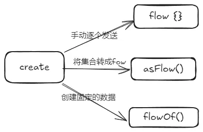
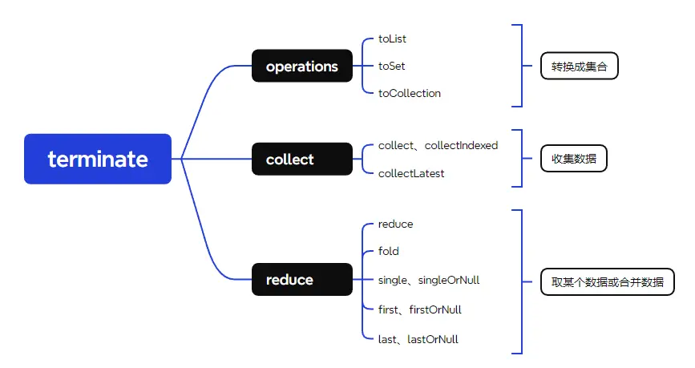

`Flow`字如其名，是一个数据流操作，他是基于`Kotlin`协程实现的异步数据流，方便我们对数据进行处理或者进行数据交换。简单点来说，就是`flow`提供了一组操作方法，通过链式调用来依次对数据进行操作修改，也可以在别的地方对`flow`设置观察者(`collect`)，当数据流处理完毕后，数据会被发送给观察者进行消费。

## 生成数据流

若要操作数据流，最先做的应该是生成一个数据流。`Flow<out T>`是一个接口，它的泛型类就是流中的数据，Flow给我们提供了很多的创建流的方式。

生成数据流比较简单，实际场景我们一般将网络请求的数据转换成`flow`进行处理，或者是获取到一组的数据转成`flow`进行处理，又或者是将`flow`作为观察者模式，在`ViewModel`中发射数据，在`View`层中观察数据。



### flow

```kotlin
val flow = flow {
    // 可以通过emit方法发射数据，同时作用域内也可以使用协程
    emit(1)
    delay(10)
    emit(2)
}

lifecycleScope.lunch {
    // 获取flow中的数据流，必须在协程作用域内收集
    flow.collect {
        Log.d(TAG, "collect flow = $it")
    }
}
```

最常见的就是通过`flow`方法去创建一个`flow`，其参数闭包是一个`FlowCollector`的拓展函数，即我们可以在闭包内通过`emit`方法去发射数据。`flow`对于协程的支持程度非常高，毕竟他就是基于协程而创建的数据流，不仅在创建协程的闭包内允许使用协程，在收集数据流的时候也要求必须在协程作用域内收集。

### asFlow

`asFlow`是一个拓展方法，也是用于生成`flow`的，它的拓展范围是非常大的，从高阶函数，到数组集合，几乎所有能产生数据的对象都可以通过`asFlow`将其转变成`flow`。

```kotlin
val flow = {
    // 高阶函数，返回值为1，通过asFlow转换成flow
    1
}.asFlow()

val flow1 = (1..10).asFlow()
val flow2 = listOf(1,2,3).asFlow()
val flow3 = arrayOf(1,2,3).asFlow()
```

### flowOf

`flowOf`也是将数据转换成`flow`的，它通常是将一个或多个数据转成`flow`，而`asFlow`则是将一个集合中的多个数据转成`flow`。

```kotlin
val flow = flowOf(1)

val flow1 = flowOf(1,2,3)

// 创建一个空的flow
val flow2 = emptyFlow<Int>()
```

## 收集数据流

当我们拿到一个flow后，我们需要从flow中获取数据，而flow也给我们提供了很多的操作符进行快速获取。需要注意的是，数据的获取方法都必须在协程作用域内执行。当我们的协程作用域被取消后，flow也会被直接取消掉。



### collect、collectIndexed

最基础的就是`collect`操作符，通过该方法，我们可以获取到flow中的所有数据。

```kotlin
val flow = flowOf(1, 1, 2, 2, 3, 4)
lifecycleScope.launch {
    flow.collect {
        Log.d(TAG, "collect = $it")
    }
    // flow.collectIndexed { index, value ->
    //    Log.d(TAG, "collect = $value, index = $index")
    // }
}

// 输出如下
collect = 1
collect = 1
collect = 2
collect = 2
collect = 3
collect = 4
```

### collectLatest

获取最新的数据，当连续发送多个数据时，如果`collectLatest`的闭包内对上一个数据的操作还未处理完，则会直接取消闭包内的方法执行，然后重新发送下一个数据。

```kotlin
val flow = flowOf(1, 1, 2, 2, 3, 4)
lifecycleScope.launch {
     flow.collectLatest {
        println("pre collect = $it")
        delay(10)
        println("collect = $it")
    }
}
// 输出如下：
pre collect = 1
pre collect = 1
pre collect = 2
pre collect = 2
pre collect = 3
pre collect = 4
collect = 4
```

可以看到，创建的`flow`会连续发射多个数据，然后每个数据会处理10ms然后输出，但是通过`collectLatest`操作符去获取数据时，每次的数据处理都会被取消掉，只有最后一个数据才会被完整的处理完。我们可以利用这种操作符的特性，在实际的开发中用作防抖。
