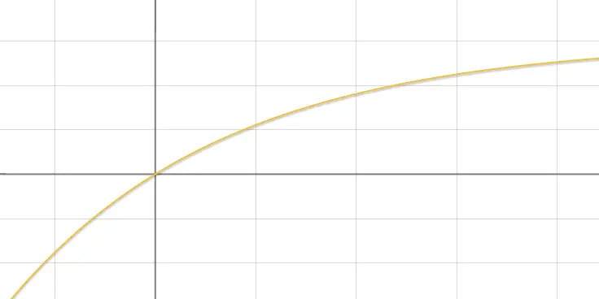

`Android`中默认是没有弹性滑动的，当发生了`overscroll`的时候，会在`View`的边界处显示一个弧状的动效。然而动效要求要和`iOS`保持一致，当过度滑动时，会整个界面向下滑动，然后松手后再回弹到原点。

### 效果分析

我们可以先去在苹果手机上大致上手查看下，当触发了过度滑动时，整个界面的滑动并不是跟随手指的，而是有一个逐渐递减的过程，例如手指滑动了`100`的距离，然后界面实际滑动了`60`的距离这样，并且随着过度滑动距离的增大，界面滑动的距离逐渐衰减，因此我们需要找到这个映射关系。

当然，这个映射关系分析肯定是分析不出来的，直接找动效工程师索要即可，至于它怎么得到就不是我们要关心的了。万一是小公司，没有动效工程师呢？所以这里我们得先动用自己所学的知识去大概模拟下。首先根据分析这个映射关系或者说映射函数应该是个递增的函数，并且增长的速率是递减的。

最简单的就是对数函数`f(x) = log(x)`即可满足我们的要求，但是它的增长速度有点太慢了，因此我们可以简单修饰下，例如我们想要的是当`x`为0时取值也是0，当x为N时，取值大概为N/2。就可以将函数修改为`f(x) = logN(x+1)*N/2`。


另外指数函数也能满足我们的要求，直接找个在线绘图的网站然后调参数即可，这里直接给出函数`f(x) = N*(1-2^(-x/N))`。

_


### 代码实现

拿到了映射函数之后，代码实现就比较简单了，主要的逻辑就是将滑动的距离通过刚才的映射函数处理后，得到实际应该滑动的距离。

```kotlin
class MyViewGroup @JvmOverloads constructor(
    context: Context,
    attributeSet: AttributeSet? = null,
     def: Int = 0
) : LinearLayout(context, attributeSet, def){

    // 300dp，函数中的常量N
    private val max = TypedValue.applyDimension(TypedValue.COMPLEX_UNIT_DIP, 300F, context.resources.displayMetrics)

    // 手指按下的坐标
    private var downY  = 0F
    // 应当滚动的距离
    private var scrollTop = 0F

    override fun onTouchEvent(event: MotionEvent?): Boolean {
        when(event?.actionMasked) {
            // 按下时记录坐标
            MotionEvent.ACTION_DOWN -> downY = event.y
            MotionEvent.ACTION_MOVE -> {
                // 当前滚动的距离
                val deltaY = event.y - downY
                // 计算deltaY对应的实际滚动距离
                scrollTop = scrollTop + compute(scrollTop + deltaY) - compute(scrollTop)
                // 滚动到对应的位置
                scrollTo(scrollX, -scrollTop.toInt())
                // 本次滑动结束，更新坐标
                downY = event.y
            }
            MotionEvent.ACTION_UP -> {
                // 手指抬起时恢复到初始位置
                ValueAnimator.ofFloat(scrollTop, 0F).also {
                    it.interpolator = DecelerateInterpolator()
                    it.addUpdateListener { anim->
                        scrollTop = anim.animatedValue as Float
                        scrollTo(scrollX, -scrollTop.toInt())
                    }
                    it.start()
                }
            }
        }
        return true
    }

	// 映射函数：f(x) = N * (1 - 2^(-x/N))
    private fun compute(x: Float): Float {
        return max * (1 - 2F.pow(-x/max))
    }

}
```

主要逻辑就是在每段的滚动中，计算该段滚动实际应该对应滚动多远，然后将布局进行滚动即可，整体逻辑还是比较简单的，然后就是将该布局跑到界面上查看效果了。

```xml
<?xml version="1.0" encoding="utf-8"?>
<com.study.androidbehavior.widget.MyViewGroup xmlns:android="http://schemas.android.com/apk/res/android"
    android:id="@+id/main"
    android:layout_width="match_parent"
    android:layout_height="match_parent"
    android:orientation="vertical">

    <View
        android:background="#FF0"
        android:layout_width="match_parent"
        android:layout_height="match_parent"/>
</com.study.androidbehavior.widget.MyViewGroup>
```

父布局是我们自定义的用户过度滚动的布局`MyViewGroup`，子布局是一个最基础的`View`，然后设置了黄色的背景方便进行观察，最后的运行效果是这样的：


大体上的效果是已经满足我们过度滑动的效果了，当我们下拉时整个界面也跟随手指的移动，并且不是线性移动，当我们手指松开之后界面又回弹到原来的位置。但是还有一些细节没有处理，如当前的这种效果只支持单指的滑动，当一根手指滑动时，是不会去响应另一根手指的，这是因为我们在`onTouch`中并没有去做处理。

### 优化多指滑动


