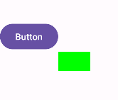
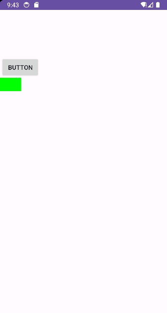
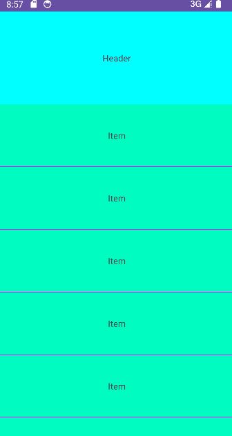

在源码的注释的第一行中有这样一句话：`CoordinatorLayout is a super-powered FrameLayout.` 也就是什么都不做的话，是可以将他当做一个简单的`FrameLayout`来使用的，当然实际上我们肯定不会这样去使用的。从名字可以看到，`CoordinatorLayout`是一个协调布局、协作布局。即作为一个控制者，处理子View之间的交互关系。

`CoordinatorLayout`是用于操控子View的行为模式的，它将操控的能力全部抽取出来，组成一个静态内部类`Behavior`，通过`Behavior`来实现操控能力，也更方便拓展。因此，`CoordinatorLayout`必须搭配`Behavior`来使用，否则失去操控能力的它就变得及其简单，也就是源码注释中说的`super-powered FrameLayout`。


## Behavior的能力

`CoordinatorLayout`将其所支持的各种功能都抽象出来，作为一个插件标准，所有人都可以依据这个插件标准，来使用它的各种能力。这个插件标准就是`Behavior`

说白了Android原生View之间的各种花样也不过布局绘制、事件操作等。而`CoordinatorLayout`所实现的就是一些常用的功能，如**依赖关系**、**测量布局**、**Touch事件**、**嵌套滑动**。


### 如何使用设置Behavior

```java
public static abstract class Behavior<V extends View> {
    public Behavior() {}
    public Behavior(Context context, AttributeSet attrs) {}
}
```

`Behavior`有两个构造方法，一个是空参数的构造方法，一个是双参数的构造方法。对于熟悉自定义`View`的我们而言，双参数的构造方法一看就是对应从`xml`中实例化出来的。事实确实如此，空参数的构造方法一般都是手动去创建实例然后设置，而双参数的一般都是直接在`xml`中设置。

注意：

- **一个子`View`只能设置一个`Behavior`**。

- **泛型V表示的是该Behavior可用于的类型，例如设置为`ImageView`，则实例化的`Behavior`只能用于`ImageView`。**

#### xml中设置

直接在`xml`中通过`app:layout_behavior="xxx"`给某个子view设置`Behavior`，其中`xxx`表示的是`Behavior`的类名。可以是缩略的如`.MyBehavior`，也可以是完整的如`com.xx.test.MyBehavior`。**建议使用完整包名**，毕竟当在`xml`中重定义`package`的时候，使用缩略名称会导致出错。

当通过xml声明的方式去设置`Behavior`的时候，会走双参数的构造方法，此时，可以通过xml属性向其设置参数，使用方式和自定义View的自定义属性是一样的。

- 1，在`attrs.xml`中定义属性和名称，和自定义`view`的做法一致

```xml
<resources>
    <declare-styleable name="MovableButton_Behavior">
        <attr name="sex" format="string" />
    </declare-styleable>
</resources>
```

- 2，在`xml`中设置这个属性

``````xml
<androidx.coordinatorlayout.widget.CoordinatorLayout 
    xmlns:android="http://schemas.android.com/apk/res/android"
    xmlns:app="http://schemas.android.com/apk/res-auto"
    android:layout_width="match_parent"
    android:layout_height="match_parent"
    tools:context=".MainActivity">

    <ImageView
        android:id="@+id/image"
        android:layout_width="wrap_content"
        android:layout_height="wrap_content"
        app:layout_behavior=".behavior.AttrBehavior"
        app:sex="aaaa" />

</androidx.coordinatorlayout.widget.CoordinatorLayout>
``````

- 在`Behavior`构造方法中读取属性

```kotlin
class AttrBehavior(
    context: Context,
    attributeSet: AttributeSet
) : CoordinatorLayout.Behavior<View>(context, attributeSet) {

    init {
        context.obtainStyledAttributes(attributeSet, R.styleable.MovableButton_Behavior).use {
            val sex = it.getString(R.styleable.MovableButton_Behavior_sex)
            println("xml中设置的app:sex属性值为：$sex")
        }
    }

}
```

#### 直接创建实例

若是不在xml中设置的话，则需要手动创建，然后设置给对应的View。这种方式稍微复杂一点点：需要首先拿到想要设置的Behavior的View，然后获取其布局属性`CoordinatorLayout.LayoutParams`，然后通过`setBehavior`方式设置。

``````kotlin
 override fun onCreate(savedInstanceState: Bundle?) {
    super.onCreate(savedInstanceState)
    setContentView(R.layout.activity_main)
    val textView:TextView = findViewById(R.id.textView)
    val params = textView.layoutParams
    if (params is CoordinatorLayout.LayoutParams) {
        // 设置Behavior
        params.behavior = AttrBehavior()
    }
}
``````


#### 通过默认的Behavior设置

使用默认的设置，就是没有使用前两种方式设置的话才会使用默认的。以前是通过注解的方式去设置，这种方式需要自定义View，然后在其类名上通过`@DefaultBehavior`进行注解。

``````kotlin
@DefaultBehavior(AttrBehavior::class)
class MovableButton @JvmOverloads constructor(
    context: Context,
    attr: AttributeSet? = null,
    defStyle: Int = 0
) : AppCompatButton(context, attr, defStyle)
``````

注意：注解方式已经被标记为`Deprecated`，不再推荐使用了，现在推荐使用接口的方式来实现，即自定义的View通过实现

```java
public interface AttachedBehavior {
    @NonNull Behavior getBehavior();
}
```


### Behavior的功能

`CoordinatorLayout`抽取的比较狠，它将所有的操作都抽取到了`Behavior`中，本身基本上没有什么特殊功能了。也就是说如果离了`Behavior`，它就是一个`FrameLayout`了。


#### 测量和布局

一个`View`的显示，通常经历三个步骤：测量、布局、绘制。而在`Behavior`中也能实现前两个步骤，这是因为`CoordinatorLayout`将其对子`View`的测量和布局的过程放在了`Behavior`中。它本身对于子View的布局就是单纯的叠加，也就是`FrameLayout`那样，如果想要特殊的测量和布局的话，则需要在`Behavior`中自己去实现了。

测量和布局对应的方法名称和`View`的方法非常类似，直接在`Behavior`中重写这两个方法实现自定义测量和布局，然后返回`true`即可。注意，**必须返回true**，否则当前自定义不会生效。

```java
boolean onMeasureChild(
    @NonNull CoordinatorLayout parent, 
    @NonNull V child,
    int parentWidthMeasureSpec,
    int widthUsed,
    int parentHeightMeasureSpec, 
    int heightUsed
)
    
boolean onLayoutChild(
    @NonNull CoordinatorLayout parent, 
    @NonNull V child,
    int layoutDirection
)
```

相对而言，自定义测量`onMeasureChild`用的较少，因为默认情况下父布局会像`FrameLayout`那样去测量子`View`，这种测量方式基本上已经够用了，而`onLayoutChild`用的会多一些。

查看下面的实例代码：

```kotlin
class LayoutBehavior(
    context: Context,
    attr: AttributeSet
) : Behavior<ImageView>(context, attr) {

    override fun onLayoutChild(
        parent: CoordinatorLayout,
        child: ImageView,
        layoutDirection: Int
    ): Boolean {
        var target: Button? = null
        // 遍历子View，查找第一个类型为Button的子View
        for (index in 0..parent.childCount) {
            if (parent.getChildAt(index) is Button) {
                target = parent.getChildAt(index) as Button
                break
            }
        }
        if (target == null) {
            return false
        } else {
            // 将应用了Behavior的子View放置在第一个Button的右下方
            child.layout(
                target.right,
                target.bottom,
                target.right + child.measuredWidth,
                target.bottom + child.measuredHeight
            )
            return true
        }
    }
}
```

然后在`xml`中，使用这个`Behavior`即可：

```xml
<?xml version="1.0" encoding="utf-8"?>
<androidx.coordinatorlayout.widget.CoordinatorLayout xmlns:android="http://schemas.android.com/apk/res/android"
    xmlns:app="http://schemas.android.com/apk/res-auto"
    xmlns:tools="http://schemas.android.com/tools"
    android:layout_width="match_parent"
    android:layout_height="match_parent"
    tools:context=".MainActivity">

    <Button
        android:layout_width="wrap_content"
        android:layout_height="wrap_content"
        android:layout_gravity="center_vertical"
        android:text="Button"
        tools:ignore="HardcodedText" />

    <ImageView
        android:layout_width="50dp"
        android:layout_height="30dp"
        android:background="#00FF00d"
        app:layout_behavior="com.example.viewdemo.LayoutBehavior" />

</androidx.coordinatorlayout.widget.CoordinatorLayout>
```

然后运行即可看到`ImageView`被放置在了`Button`的右下角：



#### 布局依赖

`Behavior`可以实现两个子`View`之间的布局依赖的关系，当被依赖的`View`发生位置尺寸的变化或者被移除时，另一个`View`也会触发相应的操作。

```java
public boolean layoutDependsOn(
    @NonNull CoordinatorLayout parent, 
    @NonNull V child,
    @NonNull View dependency
)
```

首先，在`Behavior`中通过`layoutDependsOn`方法来确定依赖关系。方法的第三个参数就是需要依赖的View，该方法会调用多次，也就是说`Behavior`会遍历除了`child`外的其他`view`，然后通过这个方法去判断其是否是child的依赖。

例如`parent`有三个子`View`，其中有一个`View`设置了`Behavior`，那么`layoutDependsOn`方法会被调用两次，其中`parent`和`child`参数不变，每次变的是`dependency`参数。当返回true时，会记录该View，作为其依赖项，因此，**依赖关系是一对多的**。

> 注意，在Behavior中，都是用parent代表父布局，child代表设置了Behavior的子View

```java
public boolean onDependentViewChanged(
    @NonNull CoordinatorLayout parent, 
    @NonNull V child,
    @NonNull View dependency
)
```

`onDependentViewChanged`则是依赖发生时调用的方法了，可以在这个方法中去声明`child`对依赖的响应行为。同样的，若是在这个方法中修改了`child`的尺寸或者位置，则需要返回`true`。

```java
public void onDependentViewRemoved(
    @NonNull CoordinatorLayout parent, 
    @NonNull V child,
    @NonNull View dependency
)
```

`onDependentViewRemoved`方法是发生在被依赖的`View`从父布局中移除的时候，也就是`child`失去了一个依赖的时候调用。

示例：

首先定义一个可移动的按钮`MovableButton`，因为依赖事件发生的前提是被依赖的`View`位置或者尺寸发生变化，因此这里需要有一个可以移动位置的`View`。下面定义一个`MovableButton`，并没有什么实质内容。

```kotlin
// 一个简单view，可以跟随手指而动
class MovableButton @JvmOverloads constructor(
    context: Context,
    attributeSet: AttributeSet? = null
) : AppCompatButton(context, attributeSet) {

    private var mInitX = 0F
    private var mInitY = 0F
    private var mEventX = 0F
    private var mEventY = 0F

    override fun onTouchEvent(event: MotionEvent?): Boolean {
        when (event?.actionMasked) {
            MotionEvent.ACTION_DOWN -> {
                mInitX = x
                mInitY = y
                mEventX = event.rawX
                mEventY = event.rawY
            }
            MotionEvent.ACTION_MOVE -> {
                x = mInitX + event.rawX - mEventX
                y = mInitY + event.rawY - mEventY
            }
        }
        return super.onTouchEvent(event)
    }

}
```

然后开始写`Behavior`，在`Behavior`中确定依赖关系并且定义相应的操作。

```kotlin
class BelowBehavior(
    context: Context,
    attributeSet: AttributeSet
) : CoordinatorLayout.Behavior<View>(context, attributeSet) {

    override fun layoutDependsOn(
        parent: CoordinatorLayout,
        child: View,
        dependency: View
    ): Boolean {
    	// 设置只有MovableButton才能作为被依赖View
        return dependency is MovableButton
    }

    override fun onDependentViewChanged(
        parent: CoordinatorLayout,
        child: View,
        dependency: View
    ): Boolean {
    	// 让child一直处在被依赖的View下面
        child.y = dependency.height + dependency.translationY
        return true
    }
    
     override fun onDependentViewRemoved(
        parent: CoordinatorLayout, child: View,
        dependency: View
    ) {
        // 当被依赖的view被移除的时候，将child的位置重置在界面顶部
        child.y = 0F
    }

}
```

注意一点的是，在`layoutDependsOn`中确定依赖的条件是很简单的，只要`View`是`MovableButton`即可。实际中的条件应该更复杂一些的，因为简单的条件很容易形成多个依赖的`View`。

然后是在`xml`中使用`Behavior`，注意后面都是在`xml`中使用`Behavior`，因为比较简单：

```xml
<?xml version="1.0" encoding="utf-8"?>
<androidx.coordinatorlayout.widget.CoordinatorLayout xmlns:android="http://schemas.android.com/apk/res/android"
    xmlns:app="http://schemas.android.com/apk/res-auto"
    xmlns:tools="http://schemas.android.com/tools"
    android:layout_width="match_parent"
    android:layout_height="match_parent"
    tools:context=".MainActivity">

    <com.example.viewdemo.MovableButton
        android:layout_width="wrap_content"
        android:layout_height="wrap_content"
        android:text="Button"
        tools:ignore="HardcodedText" />

    <ImageView
        android:layout_width="50dp"
        android:layout_height="30dp"
        android:background="#00FF00"
        app:layout_behavior="com.example.viewdemo.BelowBehavior" />
</androidx.coordinatorlayout.widget.CoordinatorLayout>
```

最后是效果图如下：




#### 事件拦截处理

在`View`的事件分发中，事件都是先分发给最里层的子`View`的，当子`View`决定不处理`touch`事件的时候，外层的父布局才会得到处理事件的机会。但这也不是一定的，因为父布局中有一个方法可以用来拦截事件，这样事件就会直接交给父布局进行处理，而不会传递给子`View`了。

`CoordinatorLayout`作为一个父布局(`ViewGroup`)一定也是有这个拦截的功能的，但是同样的，它本身也没去实现拦截的机制，而是将这个功能抽取到`Behavior`中，由`Behavior`去决定`CoordinatorLayout`是否拦截此次的事件。当决定拦截了事件后，同样的`CoordinatorLayout`也不去处理这些事件，而是将这些事件传递给决定拦截事件的这些`Behavior`中，由`Behavior`去处理。

```java
public boolean onInterceptTouchEvent(
    @NonNull CoordinatorLayout parent, 
    @NonNull V child,
    @NonNull MotionEvent ev
)

public boolean onTouchEvent(
    @NonNull CoordinatorLayout parent, 
    @NonNull V child,
    @NonNull MotionEvent ev
)
```

和`ViewGroup`一样的方法，通过`onInterceptTouchEvent`进行拦截，然后在`onTouchEvent`中去处理。`Behavior`是服务child的，因此这里的事件拦截也仅是为了child而拦截的。让child在事件分发之前就能提前拦截到触摸事件。

#### 嵌套滑动

`Behavior`还有一个比较常用的就是嵌套滑动。嵌套滑动的设计能够将一次事件流交给多个`View`去处理，从而可以让滑动更加流畅更加符合我们的期望。它使用两套接口来实现这种功能，分别是`NestedScrollingChild3`和`NestedScrollingParent3`，对应着子`View`和父`View`，当然也可以同时实现这两个接口，这样就可以为所欲为了。

虽然`CoordinatorLayout`也实现了`NestedScrollingParent3`接口，但是它并不是像传统的那种嵌套滑动一样来处理滑动事件，而是将滑动事件委托给了`Behavior`，也就是在嵌套滑动中，实际上是`Behavior`来作为`parent`处理滑动事件的。也就是说，`CoordinatorLayout`中的嵌套滑动并不需要嵌套，同时，由于在嵌套滑动中作为`parent`的是`Behavior`，所以实际上想要作为`parent`的子`View`只需要设置`Behavior`即可，而不用去实现`NestedScrollingParent3`接口。

总之，**`CoordinatorLayout`使用嵌套滑动逻辑实现了一套不是嵌套滑动的嵌套滑动**。

> 注意，嵌套滑动必须由`NestedScrollingChild3`发起，`RecyclerView`就实现了这个接口。

```java
public boolean onStartNestedScroll(
    @NonNull CoordinatorLayout coordinatorLayout,
    @NonNull V child, 
    @NonNull View directTargetChild, 
    @NonNull View target,
    @ScrollAxis int axes, 
    @NestedScrollType int type
)
```

这是嵌套滑动开始的方法，当发生嵌套滑动的时候，会先调用这个方法，判断`Behavior`是否需要参与此次的滑动，返回`true`表示参与这次滑动，才会有后续的方法调用，否则后续的事件都不会再回调到这个`Behavior`中。

其中前两个参数不用说了，第三个参数`directTargetChild`是发生滑动的`View`在`CoordinatorLayout`中的直接子布局，而`target`表示的是发生滑动的那个`View`。当`target`直接出现在`CoordinatorLayout`中的时候，这时候的`directTargetChild`和`target`是同一个对象。如下布局中，`directTargetChild`就是`FrameLayout`，而`target`是`RecyclerView`。

```xml
<androidx.coordinatorlayout.widget.CoordinatorLayout...>

    <FrameLayout...>
        <androidx.recyclerview.widget.RecyclerView... />
    </FrameLayout>
    ...

</androidx.coordinatorlayout.widget.CoordinatorLayout>
```

最后两个参数是一个是滚动的方向，一个是滚动的类型。`axes`表示滑动的方向，有水平和垂直两种类型，取值为`ViewCompat#SCROLL_AXIS_HORIZONTAL`和`ViewCompat#SCROLL_AXIS_VERTICAL`。而`type`表示滑动的类型，有触摸滚动和非触摸滚动（惯性滚动），取值为`ViewCompat#TYPE_TOUCH`和`ViewCompat#TYPE_NON_TOUCH`。当`Behavior`想要参与此次的嵌套滑动的时候，需要返回`true`。

```java
public void onNestedScrollAccepted(
    @NonNull CoordinatorLayout coordinatorLayout,
    @NonNull V child, 
    @NonNull View directTargetChild, 
    @NonNull View target,
    @ScrollAxis int axes, 
    @NestedScrollType int type
)
```

`onNestedScrollAccepted`的参数和`onStartNestedScroll`是一样的，这个方法是当`onStartNestedScroll`返回`true`的时候调用的，他与`onStartNestedScroll`是绑定在一起的，每次`onStartNestedScroll`返回`true`都会调用一次这个方法。可以在该方法中去处理嵌套滑动的前置准备，如初始化状态等；当然，也可以选择在`onStartNestedScroll`就初始化状态。

```java
public void onNestedPreScroll(
    @NonNull CoordinatorLayout coordinatorLayout,
    @NonNull V child, 
    @NonNull View target, 
    int dx, 
    int dy, 
    @NonNull int[] consumed,
    @NestedScrollType int type
)

public void onNestedScroll(
    @NonNull CoordinatorLayout coordinatorLayout, 
    @NonNull V child,
    @NonNull View target, 
    int dxConsumed, 
    int dyConsumed, 
    int dxUnconsumed,
    int dyUnconsumed, 
    @NestedScrollType int type, 
    @NonNull int[] consumed
)
```

上面两个方法才是真正滑动的时候回调的方法。在发生嵌套滑动并且`Behavior`接受了这次滑动后，会先调用`onNestedPreScroll`方法。注意这个方法是发生在`Behavior`中的，也就是说，当有滑动事件的时候，是优先传递给`Behavior`去处理的。其中参数`dx`和`dy`表示的是滑动的距离，而数组`consumed`的长度为2，表示的是`Behavior`消耗的滑动距离。`consumed[0]`为对`dx`的消耗，`consumed[1]`为对`dy`的消耗，当`Behavior`消耗滑动后，需要手动的将消耗的多少填充到数组中。

当`Behavior`处理完后，剩余的事件会传递给`target`去处理，当然这时候的处理跟我们无关了，是由`target`本身的逻辑去处理了。而当`target`滚动结束后，剩下的事件又会传递到`parent`中进而传递给`Behavior`的`onNestedScroll`方法。该方法的中间四个参数没什么可说的，从名字就可以看出是`dx`和`dy`的已消耗的和未消耗的值。`consumed`数组也是一样的，存放消耗的事件。注意的是，此时`consumed`数据可能是已经有值的，因此我们消耗后，需要进行叠加而不是赋值。例如消耗`deltaY`，则应该`consumed[1] += deltaY`。

```java
public boolean onNestedPreFling(
    @NonNull CoordinatorLayout coordinatorLayout,
    @NonNull V child, 
    @NonNull View target, 
    float velocityX, 
    float velocityY
)

public boolean onNestedFling(
    @NonNull CoordinatorLayout coordinatorLayout,
    @NonNull V child, 
    @NonNull View target, 
    float velocityX, 
    float velocityY,
    boolean consumed
)
```

当子`View`发生惯性滑动也就是`fling`的时候，同样是先传递给`Behavior`。也就是`onNestedPreFling`方法，`Behavior`需要在这个方法中去判断是否需要消耗这次的惯性滑动，若是需要的话则返回`true`。然后就是再交还给子`View`去进行判断是否需要显示`overScroll`，然后再通过`onNestedFling`传递回`Behavior`中进行真正的惯性滑动处理。其中参数`consumed`表示嵌套子`View`(发起滚动的子`View`)是否消耗此次惯性滑动，若是`Behavior`需要消耗此次滚动，则需要返回`true`。

*这是`NestedScrollingParent`中的机制，而在`NestedScrollingParent2/3`中，已经取消了这种惯性滑动的处理方式，而是采用`Child`去消耗滑动，产生的滑动再次分发的形式。**因此，实际上这两个方法都不用重写的，直接保持默认的实现就行了**。*

```java
 public void onStopNestedScroll(
     @NonNull CoordinatorLayout coordinatorLayout,
     @NonNull V child, 
     @NonNull View target, 
     @NestedScrollType int type
)
```

在滚动结束后，会调用`onStopNestedScroll`方法，可以在这个方法中去做一些收尾工作。所以嵌套滑动一共涉及到七个方法，滑动刚开始的两个方法，滑动过程中的两个方法，惯性滑动的两个方法，以及收尾的一个方法。并且，滑动事件的顺序都是`子View->Behavior->子View->Behavior`。因此滑动过程和惯性滑动过程都是两个方法，一个是第一次开始处理，一个是子`View`处理后剩下的再去处理。


下面实现一个示例，给`RecyclerView`添加一个Header：

``````xml
<?xml version="1.0" encoding="utf-8"?>
<androidx.coordinatorlayout.widget.CoordinatorLayout xmlns:android="http://schemas.android.com/apk/res/android"
    xmlns:app="http://schemas.android.com/apk/res-auto"
    xmlns:tools="http://schemas.android.com/tools"
    android:layout_width="match_parent"
    android:layout_height="match_parent"
    tools:context=".MainActivity">

    <TextView
        android:layout_width="match_parent"
        android:layout_height="150dp"
        android:background="#00FFFF"
        android:gravity="center"
        android:text="Header"
        app:layout_behavior=".NestedBehavior" />

    <androidx.recyclerview.widget.RecyclerView
        android:id="@+id/recyclerView"
        android:layout_width="match_parent"
        android:layout_height="match_parent"
        android:orientation="vertical"
        app:layoutManager="androidx.recyclerview.widget.LinearLayoutManager"
        app:layout_behavior=".ToBottomBehavior"
        tools:listitem="@layout/item_text" />

</androidx.coordinatorlayout.widget.CoordinatorLayout>
``````

整体布局如上所示，要实现添加Header的效果，需要两步，一是将`RecyclerView`放置在Header的下面，一是跟随滑动。由于`CoordinatorLayout`的默认布局效果是堆叠的方式，所以需要我们自己去进行布局，这里定义一个`ToBottomBehavior`，作用与`RecyclerView`，用于让其一直处于Header的下方：

```Kotlin
class ToBottomBehavior(context: Context,attr: AttributeSet) : Behavior<RecyclerView>(context, attr) {
    override fun onLayoutChild(
        parent: CoordinatorLayout,
        child: RecyclerView,
        layoutDirection: Int
    ): Boolean {
        if (parent.childCount < 2) {
            return false
        }
        // 将RecyclerView放置在Header的下面
        val first = parent.getChildAt(0)
        child.layout(0, first.measuredHeight, first.measuredWidth, child.measuredHeight)
        return true
    }

    override fun layoutDependsOn(
        parent: CoordinatorLayout,
        child: RecyclerView,
        dependency: View
    ): Boolean {
        return dependency is TextView
    }

    override fun onDependentViewChanged(
        parent: CoordinatorLayout,
        child: RecyclerView,
        dependency: View
    ): Boolean {
        // 当Header的 位置发生变化时，继续挪动RecyclerView，让其一直在Header下方
        child.layout(
            0,
            (dependency.bottom + dependency.translationY).toInt(),
            child.measuredWidth,
            child.measuredHeight
        )
        return true
    }
}
```

然后再定义一个`NestedBehavior`，让Header跟随RecyclerView进行滑动：

```kotlin
class NestedBehavior(
    context: Context,
    attr: AttributeSet? = null
) : CoordinatorLayout.Behavior<View>(context, attr) {

    override fun onStartNestedScroll(
        coordinatorLayout: CoordinatorLayout,
        child: View,
        directTargetChild: View,
        target: View,
        axes: Int,
        type: Int
    ): Boolean {
        // 只拦截纵向的滚动
        return axes == ViewCompat.SCROLL_AXIS_VERTICAL
    }

    override fun onNestedPreScroll(
        coordinatorLayout: CoordinatorLayout,
        child: View,
        target: View,
        dx: Int,
        dy: Int,
        consumed: IntArray,
        type: Int
    ) {
        // 注意，手指向上滑动的时候，dy大于0。向下的时候dy小于0。
        val translationY = child.translationY
        if (-translationY >= child.measuredHeight || dy < 0) {
            // child已经滚动到屏幕外了，或者向下滚动，就不去消耗滚动了
            return
        }
        // 还差这么desireHeight距离将会移出屏幕外
        val desireHeight = translationY + child.measuredHeight
        if (dy <= desireHeight) {
            // 将dy全部消耗掉
            child.translationY = translationY - dy
            consumed[1] = dy
        } else {
            // 消耗一部分的的dy
            child.translationY = translationY - desireHeight
            consumed[1] = desireHeight.toInt()
        }
    }

    override fun onNestedScroll(
        coordinatorLayout: CoordinatorLayout,
        child: View,
        target: View,
        dxConsumed: Int,
        dyConsumed: Int,
        dxUnconsumed: Int,
        dyUnconsumed: Int,
        type: Int,
        consumed: IntArray
    ) {
        val translationY = child.translationY
        if (translationY >= 0 || dyUnconsumed > 0) {
            // 手指向上滚动或者child已经滚出了屏幕，不去处理
            return
        }

        if (dyUnconsumed > translationY) {
            // 全部消耗
            consumed[1] += dyUnconsumed
            child.translationY = translationY - dyUnconsumed
        } else {
            // 消耗一部分
            consumed[1] += child.translationY.toInt()
            child.translationY = 0F
        }
    }
}
```

然后随便设置一下RecyclerView的Adapter等，效果如下：




## 总结

首先，`Behavior`是一个插件，它是`CoordinatorLayout`抽取出来的一个标准。`CoordinatorLayout`将本身的各种能力抽取到了`Behavior`中，在需要的时候去加载它从而实现某些交互。

其次，`Behavior`一共有四种能力：**测量布局，位置依赖，事件拦截，嵌套滑动**。其中依赖和嵌套滑动用的是最多的，然后是布局和测量，最后才是touch。

当学会了`Behavior`的各个方法的使用后，就可以设计出各种花里胡哨的操作了，也就学会了Behavior了。
