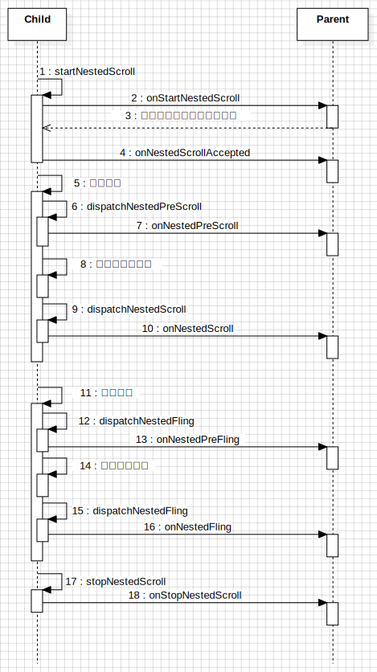

在`Android`中，事件是以一组事件作为一个整体的，即`down->move->..->up/cancel`，在其一开始的设计中，是没有考虑嵌套滑动的处理的，当认定了某一个`View`选择拦截处理事件的话，这一组事件都会交给该控件去处理。

这样的处理逻辑会带来一些问题，因为事件是只给一个控件处理的，当有嵌套的两个控件都可以处理事件的时候，例如两个`ScrollView`

嵌套的时候，就会出现问题。此时只有一个可以进行滚动，这时候即发生了滑动冲突，这个问题通常使用内部拦截和外部拦截两种方式去处理。但是，不管采用哪种方式，在滑动过程中，参与的对象都是单一的。

但这样会出现一种问题，即滑动会丢失连续性。我们更想要的效果是内部`View`滚动到不可滚动后，继续滑动手指的时候外部`View`可以接着滚动，这种连续性是传统的事件分发无法做到的。

## 嵌套滑动

### 第一版

为了解决滑动的连续性，在`Android 5`上引入了嵌套滑动。它的整体思路是将滑动的双方分为`Parent`和`Child`，事件全部由`Child`接受，然后处理事件的时候会先将事件给`Parent`处理，然后再自己处理，处理完之后剩下的事件再次给到`Parent`，由此来实现事件的连续性。

该过程涉及的方法较多，但是如果放在一块的话就比较好理解。

#### 开启嵌套滑动

```java
// Child
boolean startNestedScroll(@ScrollAxis int axes);

// Parent
boolean onStartNestedScroll(
    @NonNull View child,  // Child在Parent中的直接父布局
    @NonNull View target, // 直接滑动的Child
    @ScrollAxis int axes);

void onNestedScrollAccepted(
    @NonNull View child,
    @NonNull View target, 
    @ScrollAxis int axes);
```

滑动是由`Child`发起的，因此当发生滑动的时候，会先调用`Child#startNestedScroll`方法去开启嵌套滑动。同样的，在`Parent`中也有一个对应的方法，就是`onStartNestedScroll`，当`Child`开启嵌套滑动的时候，`Parent`可以在`onStartNestedScroll`中对本次滑动做出响应，即是否要参与此次的嵌套滑动。只有建立了嵌套滑动关系后（`onStartNestedScroll`返回true），`Parent`才会收到后续的方法回调。

`onNestedScrollAccepted`与`onStartNestedScroll`是绑定的，每次`onStartNestedScroll`返回true的时候就会调用它，可以在这个方法中做一些嵌套滑动的前置准备如参数初始化等。

#### 开始嵌套滑动

```java
// Child
boolean dispatchNestedPreScroll(
    int dx, 
    int dy, 
    @Nullable int[] consumed,
    @Nullable int[] offsetInWindow
);

// Parent
void onNestedPreScroll(
    @NonNull View target, 
    int dx, 
    int dy, 
    @NonNull int[] consumed
);
```

当开始滑动的时候，滑动事件会通过`Child#dispatchNestedPreScroll`去分发，将事件分发给`Parent#onNestedPreScroll`先进行消耗。然后`Parent`消耗之后，需要将消耗的距离放入数组`consumed`中。其中`consumed`数组长度为2，分别是`dx`的消耗和`dy`的消耗。

若是`Parent`消耗了滑动事件(可以通过对`consumed`数组来进行判断`Parent`是否消耗滑动)，`Child#dispatchNestedPreScroll`应该返回true，否则返回false。

```java
// Child
boolean dispatchNestedScroll(
    int dxConsumed, 
    int dyConsumed,
    int dxUnconsumed, 
    int dyUnconsumed, 
    @Nullable int[] offsetInWindow
);

// Parent
void onNestedScroll(
    @NonNull View target, 
    int dxConsumed, 
    int dyConsumed,
    int dxUnconsumed, 
    int dyUnconsumed
);
```

当发生滚动的时候，会先将事件分发给`Parent`去消耗，剩下的才轮到`Child`进行消耗（这里没有额外的方法，因为这整个过程应该发生在`Child#onTouchEvent`中）。当`Child`消耗之后，剩余的事件还会再次分发给`Parent`。通过方法`dispatchNestedScroll`分发已消耗的距离和未消耗的距离，进而调用到`Parent`的`onNestedScroll`方法。

`dispatchNestedScroll`方法也有一个返回值，但是它返回的不是`NSParent`是否消耗了事件，而是表示这次的事件有没有分发给`Parent`。


所以嵌套滑动的过程就是：**Child产生滑动 -> Parent先消耗 -> Child再消耗 -> 剩下全给Parent**

#### 开始惯性滑动

当手指快速滑动并抬起时，会产生惯性滑动，也就是`Fling`。惯性滑动和普通滑动有一点区别，就是惯性滑动实际上并不是真正的滑动，它是手指快速滑动并抬起后，产生的一个速度，然后通过`Scroller`将速度模拟成滑动。对于惯性滑动也是需要进行分发的。

```java
// Child
boolean dispatchNestedPreFling(float velocityX, float velocityY);

// Parent
boolean onNestedPreFling(@NonNull View target, float velocityX, float velocityY);
```
惯性滑动的分发和普通滑动有点区别，就是因为惯性滑动实际上只有一个速度，没有实际的滑动。因此，在进行惯性的分发时，只是分发了速度。

同样的，当发生惯性滑动的时候，也是先通过`dispatchNestedPreFling`去分发惯性滑动的速度。进而会调用到`Parent`的`onNestedPreFling`方法，该方法是`Parent`用来决定是否需要参与这次的惯性滑动的，若是参与，则返回true。

```java
// Child
boolean dispatchNestedFling(float velocityX, float velocityY, boolean consumed);

// Parent
boolean onNestedFling(
    @NonNull View target, 
    float velocityX, 
    float velocityY, 
    boolean consumed // Child是否消耗，true消耗
);
```

前面在发生惯性滑动的时候，已经先分发给了`Parent`并询问它是否需要消耗惯性速度，然后才是`Child`决定自己是否需要消耗惯性滑动。最后，再通过`dispatchNestedFling`方法将自己是否要消耗速度的决定再次分发给`Parent#onNestedFling`（通过`consumed`参数）。

为什么要多此一举呢，前面已经问过了`Parent`是否需要消耗，为什么当`Child`决定后还需要再告诉`Parent`自己的决定呢？这是考虑到，当`Parent`不消耗惯性滑动，并且`Child`也不消耗惯性滑动的时候，`Parent`可以显示`OverScroll`样式(一个蓝色的弧线)。

#### 结束嵌套滑动

```java
// Child
void stopNestedScroll();

// Parent
void onStopNestedScroll(@NonNull View target);
```

当滑动结束后，需要调用这个方法去进行收尾工作。所以整个流程是这样的：



#### 其他相关方法

`Child`的其他方法

```java
// 设置嵌套滑动能力是否开启
void setNestedScrollingEnabled(boolean enabled);
// 当前是否支持嵌套滑动
boolean isNestedScrollingEnabled();
// 是否有嵌套的Parent
boolean hasNestedScrollingParent();

```

`Parent`的其他方法

```java
// 获取当前滚动的方向
int getNestedScrollAxes();
```


#### 适配以往的版本

其中`Child`相关的方法定义在`View`中，而`Parent`相关的方法定义在`ViewParent`中，并且`ViewGroup`实现了这个接口。如果我们实现嵌套滑动的话，例如想要实现一个`Child`类型的组件，则需要处理`onTouch`事件，在其中调用这些嵌套滑动的相关方法就行了。如果是实现的`Parent`类型的组件的话，则需要重写这些嵌套方法，实现对应的逻辑。

但是，这些是直接在源码中实现的，这就导致如果使用的系统版本低于`Android 5`的话，是没法使用嵌套滑动的。因此，为了兼容更早的系统版本，这些嵌套相关的方法被抽取出来，成了两个接口：`NestedScrollingChild`和`NestedScrollingParent`。任何想要使用嵌套滑动功能的组件，实现对应的接口即可，这样的话，更早的安卓版本也可以使用嵌套滑动了。另外，这些方法的实现也被抽取出来形成一个帮助类，其内容与在`View`中定义的方法的内容是一模一样的，我们可以直接调用。这两个帮助类是：`NestedScrollingChildHelper`和`NestedScrollingParentHelper`。

**但是，现在应该没有应用还适配`Android 5`之前的版本了吧，所以这里是不需要再看了。**

#### 存在的问题

在整个滑动事件中，事件被分为了四部分传递，分别在`Parent`和`Child`中分发处理，因此做到了滑动的连续性。但是，惯性滑动却没有做到连续性，因为惯性滑动是以一个 速度作为分发的对象，不是`Parent`处理就是`Child`处理。 例如当`Child`处于惯性滑动事件，当发生惯性滑动时，若是`Child`滑动到底了，则会直接停止。当然这不算问题，只是体验不够好而已。

### 第二版

第一版中对惯性滑动的处理，是将惯性滑动产生的速度，分发给`Parent`，如果`Parent`不消耗，则自己处理，然后就没然后了。这里的问题是惯性滑动并没有分段处理，而是作为一个整体，不是给`Parent`处理，就是给`Child`处理，这是关键点。所以处理惯性滑动连续性的方式也就是将惯性滑动分割为多个部分，然后分别由`Parent`和`Child`处理。

这一共有两种方式：

- 将惯性滑动产生的速度分割，按照嵌套滑动的套路去分发。例如初始速度是10，那么先给`Parent`处理（例如消耗了2），然后到`Child`中消耗(例如消耗了4)，再给`Parent`然后再到`Child`。
- 将惯性滑动产生的速度计算对应的滑动值，然后将这些滑动值按照惯性滑动的方式重走一遍流程。

#### 相比第一版的改动

显然，谷歌选择了第二种方式。这一次并没有直接在源码中修改，而是增加了个接口：`NestedScrollingChild2`和`NestedScrollingParent2`。这两个接口继承原来的接口，然后并没有动原方法，而是将每个方法都重载了一次，然后增加了一个参数`int type`，其取值有两种：`ViewCompat.TYPE_TOUCH`和`ViewCompat.TYPE_NON_TOUCH`，代表着普通滚动和惯性滚动。

这里加了重载方法而不是直接修改原方法是因为要考虑到兼容问题。这次改动涉及到的方法如下，都是前面介绍过的，这里不在赘述了：

```java
// NSChild2
boolean startNestedScroll(@ScrollAxis int axes, @NestedScrollType int type);
void stopNestedScroll(@NestedScrollType int type);
boolean hasNestedScrollingParent(@NestedScrollType int type);
boolean dispatchNestedScroll(... @NestedScrollType int type);
boolean dispatchNestedPreScroll(... @NestedScrollType int type);

// NSParent2
boolean onStartNestedScroll(... @NestedScrollType int type);
void onNestedScrollAccepted(... @NestedScrollType int type);
void onStopNestedScroll(@NonNull View target, @NestedScrollType int type);
void onNestedScroll(... @NestedScrollType int type);
void onNestedPreScroll(... @NestedScrollType int type);
```

#### 存在的问题

可以看到的是，在第二版的嵌套滑动中，关于滑动的方法都多了一个`type`参数，并且没有了和`Fling`相关的东西。因为在第二版的设计思路中，是将惯性滑动也当做一种特殊的普通滑动，那么现在就相当于只有普通滑动的分发了，作为`Child`，需要处理惯性滑动产生的速度，然后计算产生的滑动值，将滑动值继续用惯性滑动的套路流转。

也就是说`Fling`事件按照普通的move事件进行流转，这又有一个问题。在嵌套滑动的过程中，事件由`子->父->子->父`，一系列方法都没把事件消耗完的话，最终事件会给`Parent`。这在move的滑动中当然没问题，因为手指拿开的时候滑动就结束了。但是，在`Fling`中却是有问题的。

当手指拿开的时候，`Child`会根据产生的滑动速度开始计算滑动值，假如此时的速度较快，然后`Child`和`Parent`也都滑动到底部了，这时候的事件都会给到`Parent`中，此时是不会有问题的，因为都滑到底了。但是如果此时手动去向上划`Parent`的话，发现也是划不动的。因为此时`Child`还在源源不断的产生滑动事件给`Parent`，所以一个向上一个向下，导致划不动。

解决这个方法也很简单：`ACTION_DOWN`的时候让`Child`停止`Fling`就行了。但问题就在这里，如果不手动点击到`Child`的话，事件是不会传递到`Child`，也因此无法知晓什么时候停止。那你说触摸到`Parent`的时候遍历子View，查找有没有`Child`在`Fling`，可以是可以，但是**不够优雅**。

### 第三版

第三版的嵌套滑动是为了解决第二版中`Child`无法停止`Fling`的事情。为什么无法停止呢？因为惯性滑动的时候，先给`Parent`消费，然后再自己消费，最后剩余的部分一股脑全部给了`Parent`。

但是不知道`Parent`最终有没有消耗这些，所以他得一直`Fling`产生滑动给到`Parent`。因此，第三版的嵌套滑动又重载了一个方法，然后又加了一个参数添加了一个参数`consumed`，用来记录`Parent`第二次消耗的距离。这样的话，`Child`就能知道`Parent`到底有没有消费滑动了，如果发现它不消费了，那么`Fling`也就没必要了，就可以停止了。第三版的接口继承自第二版：`NestedScrollingChild3`和`NestedScrollingParent3`。

```java
// NSChild3
void dispatchNestedScroll(... @NonNull int[] consumed);

// NSParent3
void onNestedScroll(... @NonNull int[] consumed);
```


### 总结

经过三版的变更，嵌套滑动已经稳定，基本上没啥bug了。正常来说，如果我们想要实现嵌套滑动的话，最好是实现第三版的机制，即`NestedScrollingChild3`和`NestedScrollingParent3`。但这个也是有一点问题的，就是第三版的机制将`Fling`切换成了普通的`move`来处理的，对应`Parent`而言，无法拿到惯性滑动速度。

例如想要实现列表滑到底部后实现界面回弹的效果，则需要惯性滑动的速度，此时用第三版的嵌套滑动机制就不是很友好了（也能实现，但是不如直接通过速度处理方便）。这种情况，可以考虑使用第一版的嵌套滑动。但是：**不要使用第二版的机制。**

## 其他

`CoordinatorLayout`也是玩弄嵌套滑动的，它封装了嵌套滑动，使用`Behavior`实现，用起来更加方便，可以查看这篇文章：[CoordinatorLayout的秘密之Behavior](https://pgaofeng.github.io/2021/11/02/CoordinatorLayout%E7%9A%84%E7%A7%98%E5%AF%86%E4%B9%8BBehavior/)