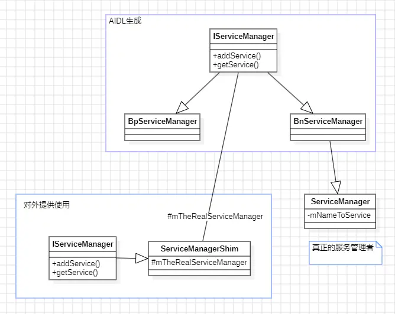

Binder是Android中非常非常重要的一个部分，它实现了进程间高效安全的通信。整个Binder系统整体上分为两个部分，一部分是Binder驱动，运行在内核中，也是跨进程的基石；一部分是Binder实体，封装了通信的逻辑，主要用来进行通信的，运行在用户空间中，提供各种服务。实体Binder中有一个特殊的存在ServiceManager，它只给服务来提供服务，用于管理服务的注册和查询。

学习Binder能够让我们对Android系统的理解更加深刻，更加清晰各个层级之间的关联。虽然在实际应用中我们几乎很难遇到裸用Binder的，但是想要在Framework上走的更深，Binder是必不可少的一环。并且实际面试中更是经常被问到，因此就算是为了应付面试，我们也应该仔细阅读Binder的实现。

## Binder的继承结构
Binder的设计独特的，它分出了两种Binder，一种是BBinder代表着服务实体，一种是BpBinder代表着服务的代理。在服务的实现中，它们继承自相同的接口并且分别实现了对应的方法。其中BBinder实现了具体的业务，而BpBinder封装了具体的跨进程调用，于是当一个进程拿到另一个进程对应的BpBinder后，就可以直接调用对应的方法，也就是通过同步调用的方式来实现跨进程的异步过程。

接下来先看下它们的继承结构：
### IBinder

```c++
//frameworks/native/include/binder/IBinder.h

class [[clang::lto_visibility_public]] IBinder : public virtual RefBase
{
public:
    IBinder();
    // 实际的交互方法
     virtual status_t  transact(uint32_t code,
                                const Parcel& data,
                                Parcel* reply,
                                uint32_t flags = 0) = 0;

     // 返回本地binder和远程binder
     virtual BBinder*        localBinder();
     virtual BpBinder*       remoteBinder();

protected:
     virtual          ~IBinder();
}
```
IBinder中定义了一些Binder的基础能力，所有的Binder都必须实现IBinder的接口，而IBinder又是继承自RefBase，因此可以使用智能指针去引用Binder。BBinder和BpBinder都是IBinder的实现类，从方法名字也能看到，他们分别代表本地Binder和远程Binder。注意这几个方法都是有着默认的空实现的。

### BBinder
```c++
// frameworks/native/libs/binder/Binder.cpp

class BBinder : public IBinder
{
public:
    BBinder();
    // 实际的交互方法
    virtual status_t transact(uint32_t code,
                              const Parcel& data,
                              Parcel* reply,
                              uint32_t flags = 0) final;

    virtual BBinder*  localBinder();
protected:
     virtual ~BBinder();
     // 收到的交互信息
     virtual status_t onTransact(uint32_t code,
                                 const Parcel& data,
                                 Parcel* reply,
                                 uint32_t flags = 0);

private:
      BBinder(const BBinder& o);
      BBinder& operator=(const BBinder& o);
};
```
BBinder是本地实体Binder，它继承自IBinder，本身又定义了一个onTranscat方法。transact方法是跨进程发送的方法，因此它是在IBinder中定义的，但是onTransact表示的是接受跨进程调用，因此它只在BBinder中有，因为它才是服务的本体，才需要处理消息事件。

```c++
// frameworks/native/libs/binder/Binder.cpp

// 本地binder重写方法，返回this本身
BBinder* BBinder::localBinder()
{
    return this;
}

// 跨进程发送的方法，因为本身就是本地Binder了，所以不需要跨进程调用，直接到onTransact中
status_t BBinder::transact(
    uint32_t code, const Parcel& data, Parcel* reply, uint32_t flags)
{
    ...
    status_t err = NO_ERROR;
    switch (code) {
        ...
        default:
            err = onTransact(code, data, reply, flags);
            break;
    }
    ...
    return err;
}

// 跨进程调用的接收方法，这里给了一些基础的实现，正常情况下在具体的服
// 务中需要再次重写这个方法，然后根据code和data调用本地的对应的方法，
status_t BBinder::onTransact(
    uint32_t code, const Parcel& data, Parcel* reply, uint32_t /*flags*/)
{
    switch (code) {
        case INTERFACE_TRANSACTION:
            reply->writeString16(getInterfaceDescriptor());
            return NO_ERROR;
        case DUMP_TRANSACTION: {
            ...
            return dump(fd, args);
        }
        case SHELL_COMMAND_TRANSACTION: {
            ...
            return NO_ERROR;
        }
        case SYSPROPS_TRANSACTION: {
            report_sysprop_change();
            return NO_ERROR;
        }
        default:
            return UNKNOWN_TRANSACTION;
    }
}
```
对于本地Binder，localBinder返回的就是它本身，而remoteBinder则是默认的返回nullptr。同样的，在transact方法中，会直接走到onTransact中。这是因为它是本地实体，当通过实体Binder的transact方法发送消息的时候，实际是不需要经过跨进程的而是直接就能获取到消息，因此不需要处理发送的细节，而是直接将请求发回给onTransact中进行处理即可。

### BpBinder
```c++
// frameworks/native/libs/binder/include/binder/BpBinder.h

class BpBinder : public IBinder
{
public:
    // 实际的交互方法
    virtual status_t transact(uint32_t code,
                              const Parcel& data,
                              Parcel* reply,
                              uint32_t flags = 0) final;

    virtual BpBinder*   remoteBinder();

private:
     static sp<BpBinder> create(int32_t handle);
     virtual             ~BpBinder();
};
```
BpBinder是远程Binder的代理类，当客户端和服务端处于不同的进程时，客户端会获取到服务端BBinder实体的引用，然后将其包装成BpBinder，通过对BpBinder方法的调用来访问具体的业务，而这些方法最终会走到transact方法中去进行具体的跨进程逻辑。这里提供了一个create的方法来构建BpBinder，参数是handle。这个handle就是远程的服务本体BBinder在当前进程中的唯一索引，是通过SerciceManager查询到的。

```c++
// frameworks/native/libs/binder/BpBinder.cpp

BpBinder* BpBinder::remoteBinder()
{
    return this;
}

// 跨进程调用的发送方法
status_t BpBinder::transact(
    uint32_t code, const Parcel& data, Parcel* reply, uint32_t flags)
{
    if (mAlive) {
        ...
        status_t status;
        if (CC_UNLIKELY(isRpcBinder())) {
            // 远程调用，可以是别的虚拟机
            status = rpcSession()->transact(sp<IBinder>::fromExisting(this), code, data, reply,flags);
        } else {
            // 交给IPCThreadState处理
            status = IPCThreadState::self()->transact(binderHandle(), code, data, reply, flags);
        }
        ...
        return status;
    }
    return DEAD_OBJECT;
}
```

BpBinder在跨进程调用的时候，将参数和命令统一转发给了IPCThread去处理的，因此，我们在具体的服务代理实现中，只需要在对应的方法中封装code和data即可，最后通过transact发送消息即可。


## ServiceManager

上面看了Binder的相关定义，大体上能看出它的设计理念：调用方拿到实体服务的handle去创建服务代理BpBinder，然后实现服务的方法，逻辑是封装code命令和data参数，最终通过transact发送。实体服务继承自BBinder，实现服务的方法并且在onTransact中解析code和data参数，然后调用自己对应的方法。

有了前面的基础我们再去看ServiceManager，前面看到调用方需要拿到实体服务的handle才能创建对应的代理服务BpBinder，这个handle就是通过ServiceManager拿到的。但是ServiceManager和调用方也不是在同一个进程，因此想要和ServiceManager交互就必须拿到ServiceManager的handle，而handle又得通过和ServiceManager交互才能拿到。想解决这个问题，只需要将ServiceManager的handle固定即可，就不需要查询了，因此它的值被固定成为0。这样所有的进程，都可以通过0的来创建ServiceManager的代理服务进而进行交互了。

```c++
// frameworks/native/cmds/servicemanager/main.cpp

int main(int argc, char** argv) {
    // binder驱动的路径
    const char* driver = argc == 2 ? argv[1] : "/dev/binder";
    // 初始化ProcessState
    sp<ProcessState> ps = ProcessState::initWithDriver(driver);
    ps->setThreadPoolMaxThreadCount(0);
    ps->setCallRestriction(ProcessState::CallRestriction::FATAL_IF_NOT_ONEWAY);
    // 构建ServiceManager对象
    sp<ServiceManager> manager = sp<ServiceManager>::make(std::make_unique<Access>());
    // 将自己也注册到Service集合中
    if (!manager->addService("manager", manager, false /*allowIsolated*/, IServiceManager::DUMP_FLAG_PRIORITY_DEFAULT).isOk()) {
        LOG(ERROR) << "Could not self register servicemanager";
    }
    // 将自己设置为管理服务
    IPCThreadState::self()->setTheContextObject(manager);
    ps->becomeContextManager();

    // 启用looper机制
    sp<Looper> looper = Looper::prepare(false /*allowNonCallbacks*/);
    // 注册eventfd，当唤醒后处理对应的消息。这里实际注册的是驱动的fd
    BinderCallback::setupTo(looper);
    ClientCallbackCallback::setupTo(looper, manager);
    // 开始循环进入阻塞，驱动有消息时才会通过epoll唤醒
    while(true) {
        looper->pollAll(-1);
    }
    return EXIT_FAILURE;
}
```

开机时ServiceManager就会启动，它的启动逻辑就是上述逻辑。概述下来就是创建ServiceManager对象，然后注册到自身中，然后将自己设置为binder的管理者，然后开始进入阻塞等待Binder驱动的epoll唤醒，唤醒后再去处理相关的业务。

下面具体看下实现的细节，首先是ProcessState，它的定义在frameworks/native/libs/binder/include/binder/ProcessState.h，这里只是定义了它的一些方法，没什么可看的，直接看它的逻辑部分：

```c++
// frameworks/native/libs/binder/ProcessState.cpp

sp<ProcessState> ProcessState::initWithDriver(const char* driver)
{
    return init(driver, true /*requireDefault*/);
}

// 创建ProcessState，通过静态变量实现进程唯一单例
[[clang::no_destroy]] static sp<ProcessState> gProcess;
[[clang::no_destroy]] static std::mutex gProcessMutex;
sp<ProcessState> ProcessState::init(const char *driver, bool requireDefault)
{
    [[clang::no_destroy]] static std::once_flag gProcessOnce;
    std::call_once(gProcessOnce, [&](){
        ...
        std::lock_guard<std::mutex> l(gProcessMutex);
        gProcess = sp<ProcessState>::make(driver);
    });
    ...
    verifyNotForked(gProcess->mForked);
    return gProcess;
}
```

也就是在initWithDriver的时候，会通过智能指针的sp::make创建ProcessState对象，并且这个对象是进程中的唯一单例对象。这里的make实际上就是调用了它的new方法创建的，所以直接看构造方法即可。

```c++
ProcessState::ProcessState(const char* driver)
      : mDriverName(String8(driver)),// 驱动的名字 /dev/binder
        mDriverFD(-1),// 驱动的fd
        mVMStart(MAP_FAILED), // 映射内存的起始位置
        mThreadCountLock(PTHREAD_MUTEX_INITIALIZER),
        mThreadCountDecrement(PTHREAD_COND_INITIALIZER),
        mExecutingThreadsCount(0),
        mWaitingForThreads(0),
        mMaxThreads(DEFAULT_MAX_BINDER_THREADS),// 最大的线程数：15
        mStarvationStartTimeMs(0),
        mForked(false),
        mThreadPoolStarted(false),
        mThreadPoolSeq(1),
        mCallRestriction(CallRestriction::NONE) {
    // 打开驱动
    base::Result<int> opened = open_driver(driver);

    if (opened.ok()) {
        // 进行内存映射，将当前进程中的一部分内存与内核的内存进行映射，大小为1M-2*page
        mVMStart = mmap(nullptr, BINDER_VM_SIZE, PROT_READ, MAP_PRIVATE | MAP_NORESERVE,
                        opened.value(), 0);
    }
// 记录驱动的fd
    if (opened.ok()) {
        mDriverFD = opened.value();
    }
}

static base::Result<int> open_driver(const char* driver) {
    // 打开驱动
    int fd = open(driver, O_RDWR | O_CLOEXEC);
    // 查询binder的版本
    int vers = 0;
    status_t result = ioctl(fd, BINDER_VERSION, &vers);
    // 设置最大的线程数：默认是15
    size_t maxThreads = DEFAULT_MAX_BINDER_THREADS;
    result = ioctl(fd, BINDER_SET_MAX_THREADS, &maxThreads);
    // 是否允许单向的binder垃圾检测
    uint32_t enable = DEFAULT_ENABLE_ONEWAY_SPAM_DETECTION;
    result = ioctl(fd, BINDER_ENABLE_ONEWAY_SPAM_DETECTION, &enable);
    return fd;
}
```

在ProcessState的构造方法中，对驱动做了一些基础的设置，如线程数、内存映射等操作。总的来说就是ProcessState是进程内单例的，用于和binder驱动建立连接的一个对象。它是通用的，因此在构造方法中就直接打开驱动并做了一些通用的设置，如设置最大线程数。继续回到启动ServiceManager的main方法中，在initWithDriver后，又重新设置了最大线程数为0：ps->setThreadPoolMaxThreadCount(0)，也就是说ServiceManager中线程池的个数为0，即当前进程只会存在一个默认的主线程。

这里我们先不去看驱动的具体实现过程，而是把驱动作为一个黑盒来理解。我们只需要知道可以通过open打开驱动，通过ioctl进行设置和交互，至于具体实现后续再仔细研读。接下来继续回到main方法中，然后看ServiceManager的构造：

```c++
// frameworks/native/cmds/servicemanager/ServiceManager.h

class ServiceManager : public os::BnServiceManager, public IBinder::DeathRecipient {
public:
    ServiceManager(std::unique_ptr<Access>&& access);
    ~ServiceManager();

    binder::Status getService(const std::string& name, sp<IBinder>* outBinder) override;
    binder::Status checkService(const std::string& name, sp<IBinder>* outBinder) override;
    binder::Status addService(const std::string& name, const sp<IBinder>& binder,
                              bool allowIsolated, int32_t dumpPriority) override;
    binder::Status listServices(int32_t dumpPriority, std::vector<std::string>* outList) override;
    ...
private:
    struct Service {
        sp<IBinder> binder; // not null
        ...
    };
    using ServiceMap = std::map<std::string, Service>;
    ServiceMap mNameToService;
    ...
};
```

ServiceManager是为了成为binder服务的管理者，它所相关的方法都是由用户查询和添加服务的，它有一个私有属性ServiceMap，用于存储注册的服务。可以看到它是继承自BnServiceManager的，这是AIDL生成的类，通常情况下我们使用AIDL都是在Java层中使用的，可以省下很多跨进程逻辑的编码。而在C++层也是可以使用AIDL的，它会生成对应的BnServiceManager和BpServiceManager，我们的本地实体服务继承自BnServiceManager，然后实现对应的逻辑。然后BpServiceManager中的逻辑是跨进程交互的逻辑，由AIDL直接生成，后面我们再看它生成的类。文件目录在：frameworks/native/libs/binder/aidl/android/os/IServiceManager.aidl

然后继续看构造方法和添加服务的方法：

```c++
// frameworks/native/cmds/servicemanager/ServiceManager.cpp

ServiceManager::ServiceManager(std::unique_ptr<Access>&& access) : mAccess(std::move(access)) {
}

Status ServiceManager::addService(const std::string& name, const sp<IBinder>& binder, bool allowIsolated, int32_t dumpPriority) {
    ...
    // 添加到ServiceMap中
    mNameToService[name] = Service {
        .binder = binder,
        .allowIsolated = allowIsolated,
        .dumpPriority = dumpPriority,
        .debugPid = ctx.debugPid,
    };
    ...
    return Status::ok();
}
```

这里仅是将自身添加到ServiceMap中存储下来，逻辑比较简单，因为这里也没有发生跨进程的调用，都是发生在ServiceManager的进程中的。添加服务后，它还会注册自己成为服务管理者，`IPCThreadState::self()->setTheContextObject(manager)`。

```c++
// frameworks/native/libs/binder/IPCThreadState.cpp

// 创建线程中单例对象
IPCThreadState* IPCThreadState::self()
{
    if (gHaveTLS.load(std::memory_order_acquire)) {
restart:
        const pthread_key_t k = gTLS;
        // 从线程局部变量中读取，读不到则直接创建。在构造方法中会存入到线程局部变量中
        // 下次就可以直接获取到了
        IPCThreadState* st = (IPCThreadState*)pthread_getspecific(k);
        if (st) return st;
        return new IPCThreadState;
    }
    ...
    goto restart;
}

IPCThreadState::IPCThreadState()
      : mProcess(ProcessState::self()),// 获取到ProcessState
        mServingStackPointer(nullptr),
        mServingStackPointerGuard(nullptr),
        mWorkSource(kUnsetWorkSource),
        mPropagateWorkSource(false),
        mIsLooper(false),
        mIsFlushing(false),
        mStrictModePolicy(0),
        mLastTransactionBinderFlags(0),
        mCallRestriction(mProcess->mCallRestriction) {
    pthread_setspecific(gTLS, this);// 将自己存入到线程局部变量中
    clearCaller();
    mIn.setDataCapacity(256);// 从binder驱动读取的容量
    mOut.setDataCapacity(256); // 向binder驱动写入的容量
}

void IPCThreadState::setTheContextObject(const sp<BBinder>& obj)
{
    the_context_object = obj;
}
```

对于ProcessState，它是进程单例；对于IPCThreadState，它是线程单例。但是由于ServiceManager的线程池设置的为0，因此它们两个实际上都可以算是进程内单例的。然后IPCThreadState#setTheContextObject将自己设置为了服务管理者，对于其他进程的IPCThreadState，他们的the_context_obj实际上是空，所以当它们想获取ServiceManager的时候，就会通过handle为0的句柄去创建BpServiceManager。
最后一步是将自己注册到binder驱动中，因为它的handle是固定的，因此不需要将binder实体传入到驱动中，直接通过命令注册即可。

```c++
// frameworks/native/libs/binder/ProcessState.cpp

bool ProcessState::becomeContextManager()
{
    flat_binder_object obj {
        .flags = FLAT_BINDER_FLAG_TXN_SECURITY_CTX,
    };
    // 新的注册指令
    int result = ioctl(mDriverFD, BINDER_SET_CONTEXT_MGR_EXT, &obj);
   
    if (result != 0) {
        int unused = 0;
        // 老的注册指令
        result = ioctl(mDriverFD, BINDER_SET_CONTEXT_MGR, &unused);
    }
    return result == 0;
}
```

到这里ServiceManager的启动流程基本上已经完成了，首先就是通过ProcessState的初始化来打开binder驱动并建立内存映射，然后初始化IPCThreadState用于准备与驱动进行数据交互。最后就是启用looper循环了，然后将驱动的fd添加到epoll中监听binder的变化。可以查看[native looper](https://pgaofeng.github.io/2022/03/07/handler/#Native%E5%B1%82%E6%BA%90%E7%A0%81)的实现细节，也可以查看[epoll机制](https://pgaofeng.github.io/2022/02/23/eventfd-epoll/)的机制的实现。

在启动looper循环之前，注册了一个BinderCallback：

```c++
// frameworks/native/cmds/servicemanager/main.cpp

class BinderCallback : public LooperCallback {
public:
    static sp<BinderCallback> setupTo(const sp<Looper>& looper) {
        sp<BinderCallback> cb = sp<BinderCallback>::make();

        int binder_fd = -1;
        // 告知驱动自己进入了looper循环
        IPCThreadState::self()->setupPolling(&binder_fd);
        // 将驱动的fd添加到looper监听中
        int ret = looper->addFd(binder_fd,
                                Looper::POLL_CALLBACK,
                                Looper::EVENT_INPUT,
                                cb,
                                nullptr /*data*/);
        return cb;
    }

    // 当驱动发生了变化后，会走到这里来
    int handleEvent(int /* fd */, int /* events */, void* /* data */) override {
        // 最终交给IPCThreadState处理消息
        IPCThreadState::self()->handlePolledCommands();
        return 1;
    }
};

int main(int argc, char** argv) {
    ...
    // 进入循环前，将驱动fd添加到looper中，然后回调转发到IPCThreadState中处理
    BinderCallback::setupTo(looper);
    ...
}
```

在进入looper循环时，将驱动的fd添加到了looper中，这样每次驱动发生变化后，就会通知到ServiceManager，然后由ServiceManager的IPCThreadState去处理消息。同时还会通知到驱动自己已经进入到looper循环了。

```c++
// frameworks/native/libs/binder/IPCThreadState.cpp

status_t IPCThreadState::setupPolling(int* fd)
{
    // 写入BC_ENTER_LOOPER命令，然后刷新
    mOut.writeInt32(BC_ENTER_LOOPER);
    flushCommands();
    *fd = mProcess->mDriverFD;
    return 0;
}

void IPCThreadState::flushCommands()
{
    // 与驱动进行交互
    talkWithDriver(false);
    // 如果还有待写入的内容，再次与驱动进行交互
    if (mOut.dataSize() > 0) {
        talkWithDriver(false);
    }
}
```

在通知到驱动自己进入循环的过程，实际上就是与驱动进行的一个交互。先向mOut写入数据，然后再往驱动中进行写入，在前面看IPCThreadState的时候我们知道它有两个私有属性mIn和mOut。其中mIn用于读取驱动发送来的数据，而mOut用来写入即将向驱动写入的数据。最终在talkWithDriver中完成实际的写入和读取：

```c++
// frameworks/native/libs/binder/IPCThreadState.cpp

status_t IPCThreadState::talkWithDriver(bool doReceive)
{
    // 向驱动写入的数据的结构体
    binder_write_read bwr;

    // mIn中的数据是否是空的
    const bool needRead = mIn.dataPosition() >= mIn.dataSize();
    // 如果doReceive为false说明不是接收，而是发送，因此记录mOut的数据大小
    const size_t outAvail = (!doReceive || needRead) ? mOut.dataSize() : 0;
    // 设置写入的大小和缓存指针
    bwr.write_size = outAvail;
    bwr.write_buffer = (uintptr_t)mOut.data();

    // 如果需要读取，则设置读取的容量和存储的指针
    if (doReceive && needRead) {
        bwr.read_size = mIn.dataCapacity();
        bwr.read_buffer = (uintptr_t)mIn.data();
    } else {
        bwr.read_size = 0;
        bwr.read_buffer = 0;
    }

    // 没有可读和可写的内容
    if ((bwr.write_size == 0) && (bwr.read_size == 0)) return NO_ERROR;

    bwr.write_consumed = 0;
    bwr.read_consumed = 0;
    status_t err;
    do {
        // 通过ioctl将结构体写入到驱动中
        if (ioctl(mProcess->mDriverFD, BINDER_WRITE_READ, &bwr) >= 0)
            err = NO_ERROR;
        else
            err = -errno;
    } while (err == -EINTR);

    // 写入成功之后
    if (err >= NO_ERROR) {
        if (bwr.write_consumed > 0) {
            if (bwr.write_consumed < mOut.dataSize())
                // 驱动没有将mOut中的数据读完
            else {
                // 驱动读完了mOut的数据
                mOut.setDataSize(0);
                processPostWriteDerefs();
            }
        }
        // 驱动有往bwr写入内容，或者上次的内容还没读取完
        if (bwr.read_consumed > 0) {
            mIn.setDataSize(bwr.read_consumed);
            mIn.setDataPosition(0);
        }
        return NO_ERROR;
    }
    return err;
}
```

talkWithDriver如其名字一样，与驱动进行交互。这个方法可以看到它不仅向驱动写入内容，也从驱动读取内容。当有内容需要写入到驱动的时候，先往mOut中写入，然后调用talkWithDriver写入到驱动中。如果想从驱动读取数据，需要先将mIn清空，然后调用talkWithDriver，然后就可以从mIn中读取到驱动写入的内容了。

然后看looper的回调，正常当向驱动发送数据后，驱动处理完之后会通知到epoll唤醒进程，进而回到looper中注册的回调，然后再走到IPCThreadState中处理：

```c++
// frameworks/native/libs/binder/IPCThreadState.cpp

status_t IPCThreadState::handlePolledCommands()
{
    status_t result;
    do {
        // 获取并处理命令
        result = getAndExecuteCommand();
    // 命令处理完之后这里会是false，就会跳出循环了
    } while (mIn.dataPosition() < mIn.dataSize());
    // 再次talkWithDriver，查看是否有需要交互的
    flushCommands();
    return result;
}

status_t IPCThreadState::getAndExecuteCommand()
{
    status_t result;
    int32_t cmd;
    // 与驱动交互，此时驱动正常会向mIn中写入数据
    result = talkWithDriver();
    if (result >= NO_ERROR) {
        // 读取交互的命令
        cmd = mIn.readInt32();
        // 处理命令
        result = executeCommand(cmd);
        ...
    }
    return result;
}
```

重新整理下交互逻辑：ServiceManager实例化之后，将自己设置成为服务管理者，并通知到驱动。ProcessState负责打开驱动建立映射，IPCThreadState负责向驱动发送和读取数据。首先向mOut写入数据，然后talkWithDriver将数据发送给驱动，然后驱动读取数据并处理后通过epoll机制回调到looper进而再次走到IPCThreadState，然后再次talkWithDriver让驱动把数据写入到mIn中，然后在executeCommand方法中处理mIn中的数据。

到这里ServiceManager的启动逻辑基本上已经清楚了，与驱动交互的逻辑也基本上已经清楚了，这里我们没是将驱动作为黑盒看待的，具体的逻辑以及命令交互的过程都是没仔细看的，这个在后面讲驱动的时候再看了。

## IServiceManager

前面我们看到的ServiceManager都是定义在frameworks/native/cmds/servicemanager下的，然后继承的BnServiceManager是aidl生成的。实际上，在Android10及以前，ServiceManager是用c语言实现的，没有类的概念也就没有ServiceManager，所有的逻辑都是由C的结构体实现的。
其他模块基本上都是用的C++，因此为了提供方法给其他模块调用，在frameworks/native/libs/binder/include/binder下定义了IServiceManager.h，并且在frameworks/native/libs/binder/目录下定义了IServiceManager.cpp实现了BpServiceManager类。

到了Android11以后，ServiceManager弃用了原来的C语言实现，和普通的服务一样使用更加通用的AIDL方式实现，声明文件在：frameworks/native/libs/binder/aidl/android/os/IServiceManager.aidl

编译后生成的文件在：out/soong/.intermediates/frameworks/native/libs/binder/libbinder/android_x86_64_shared/gen/aidl/android/os目录下。一共是四个文件：
- IServiceManager.h：根据IServiceManager.aidl生成的接口
- IServiceManager.cpp：实现了BpServiceManager类的方法，通过Parcel中添加参数标记自己要调用的方法以及参数；实现了BnServiceManager中的onTransact方法，解析Parcel中的方法和参数，然后调用到自己本地的方法，然后将返回值再塞进Parcel中返回。
- BnServiceManager.h：代表着实体服务
- BpServiceManager.h：代表着远程代理服务

通过AIDL实现的ServiceManager更加易于阅读，同时也更容易管理，整个逻辑和Java层的AIDL也是一致的。但是，原本的IServiceManager怎么办？不能废弃了吧，因为很多的地方都在使用IServiceManager，如果直接废弃了而使用AIDL生成的新的IServiceManager改动起来就太多了。因此为了兼容，对老的IServiceManager进行改造，让它的内部持有一个新的ServiceManager，原来的方法都由新的SM来进行处理，这样就不需要改动到别的地方了。

```c++
// frameworks/native/libs/binder/include/binder/IServiceManager.h

namespace android {

// 方法基本上与AIDL的IServiceManager一致，但是返回值有一些差异，使用了智能指针包裹
class IServiceManager : public IInterface
{
public:
    virtual const String16& getInterfaceDescriptor() const;
    IServiceManager();
    virtual ~IServiceManager();
    virtual sp<IBinder>         getService( const String16& name) const = 0;
    virtual sp<IBinder>         checkService( const String16& name) const = 0;
    virtual status_t addService(const String16& name, const sp<IBinder>& service,
                                bool allowIsolated = false,
                                int dumpsysFlags = DUMP_FLAG_PRIORITY_DEFAULT) = 0;   
    virtual Vector<String16> listServices(int dumpsysFlags = DUMP_FLAG_PRIORITY_ALL) = 0;
};

// 在android命名空间中定义了一个获取默认ServiceManager的方法
sp<IServiceManager> defaultServiceManager();
}
```

原本的IServiceManager和AIDL生成的类的方法基本上是一样的，但是方法的返回值可能会有一些差异，不过差异不大。另外，在IServiceManager.h中，在android的命名空间中增加了一个defaultServiceManager，用于获取到ServiceManager。

```c++
// 给AIDL的IServiceManager起了个别名AidlServiceManager
using AidlServiceManager = android::os::IServiceManager;


const String16& IServiceManager::getInterfaceDescriptor() const {
    return AidlServiceManager::descriptor;
}
IServiceManager::IServiceManager() {}
IServiceManager::~IServiceManager() {}

// 老的ServiceManager的实现
class ServiceManagerShim : public IServiceManager
{
public:
    // 构造方法中传入AIDL的实现
    explicit ServiceManagerShim (const sp<AidlServiceManager>& impl);

    sp<IBinder> getService(const String16& name) const override;
    sp<IBinder> checkService(const String16& name) const override;
    status_t addService(const String16& name, const sp<IBinder>& service,
                        bool allowIsolated, int dumpsysPriority) override;
    Vector<String16> listServices(int dumpsysPriority) override;

protected:
    // 真实的IServiceManager，也就是AIDL的实现
    sp<AidlServiceManager> mTheRealServiceManager;
};

// -----------------------------------------------
// 获取默认的ServiceManager，然后存入到静态变量中
[[clang::no_destroy]] static std::once_flag gSmOnce;
[[clang::no_destroy]] static sp<IServiceManager> gDefaultServiceManager;

sp<IServiceManager> defaultServiceManager()
{
    std::call_once(gSmOnce, []() {
        sp<AidlServiceManager> sm = nullptr;
        while (sm == nullptr) {
            // 通过ProcessState.getContextObject获取到ServiceManager
            sm = interface_cast<AidlServiceManager>(ProcessState::self()->getContextObject(nullptr));
            if (sm == nullptr) {
                sleep(1);
            }
        }
        // 构造IServiceManager，并传入AIDL的ServiceManager实现
        gDefaultServiceManager = sp<ServiceManagerShim>::make(sm);
    });
    return gDefaultServiceManager;
}
// ----------------------------------------------------------------------

ServiceManagerShim::ServiceManagerShim(const sp<AidlServiceManager>& impl)
: mTheRealServiceManager(impl)
{}

sp<IBinder> ServiceManagerShim::getService(const String16& name) const
{
    // 从AIDL实现的ServiceManager中查询服务
    sp<IBinder> svc = checkService(name);
    if (svc != nullptr) return svc;
    // 未查询到，则循环5次，每秒查询一次
    int n = 0;
    while (uptimeMillis() - startTime < timeout) {
        n++;
        usleep(1000*sleepTime);

        sp<IBinder> svc = checkService(name);
        if (svc != nullptr) {
            return svc;
        }
    }
    return nullptr;
}

// 从AIDL实现的ServiceManager中查询服务
sp<IBinder> ServiceManagerShim::checkService(const String16& name) const
{
    sp<IBinder> ret;
    if (!mTheRealServiceManager->checkService(String8(name).c_str(), &ret).isOk()) {
        return nullptr;
    }
    return ret;
}

// 通过AIDL实现的ServiceManager添加服务
status_t ServiceManagerShim::addService(const String16& name, const sp<IBinder>& service,
                                        bool allowIsolated, int dumpsysPriority)
{
    Status status = mTheRealServiceManager->addService(
        String8(name).c_str(), service, allowIsolated, dumpsysPriority);
    return status.exceptionCode();
}

// 通过AIDL实现的ServiceManager列出所有服务，并将数组转换成集合
Vector<String16> ServiceManagerShim::listServices(int dumpsysPriority)
{
    std::vector<std::string> ret;
    if (!mTheRealServiceManager->listServices(dumpsysPriority, &ret).isOk()) {
        return {};
    }

    Vector<String16> res;
    res.setCapacity(ret.size());
    for (const std::string& name : ret) {
        res.push(String16(name.c_str()));
    }
    return res;
}
```

IServiceManager的实现类实际是ServiceManagerShim，它只是个包装类，实际的方法实现仍然是由AIDL的ServiceManager实现的，它只是起到包装的作用，并且修改了方法返回值等，以适配原本的IServiceManager。同时，它还额外添加了一个方法defaultServiceManager来获取默认的AIDL的ServiceManager，该方法返回的值仍然是进程单例的，在当前进程中只会存在一个ServiceManager。该方法实际是获取到ServiceManager的IBinder对象，然后转成IServiceManager的。

```c++
// frameworks/native/libs/binder/ProcessState.cpp

sp<IBinder> ProcessState::getContextObject(const sp<IBinder>& /*caller*/)
{
    // handle传的值为0，也就是ServiceManager的默认handle
    sp<IBinder> context = getStrongProxyForHandle(0);
    return context;
}

// 根据handle从已注册的服务中查找
sp<IBinder> ProcessState::getStrongProxyForHandle(int32_t handle)
{
    sp<IBinder> result;
    // handle为0，并且the_context_object不为空，说明当前进程
    // 是ServiceManager的进程，因此直接返回实体binder
    if (handle == 0 && the_context_object != nullptr)
        return the_context_object;

    // 如果handle对应的没有handle_entry就创建一个返回
    handle_entry* e = lookupHandleLocked(handle);

    if (e != nullptr) {
        IBinder* b = e->binder;
        // 新创建的entry是没有binder的
        if (b == nullptr || !e->refs->attemptIncWeak(this)) {
            if (handle == 0) {
                // handle为0，说明创建的是ServiceManager
                IPCThreadState* ipc = IPCThreadState::self();
                // 需要检测ServiceManager是否是可用的
                Parcel data;
                status_t status = ipc->transact(
                        0, IBinder::PING_TRANSACTION, data, nullptr, 0);
                if (status == DEAD_OBJECT)
                   return nullptr;
            }
            // 创建BpBinder返回
            sp<BpBinder> b = BpBinder::PrivateAccessor::create(handle);
            e->binder = b.get();
            if (b) e->refs = b->getWeakRefs();
            result = b;
        } else {
            result.force_set(b);
            e->refs->decWeak(this);
        }
    }
    return result;
}
```
getContextObject获取ServiceManager，如果是同一个进程则直接能拿到实体Binder，如果不是同一个进程则创建handle为0的BpBinder，反正最终结果是能拿到一个IBinder，然后再将其转换成IServiceManager就可以了，至于这个IServiceManager是实体服务还是远程代理服务都无所谓啦。



## IServiceManager.aidl

一般来说，我们注册服务肯定是获取到IServiceManager，然后通过addService方法进行注册。经过前面的分析我们知道IServiceManager实际上是包装了AIDL的IServiceManager，因此我们可以看看AIDL生成的代码逻辑是怎么样的。注意，AOSP中只有IServiceManager.aidl文件的，想看实现的话必须将源码下载下来进行编译，编译之后才会有我们想要的:

```c++
// out/soong/.intermediates/frameworks/native/libs/binder/libbinder/
// android_x86_64_shared/gen/aidl/android/os/IServiceManager.cpp

::android::binder::Status BpServiceManager::addService(const ::std::string& name, const ::android::sp<::android::IBinder>& service, bool allowIsolated, int32_t dumpPriority) {
  ::android::Parcel _aidl_data;
  _aidl_data.markForBinder(remoteStrong());
  ::android::Parcel _aidl_reply;
  ::android::status_t _aidl_ret_status = ::android::OK;
  ::android::binder::Status _aidl_status;
    // 向parcel中写入要传递的数据
  _aidl_ret_status = _aidl_data.writeInterfaceToken(getInterfaceDescriptor());
  _aidl_ret_status = _aidl_data.writeUtf8AsUtf16(name);
  _aidl_ret_status = _aidl_data.writeStrongBinder(service);
  _aidl_ret_status = _aidl_data.writeBool(allowIsolated);
  _aidl_ret_status = _aidl_data.writeInt32(dumpPriority);
  // 跨进程调用方法
  _aidl_ret_status = remote()->transact(BnServiceManager::TRANSACTION_addService, _aidl_data, &_aidl_reply, 0);
  // 检查远程的ServiceManager的回复是否是OK
  _aidl_ret_status = _aidl_status.readFromParcel(_aidl_reply);
  return _aidl_status;
}
```

首先是往Parcel中写入数据，如服务的名字，服务的本体等。然后通过remote().transact方法进行跨进程的调用，其中remote()方法是定义在BpRefBase中的，它的返回值是IBinder*。而我们获取的IServiceManager的实际类型是BpServiceManager，它是继承自BpInterface，又继承自BpRefBase。因此我们实际是调用到了BpBinder.transact中了。

```c++
// frameworks/native/libs/binder/include/binder/Binder.h

class BpRefBase : public virtual RefBase
{
protected:
    explicit                BpRefBase(const sp<IBinder>& o);
    virtual                 ~BpRefBase();
    virtual void            onFirstRef();
    virtual void            onLastStrongRef(const void* id);
    virtual bool            onIncStrongAttempted(uint32_t flags, const void* id);
    // 获取到远程Binder
    inline IBinder* remote() const { return mRemote; }
    // 使用强引用来访问远程Binder
    inline sp<IBinder> remoteStrong() const { return sp<IBinder>::fromExisting(mRemote); }

private:
                            BpRefBase(const BpRefBase& o);
    BpRefBase&              operator=(const BpRefBase& o);

    IBinder* const          mRemote;
    RefBase::weakref_type*  mRefs;
    std::atomic<int32_t>    mState;
};
```

在前面我们看过BpBinder的源码，它的transact实现实际是调用IPCThreadState的transact方法，所以只要是跨进程的逻辑，最终都是走到了IPCThreadState中。

```c++
// frameworks/native/libs/binder/IPCThreadState.cpp

status_t IPCThreadState::transact(int32_t handle,
                                  uint32_t code, const Parcel& data,
                                  Parcel* reply, uint32_t flags)
{
    status_t err;
    // 写入要传输的数据
    err = writeTransactionData(BC_TRANSACTION, flags, handle, code, data, nullptr);
   
    if ((flags & TF_ONE_WAY) == 0) {
        // 非单向消息，需要等待回复
        if (reply) {
            // 等待回复
            err = waitForResponse(reply);
        } else {
            // reply为空，需要构建一个新的Parcel来接收回复
            Parcel fakeReply;
            err = waitForResponse(&fakeReply);
        }
    } else {
        // 单向消息不需要回复
        err = waitForResponse(nullptr, nullptr);
    }
    return err;
}

status_t IPCThreadState::writeTransactionData(int32_t cmd, uint32_t binderFlags,
    int32_t handle, uint32_t code, const Parcel& data, status_t* statusBuffer)
{
    binder_transaction_data tr;
    ..
    // 将参数写入到tr中之后，再将命令和数据写入到mOut中
    mOut.writeInt32(cmd);
    mOut.write(&tr, sizeof(tr));

    return NO_ERROR;
}
```

接下来就进入到驱动了，驱动中会进行一系列的处理，这里也暂时先不去看。反正最后就会走到实体服务BnServiceManager的onTransact方法中：

```c++
// out/soong/.intermediates/frameworks/native/libs/binder/libbinder/
// android_x86_64_shared/gen/aidl/android/os/IServiceManager.cpp

::android::status_t BnServiceManager::onTransact(uint32_t _aidl_code, const ::android::Parcel& _aidl_data, ::android::Parcel* _aidl_reply, uint32_t _aidl_flags) {
  switch (_aidl_code) {
  ...
  case BnServiceManager::TRANSACTION_addService:
  {
    ...
    // 读取客户端传递过来的消息
    _aidl_ret_status = _aidl_data.readUtf8FromUtf16(&in_name);
    _aidl_ret_status = _aidl_data.readStrongBinder(&in_service);
    _aidl_ret_status = _aidl_data.readBool(&in_allowIsolated);
    _aidl_ret_status = _aidl_data.readInt32(&in_dumpPriority);
    // 最终是走到了本地的addService添加服务
    ::android::binder::Status _aidl_status(addService(in_name, in_service, in_allowIsolated, in_dumpPriority));
    _aidl_ret_status = _aidl_status.writeToParcel(_aidl_reply);
  }
  ...
  }
  return _aidl_ret_status;
}
```

最终是走到ServiceManager实体的addService方法来将服务添加到集合中，addService我们前面看到，就是将binder添加到它的ServiceMap中。同样的，查找服务的时候也是向上面的流程一样，BpServiceManager将所需要的数据写入到Parcel中，然后经由驱动中转，最终到达BnServiceManager中的onTransact：

```c++
// out/soong/.intermediates/frameworks/native/libs/binder/libbinder/
// android_x86_64_shared/gen/aidl/android/os/IServiceManager.cpp

::android::status_t BnServiceManager::onTransact(uint32_t _aidl_code, const ::android::Parcel& _aidl_data, ::android::Parcel* _aidl_reply, uint32_t _aidl_flags) {
  switch (_aidl_code) {
  ...
  case BnServiceManager::TRANSACTION_getService:
  {
    // 读取要查找的服务的名字
    _aidl_ret_status = _aidl_data.readUtf8FromUtf16(&in_name);
    // 查找服务
    ::android::binder::Status _aidl_status(getService(in_name, &_aidl_return));
    // 写入到reply中，然后客户端就可以拿到IBinder了
    _aidl_ret_status = _aidl_status.writeToParcel(_aidl_reply);
    _aidl_ret_status = _aidl_reply->writeStrongBinder(_aidl_return);
  }
  ...
  }
  return _aidl_ret_status;
}
```

最终走到ServiceManager实体的getService方法中：

```c++
// frameworks/native/cmds/servicemanager/ServiceManager.cpp

Status ServiceManager::getService(const std::string& name, sp<IBinder>* outBinder) {
    *outBinder = tryGetService(name, true);
    return Status::ok();
}

Status ServiceManager::checkService(const std::string& name, sp<IBinder>* outBinder) {
    *outBinder = tryGetService(name, false);
    return Status::ok();
}

sp<IBinder> ServiceManager::tryGetService(const std::string& name, bool startIfNotFound) {
    sp<IBinder> out;
    Service* service = nullptr;
    // 从注册的ServiceMap中根据名字查询
    if (auto it = mNameToService.find(name); it != mNameToService.end()) {
        service = &(it->second);
        out = service->binder;
    }
    return out;
}
```
注册服务和查找服务，都是一个跨进程的调用。我们看到在生成的AIDL代码中，在BpServiceManager中会自动将跨进程的方法包装成对应的code和data，然后进行快进程调用。而在BnServiceManager中会自动将数据进行解包判断，然后调用自身的方法，最终实现了跨进程的方法调用。

## IInterface

至此，我们已经知道了Binder是什么了。它就是一个服务，一个可以跨越进程交互的服务。Binder的设计可以让我们以同步的方式实现跨进程的调用，它封装了具体的细节，让我们在使用的地方完全看不出来它是一个跨进程的调用。

那么服务又是什么呢？服务指的是注册在ServiceManager中的服务，可以说服务就是Binder。在前面我们看defaultServiceManager的时候，它是先获取到ServiceManager的BpBinder，然后通过`interface_cast<AidlServiceManager>`转成的BpServiceManager。如果获取的是BBinder的话，转换的结果就是BnServiceManager。这里之所以转换，就是因为IInterface。

```c++
// frameworks/native/libs/binder/include/binder/IInterface.h

// 基础接口，服务都需要继承自IInterface
class IInterface : public virtual RefBase
{
public:
    IInterface();
    // 将IInterface转换成IBinder
    static sp<IBinder>  asBinder(const IInterface*);
    static sp<IBinder>  asBinder(const sp<IInterface>&);

protected:
    virtual                     ~IInterface();
    virtual IBinder*            onAsBinder() = 0;
};

// 服务本体需要继承自BnInterface
template<typename INTERFACE>
class BnInterface : public INTERFACE, public BBinder
{
public:
    // 获取到本地的服务
    virtual sp<IInterface>      queryLocalInterface(const String16& _descriptor);
    // 获取服务的描述符，用于进行区分服务
    virtual const String16&     getInterfaceDescriptor() const;

protected:
    typedef INTERFACE           BaseInterface;
    virtual IBinder*            onAsBinder();
};

// 远程服务代理需要继承自BpInterface
template<typename INTERFACE>
class BpInterface : public INTERFACE, public BpRefBase
{
public:
    explicit                    BpInterface(const sp<IBinder>& remote);

protected:
    typedef INTERFACE           BaseInterface;
    virtual IBinder*            onAsBinder();
};
```


在前面我们获取到ServiceManager的IBinder后，就通过interface_cast转换成对应的ServiceManager了。因为BnServiceManager是继承自BBinder的，所以可以直接强转，而BpServiceManager与IBinder并没有直接的继承关系，因此是无法直接强转的。也就是说，interface_cast肯定肯定不是简单的强转，而是有一定的逻辑在其中。

```c++
// frameworks/native/libs/binder/include/binder/IInterface.h

template<typename INTERFACE>
inline sp<INTERFACE> interface_cast(const sp<IBinder>& obj)
{
    return INTERFACE::asInterface(obj);
}
```

其中interface_cast是定义在IInterface文件中的一个模板类方法，它的实现方法实际上是调用它指向的对象的asInterface方法，但是我们翻遍了所有的类和它的父类，都没有发现asInterface在哪定义的。再仔细看看实际是在IInterface中的一个宏中定义的：

```c++
// frameworks/native/libs/binder/include/binder/IInterface.h

#define DECLARE_META_INTERFACE(INTERFACE)                                                         \
public:                                                                                           \
    // descriptor实际是用来标识当前Service的
    static const ::android::String16 descriptor;                                                  \
    // 根据IBinder，转换成对应的Service
    static ::android::sp<I##INTERFACE> asInterface(const ::android::sp<::android::IBinder>& obj); \
    virtual const ::android::String16& getInterfaceDescriptor() const;                            \
    I##INTERFACE();                                                                               \
    virtual ~I##INTERFACE();                                                                      \
    // 设置默认实现，不重要
    static bool setDefaultImpl(::android::sp<I##INTERFACE> impl);                                 \
    static const ::android::sp<I##INTERFACE>& getDefaultImpl();                                   \
                                                                                                  \
private:                                                                                          \
    static ::android::sp<I##INTERFACE> default_impl;                                              \
                                                                                                  \
public:
```

它定义了一个descriptor属性以及一些方法，asInterface就是其中之一。同样的，它的实现部分也是在宏中定义的：

```c++
// 我们应该使用这个宏来实现对应的方法
#define IMPLEMENT_META_INTERFACE(INTERFACE, NAME)                       \
    DO_NOT_DIRECTLY_USE_ME_IMPLEMENT_META_INTERFACE(INTERFACE, NAME)    \
   
// 一般而言不要用这个宏
#define DO_NOT_DIRECTLY_USE_ME_IMPLEMENT_META_INTERFACE(INTERFACE, NAME)                        \
    const ::android::StaticString16 I##INTERFACE##_descriptor_static_str16(                     \
            __IINTF_CONCAT(u, NAME));                                                           \
    // 定义了这个服务的描述符
    const ::android::String16 I##INTERFACE::descriptor(I##INTERFACE##_descriptor_static_str16); \
    DO_NOT_DIRECTLY_USE_ME_IMPLEMENT_META_INTERFACE0(I##INTERFACE, I##INTERFACE, Bp##INTERFACE)
   
// 禁止直接使用这个宏
#define DO_NOT_DIRECTLY_USE_ME_IMPLEMENT_META_INTERFACE0(ITYPE, INAME, BPTYPE)                     \
    // 返回descriptor，在前一个宏中定义的
    const ::android::String16& ITYPE::getInterfaceDescriptor() const { return ITYPE::descriptor; } \
    // 根据IBinder返回对应的Service
    ::android::sp<ITYPE> ITYPE::asInterface(const ::android::sp<::android::IBinder>& obj) {        \
        ::android::sp<ITYPE> intr;                                                                 \
        if (obj != nullptr) {                                                                      \
            // 首先通过queryLocalInterface方法查询Service
            intr = ::android::sp<ITYPE>::cast(obj->queryLocalInterface(ITYPE::descriptor));        \
            if (intr == nullptr) {                                                                 \
                // 查询不到的话，直接创建一个Bp类型的Service
                intr = ::android::sp<BPTYPE>::make(obj);                                           \
            }                                                                                      \
        }                                                                                          \
        return intr;                                                                               \
    }                                                                                              \
    // 下面的不重要
    ::android::sp<ITYPE> ITYPE::default_impl;                                                      \
    bool ITYPE::setDefaultImpl(::android::sp<ITYPE> impl) {                                        \
        assert(!ITYPE::default_impl);                                                              \
        if (impl) {                                                                                \
            ITYPE::default_impl = std::move(impl);                                                 \
            return true;                                                                           \
        }                                                                                          \
        return false;                                                                              \
    }                                                                                              \
    const ::android::sp<ITYPE>& ITYPE::getDefaultImpl() { return ITYPE::default_impl; }            \
    ITYPE::INAME() {}                                                                              \
    ITYPE::~INAME() {}


```

实现逻辑就是先从IBinder中查询IInterface，查不到的时候表示当前的IBinder不是实体BBinder，而是一个BpBinder。因此直接创建对应的Bp类型的Service即可。其中，queryLocalInterface是定义在IBinder中的方法，但是在BnInterface中也定义了一次，也就是说我们实际调用的是BnInterface中的方法。

```c++
// frameworks/native/libs/binder/include/binder/IInterface.h

template<typename INTERFACE>
inline sp<IInterface> BnInterface<INTERFACE>::queryLocalInterface(
        const String16& _descriptor)
{
    // 如果参数与自己的descriptor一致，则返回本身，否则返回null
    if (_descriptor == INTERFACE::descriptor) return sp<IInterface>::fromExisting(this);
    return nullptr;
}
```

实际上interface_cast就是判断IBinder的类型，然后转换成Bn类型的服务或者Bp类型的服务。

### 定义一个服务

看了IInterface的实现以及相关的类，我们实际上已经可以模仿着AIDL的实现来实现自己的一个服务MyService了。 

第一步，定义服务的接口，需要继承自IInterface，同时使用宏增加一些方法和实现：

```c++
class IMyService : public IInterface {
public:
    DECLARE_META_INTERFACE(MyService)
    virtual int demo() = 0;
}

IMPLEMENT_META_INTERFACE(MyService, "com.demo.IMyService")
```

第二步，实现BnMyService：

```c++
class BnMyService : public BnInterface<IMyService> {
public:
    static uint32_t TRANSACTION_demo = IBinder::FIRST_CALL_TRANSACTION + 0;
    // 本地实现具体的方法
    int demo() {
        ALOGI("call from other process");
        return 0;
    }
   
   // 重写onTransact方法，根据code选择调用对应的本地方法
   status_t BnServiceManager::onTransact(uint32_t code, const Parcel& data, Parcel* reply, uint32_t flags) {
       status_t result = 0;
       switch (code) {
          case BnMyService::TRANSACTION_demo:   
          {
              if (!(data.checkInterface(this))) {
                  result = BAD_TYPE;
                  break;
              }
              demo()
          }
          default:
               result = BBinder::onTransact(code, data, reply, flags);
       }
       return result;
}
```

第三步，实现BpMyService：

```c++
class BpMyService : public BpInterface<IMyService> {
public:
    // 实现方法，逻辑是将方法参数封装到Parcel，然后通过transact发送到服务进程中
    int demo() {
        Parcel data;
        data.writeInterfaceToken(getInterfaceDescriptor());
        Parcel reply;
        remote()->transact(BnMyService::TRANSACTION_demo, data, &reply, 0);
        return 0;
    }
}
```

