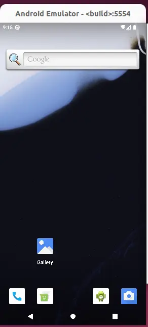

`AOSP`即是`Android`的开源项目，包含了`Android的`所有源码，可通过`AOSP`编译出`Android`系统，然后刷写到实际设备中或者运行在模拟器中。对于我们的学习而言，我们也可以下载源码进行阅读，研究其设计逻辑。当然，也有很多的在线源码阅读网站可以阅读`Android`源码，但如果需要调试的话，还是本地下载比较合适。

## 编译环境

目前`Android`官网已经不在支持`MacOS`上编译源码了，需要使用`Linux`进行编译。这里使用的是`VMWare`虚拟机下的`Ubuntu 22.04`作为编译环境。虚拟机从官网下载，目前最新的虚拟机已经免费，不需要在找破解版了，直接官网下载最新的即可。[Ubuntu下载](https://releases.ubuntu.com/)从官网下载即可，这里选的是22.04的版本，也可以选最新的版本。

创建虚拟机的时候，最好将虚拟机的核数设置为和实际`cpu`一致，以便完全利用`cpu`编译。同时存储空间需要`500g`，内存也尽量调整的大一些，加上交换空间最好要有`32g`。

### 配置环境

编译源码还需要安装一些软件和库，由于下载速度较慢，所以需要先将下载源切换到国内的源。这里配置的是[清华源](https://mirror.tuna.tsinghua.edu.cn/help/ubuntu/)。配置文件是`/etc/apt/sources.list`

```bash
# 备份原仓库配置文件
sudo cp /etc/apt/sources.list /etc/apt/sources.list.bak
# 修改配置文件
sudo gedit /etc/apt/sources.list
```

然后将以下内容输入文件中。

```bash
# 默认注释了源码镜像以提高 apt update 速度，如有需要可自行取消注释
deb https://mirrors.tuna.tsinghua.edu.cn/ubuntu/ jammy main restricted universe multiverse
# deb-src https://mirrors.tuna.tsinghua.edu.cn/ubuntu/ jammy main restricted universe multiverse
deb https://mirrors.tuna.tsinghua.edu.cn/ubuntu/ jammy-updates main restricted universe multiverse
# deb-src https://mirrors.tuna.tsinghua.edu.cn/ubuntu/ jammy-updates main restricted universe multiverse
deb https://mirrors.tuna.tsinghua.edu.cn/ubuntu/ jammy-backports main restricted universe multiverse
# deb-src https://mirrors.tuna.tsinghua.edu.cn/ubuntu/ jammy-backports main restricted universe multiverse

# 以下安全更新软件源包含了官方源与镜像站配置，如有需要可自行修改注释切换
deb http://security.ubuntu.com/ubuntu/ jammy-security main restricted universe multiverse
# deb-src http://security.ubuntu.com/ubuntu/ jammy-security main restricted universe multiverse

# 预发布软件源，不建议启用
# deb https://mirrors.tuna.tsinghua.edu.cn/ubuntu/ jammy-proposed main restricted universe multiverse
# # deb-src https://mirrors.tuna.tsinghua.edu.cn/ubuntu/ jammy-proposed main restricted universe multiverse
```

然后执行以下命令更新源并下载所需的软件。第三条命令是下载编译源码所必须的软件和库，不过大部分的软件在系统中默认都是已经有了的，只有部分需要下载。参考：[官网环境配置](https://source.android.com/docs/setup/start/initializing?hl=zh-cn#setting-up-a-linux-build-environment)

```bash
# 更新源
sudo apt update
sudo apt upgrade
# 下载编译必须的库
sudo apt install git gnupg flex bison build-essential zip curl zlib1g-dev libc6-dev-i386 libncurses5 ib32ncurses-dev x11proto-core-dev libx11-dev lib32z1-dev libgl1-mesa-dev libxml2-utils xsltproc unzip fontconfig
# 安装vim，不习惯用vim可以不用安装，直接用自带的gedit也一样
sudo apt install vim
# 配置git
git config --global user.name pppeng
git config --global user.email xxxx@163.com
```

下载`repo`，这里下载的不是谷歌的repo，而是清华源的，方便国内访问。

```bash
mkdir ~/bin
PATH=~/bin:$PATH
curl https://mirrors.tuna.tsinghua.edu.cn/git/git-repo -o repo > ~/bin/repo
chmod a+x ~/bin/repo

# 修改repo的更新源
sudo gedit ~/.bashrc
# 然后在该文件的最后添加这一行
export REPO_URL='https://mirrors.tuna.tsinghua.edu.cn/git/git-repo'
```


### 源码下载

源码下载需要梯子，不然无法下载到。这里使用的清华源的`AOSP`，不需要梯子，并且下载速度也挺快的，具体链接：[清华源AOSP](https://mirror.tuna.tsinghua.edu.cn/help/AOSP/)。就是可以先下载`aosp-latest.tar`的初始包压缩包，然后再同步到最新代码，这样操作下来是比较快的，比直接同步所有源码速度快一些。

```bash
# 下载aosp-latest.tar
curl -OC - https://mirrors.tuna.tsinghua.edu.cn/aosp-monthly/aosp-latest.tar

# 或者直接在虚拟机浏览器上下载或者别的方式进行下载都可以，注意不要直接在宿主机上下载，不然
# 同步到虚拟机上很麻烦，因为文件太大了。。
```

下载完初始包之后切换下分支，然后同步到最新的代码即可。分支可以从官网查询，需要梯子：[Build ID查询](https://source.android.com/docs/setup/about/build-numbers?hl=zh-cn#source-code-tags-and-builds)

```bash
tar -xvf aosp-latest.tar
# 进入解压后得到的aosp目录
cd AOSP
# 切换分支，这里选的Android13的最新版本
repo init -u https://mirrors.tuna.tsinghua.edu.cn/git/AOSP/platform/manifest -b android-13.0.0_r44
# 重置下repo，不然可能会导致下载失败
cd .repo/repo
git fetch -all
git reset --hard origin/stable
git pull
# 回到aosp目录
cd ../../
# 同步源码，时间挺久的，不过下载中断也没关系，后续直接repo sync就会接着下载了
repo sync
```

### 编译系统

同步完成后进入到`aosp`目录后，可以看到源码已经存在了。直接输入`source build/envsetup.sh`配置下编译环境，然后输入`lunch`选择编译目标。最终会输出一大堆的带编号的目标，如果想在模拟器上查看编译的系统的话，选择输入`sdk_phone_x86_64-eng`，或者输入对应的编码数字也是可以的（这里不会全部列出来，所以可能输出的列表中没有这个选项）。然后输入`m`即可进行编译。

编译时不要输入`m -j16`这种，而是单纯的`m`，让其根据你的`CPU`来自动选择并发的任务数。

```bash
cd AOSP
source build/envsetup.sh
lunch sdk_phone_x86_64-eng
m
```

根据需要选择lunch的目标，这里一定要选择好，毕竟编译一次需要耗费一个多小时。。。注意每次切换后最好执行下`make clean`，我就因为没有clean导致了出现莫名其妙的问题，排查老半天了。

#### 虚拟机跑不满cpu

编译时打开`window`的任务管理器，可以看到`CPU`的利用率并没有达到`100%`，当然这也是没问题的，只是会编译的比较慢而已。解决方法是在`windows`上打开`设置-系统-电源-电源模式`，然后设置为**最佳性能**。再重新编译，打开任务管理器可以看到cpu跑到100%了。

#### 编译报错ninja 137

```bash
============================================
14:18:27 ninja failed with: exit status 137

#### failed to build some targets (01:24 (mm:ss)) ####
```

编译时基本上没有别的提示，就一句失败了，然后错误码137。这种137的错误码通常都是内存不足导致的，可以看编译日志进行确认，输入`tail out/soong.log`

```bash
14:17:11.518992 build/soong/ui/build/exec.go:64: "ninja" executing "prebuilts/build-tools/linux-x86/bin/nsjail" [-x prebuilts/build-tools/linux-x86/bin/ninja -H android-build --cwd /home/feng/Desktop/aosp -t 0 -e --proc_rw -u nobody -g nogroup --rlimit_as soft --rlimit_core soft --rlimit_cpu soft --rlimit_fsize soft --rlimit_nofile soft -R / -B /tmp -B /home/feng/Desktop/aosp -B /home/feng/Desktop/aosp/out --disable_clone_newcgroup -q -- -d keepdepfile -d keeprsp -d stats --frontend_file out/.ninja_fifo droid -j 18 -f out/combined-aosp_arm.ninja -o usesphonyoutputs=yes -w dupbuild=err -w missingdepfile=err]
14:18:27.593425 build/soong/ui/build/exec.go:74: "ninja" finished with exit code 137 (1m16.073s real, 23.135s user, 42.786s system, 11217MB maxrss)
14:18:27.600733 build/soong/ui/build/exec.go:127: ninja failed with: exit status 137
```

首先需要通过`out/soong.log`查看具体的报错信息，然后排查是谁发生异常。这里实际也没有任何信息，只显示了退出时`ninja`的错误码是137。然后查下系统log：`cat /var/log/syslog | grep ninja`

```bash
14:18:25 ubuntu kernel: [ 6902.917239] Out of memory: Killed process 21126 (ninja) total-vm:5222380kB, anon-rss:3099840kB, file-rss:0kB, shmem-rss:0kB, UID:1000 pgtables:9260kB oom_score_adj:0
```

可以看到相关的结果是`Out of memory`导致的`ninja`被杀死，因此可以判定为内存不足导致的。查看虚拟机内存输入`free -h`，我这边显示的是24g的内存，2g的交换内存，仍然是不够编译的，需要至少`32g`的内存。可以通过增加交换内存来达到32g。

```bash
# 禁用当前交换空间
sudo swapoff -a
# 创建新的大小，改成12g，可以根据实际需要调整大小。加上内存最好能达到32g以上
sudo fallocate -l 12g /swapfile
# 设置交换空间
sudo chmod 600 /swapfile
sudo mkswap /swapfile
sudo swapon /swapfile

# 查看是否设置成功
free -h
```

### 运行模拟器

编译成功之后直接输入`emulator`即可运行模拟器，如果提示没有这个命令的话，说明是环境有问题，或者`lunch`的选项不对。可以输入以下命令重新进行编译：

```bash
# 进入到AOSP的目录
cd AOSP
source build/envsetup.sh
# 或者直接输入lunch，然后在输入sdk_phone_x86_64-eng
lunch sdk_phone_x86_64-eng
# 编译
m
# 编译成功运行模拟器
emulator
```

#### 无法启动虚拟机

```bash
ERROR: x86_64 emulation currently requires hardware acceleration!
```

编译成功之后，可以直接运行`emulator`启动虚拟机，可能会遇到以上的报错信息，解决方案：

1. 关闭虚拟机，然后在`虚拟机-设置-处理器`的地方，底下有个虚拟化引擎，将第一个虚拟化`Intel VT-x/EPT或AMD-V/RVI(V)`勾选，然后确定即可
2. 按`win`键搜索`内核隔离`，然后将该选项关闭，不然无法打开虚拟机

执行以上两步操作后，再输入`emulator`即可成功开启虚拟机了。



