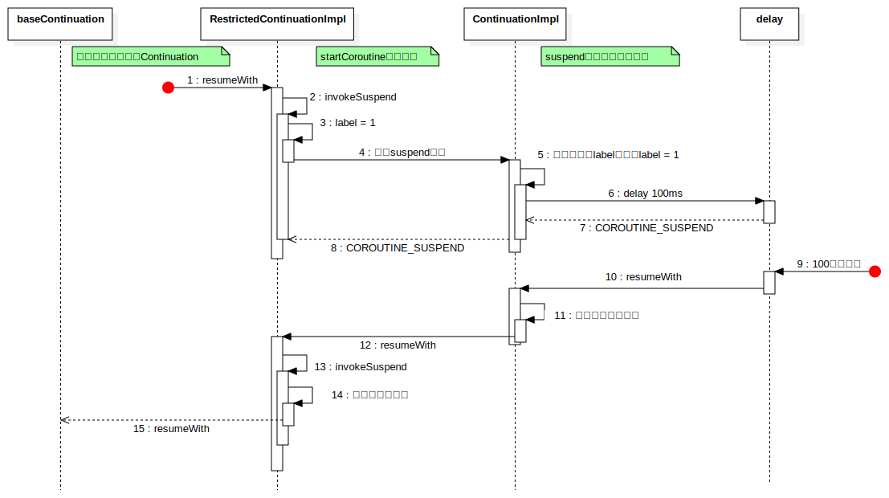

我们了解过协程的使用，通过`launch`和`async`创建协程，也知道协程是个挂起恢复的框架。我们可以简单理解它是一个线程调度框架，可以方便切换线程，但这只是它的一种使用方式，它最重要的是代码块的挂起与恢复。它不仅可以在线程之间进行挂起恢复来达到切换线程的目的，甚至可以在同一个线程中将一块块的代码块进行挂起与恢复。本文就是分析它是如何做到这一点的。

### Continuation

我们从最简单的启动协程来看，即`scope.launch`启动的协程：

```kotlin
public fun CoroutineScope.launch(
    context: CoroutineContext = EmptyCoroutineContext,
    start: CoroutineStart = CoroutineStart.DEFAULT,
    block: suspend CoroutineScope.() -> Unit
): Job {
    val newContext = newCoroutineContext(context)
    val coroutine = if (start.isLazy)
        LazyStandaloneCoroutine(newContext, block) else
        StandaloneCoroutine(newContext, active = true)
    coroutine.start(start, coroutine, block)
    return coroutine
}
```

上面是启动的源码，可以看到`launch`的作用就是创建了一个`StandaloneCoroutine`，然后通过`start`方法进行启动。而它是协程的一个具体实例，我们继续追踪可以看到它是继承自`AbstractCoroutine`的。但最终它实现了很多的接口，我们并不知道谁才是协程的最顶层定义，因此继续往下看：

```kotlin
public abstract class AbstractCoroutine<in T>(
    parentContext: CoroutineContext,
    initParentJob: Boolean,
    active: Boolean
) : JobSupport(active), Job, Continuation<T>, CoroutineScope {
    ...

    public fun <R> start(start: CoroutineStart, receiver: R, block: suspend R.() -> T) {
        start(block, receiver, this)
    }
}
```

即最终实现是直接调用了`CoroutineStart`的方法，该参数是在`launch`启动时传递进去的，它表示的是协程的启动时机，有多个枚举值。这里我们没有直接传递参数，而是使用的默认值`CoroutineStart.DEFAULT`，继续追踪进入：

```kotlin
public enum class CoroutineStart {
    ...
    
    public operator fun <R, T> invoke(block: suspend R.() -> T, receiver: R, completion: Continuation<T>): Unit =
        when (this) {
            DEFAULT -> block.startCoroutineCancellable(receiver, completion)
            ATOMIC -> block.startCoroutine(receiver, completion)
            UNDISPATCHED -> block.startCoroutineUndispatched(receiver, completion)
            LAZY -> Unit // will start lazily
        }
}

// suspend代码块的拓展函数
internal fun <R, T> (suspend (R) -> T).startCoroutineCancellable(
    receiver: R, completion: Continuation<T>,
    onCancellation: ((cause: Throwable) -> Unit)? = null
) =
    runSafely(completion) {
        createCoroutineUnintercepted(receiver, completion).intercepted().resumeCancellableWith(Result.success(Unit), onCancellation)
    }

// Continuation的拓展函数
public fun <T> Continuation<T>.resumeCancellableWith(
    result: Result<T>,
    onCancellation: ((cause: Throwable) -> Unit)? = null
): Unit = when (this) {
    is DispatchedContinuation -> resumeCancellableWith(result, onCancellation)
    else -> resumeWith(result)
}
```

所以最终走到的是`Continuation.resumeWith`方法去启动的协程，从这里也能看到，协程的具体定义实际上就是`Continuation`接口，我们从这个接口文件中的注释也可以看到它就代表着协程。

```kotlin
public interface Continuation<in T> {
   
    public val context: CoroutineContext
 
    public fun resumeWith(result: Result<T>)
}
```

它有一个参数以及一个方法，其中参数表示的是协程的上下文，前面文章[协程上下文CoroutineContext](https://pgaofeng.github.io/2023/04/29/coroutine-context/)我们看过其结构实体，其本身就可以代表一组上下文集合，通过`Key`进行区分。然后就是`resumeWith`方法，该方法启动该协程。也就是说，实际上我们启动协程就是先创建一个`Continuation`然后再通过`resumeWith`启动即可。

那么我们不用给定的启动协程的接口，像它这样通过`suspend`来启动协程如何：

```kotlin
suspend {
    log("协程体内容")
    delay(100)
    // 协程的返回值为10
    10
}.startCoroutine(object : Continuation<Int> {
    override val context: CoroutineContext
        get() = EmptyCoroutineContext
        
    override fun resumeWith(result: Result<Int>) {
        log("resumeWith ${result.getOrNull()}")
    }
})

-------------
D  协程体内容
D  resumeWith 10
```

### suspend关键字

我们知道，协程所执行的代码块或者方法必须是被`suspend`修饰的，该关键字代表着可挂起，因此被修饰的方法或代码块才能在协程中执行。但是，`Kotlin`是运行在`JVM`上的，而`JVM`是没有该关键字的，所以在编译成字节码时，`suspend`发生了什么？

```kotlin
private suspend fun other() {}

// 编译之后再反编成Java
private final Object other(Continuation $completion) {
   return Unit.INSTANCE;
}
```

这是一个普通的`suspend`函数，我们看到编译器在编译这个方法的时候，给他加了一个`Continuation`参数，并将返回值改成了`Object`。经过我们前面的分析知道，`Continuation`就是协程的本体，它调用`suspend`方法的时候将本身传入了。这里因为我们定义的`suspend`方法是一个空实现，因此实际的实现中并没有用到`Continuation`，但我们根据此可以猜到，它就类似一个回调。

当我们在一个协程中执行一些操作，然后调用某个可挂起函数时，就将本身`Continuation`传递给了那个可挂起函数，当那个函数执行完之后，通过`continuation.resumeWith`再回到原协程体中。我们重新定义一个可挂起函数，让它进行挂起操作：

```kotlin
private suspend fun other() {
    println("挂起前")
    delay(100)
    println("挂起后")
}
```

然后编译之后再反编成`Java`：

```java
private static final Object other(Continuation $completion) {
   Continuation $continuation;
   label20: {
      // 判断是否是当前的内部类，也就是下面的ContinuationImpl
      if ($completion instanceof MainActivity$other$1) {
         // 是的话，说明该方法不是第一次调用了，重新获取下当前的最新label
         $continuation = (MainActivity$other$1)$completion;
         if (($continuation.label & Integer.MIN_VALUE) != 0) {
            $continuation.label -= Integer.MIN_VALUE;
            break label20;
         }
      }

      // 这里说明是第一次调用other方法，创建一个内部类，代表一个新的可挂起块
      $continuation = new ContinuationImpl($completion) {
         // $FF: synthetic field
         Object result;
         int label;

         @Nullable
         public final Object invokeSuspend(@NotNull Object $result) {
            this.result = $result;
            this.label |= Integer.MIN_VALUE;
            // 再次走到other方法中
            return MainActivityKt.other((Continuation)this);
         }
      };
   }

   Object $result = $continuation.result;
   // 该值是一个常量COROUTINE_SUSPENDED，代表当前协程正在挂起
   Object var4 = IntrinsicsKt.getCOROUTINE_SUSPENDED();
   switch ($continuation.label) {
      case 0:
         ResultKt.throwOnFailure($result);
         // 输出挂起前内容
         String var1 = "挂起前";
         System.out.println(var1);
         // 将label指向下一个值
         $continuation.label = 1;
         // 进入到另一个可挂起方法中，将当前内部类传递进去
         if (DelayKt.delay(100L, $continuation) == var4) {
             // delay会返回COROUTINE_SUSPENDED，我们也直接返回COROUTINE_SUSPENDED
             return var4;
         }
         break;
      case 1:
         ResultKt.throwOnFailure($result);
         break;
      default:
         throw new IllegalStateException("call to 'resume' before 'invoke' with coroutine");
   }
   // 当delay延迟100毫秒后，会再次调用我们的$continuation.invokeWith，然后
   // 我们会回到other方法中走到这里
   String var5 = "挂起后";
   System.out.println(var5);
   return Unit.INSTANCE;
}
```

我们分析这段代码，可以看到协程的本质就是状态机+回调。这也是为什么`suspend`必须在协程代码块中执行，因为它需要一个`Continuation`参数，使用该参数回到原来的协程中。

因此，协程的启动必须从手动创建一个`Continuation`开始，然后这个初始`Continuation`开始调用某个`suspend`方法，然后将自身传入到这个`suspend`方法中。然后这个`suspend`如果内部有挂起点的话，就会把自己编译成一个内部类`ContinuationImpl`，然后按照挂起点将原本方法的代码分成多个块，每个块放在对应的`switch`语句中，通过`label`进行区分。

上面的代码我们看的是一个`suspend`方法，实际上`suspend`代码块编译后也是一样的。

#### 初始启动

再次回到我们最开始的启动协程的代码块中，然后一路追踪它是如何开启协程的：

```kotlin
// 我们启动一个协程的方式
suspend {
    ...
}.startCoroutine(object : Continuation<Int> {
    override val context: CoroutineContext
        get() = EmptyCoroutineContext
        
    override fun resumeWith(result: Result<Int>) {
        log("resumeWith ${result.getOrNull()}")
    }
})

// 拓展方法通过创建Continuation然后再resume启动
public fun <T> (suspend () -> T).startCoroutine(
    completion: Continuation<T>
) {
    createCoroutineUnintercepted(completion).intercepted().resume(Unit)
}

// 创建协程
public actual fun <T> (suspend () -> T).createCoroutineUnintercepted(
    completion: Continuation<T>
): Continuation<Unit> {
    // 该方法实际就是直接返回completion
    val probeCompletion = probeCoroutineCreated(completion)
    return if (this is BaseContinuationImpl)
        create(probeCompletion)
    else
        // 我们最终会走到这里
        createCoroutineFromSuspendFunction(probeCompletion) {
            (this as Function1<Continuation<T>, Any?>).invoke(it)
        }
}
```

最终是通过`createCoroutineFromSuspendFunction`方法创建协程的，该方法接收两个参数，第一个参数是`probeCompletion`也就是我们在`startCoroutine`是传入的一个匿名内部类；第二个参数是一个表达式，表达式中直接执行了`this`，也就是我们最开始的`suspend`代码块。

```kotlin
private inline fun <T> createCoroutineFromSuspendFunction(
    completion: Continuation<T>,
    crossinline block: (Continuation<T>) -> Any?
): Continuation<Unit> {
    val context = completion.context
    // 我们startCoroutine的时候创建的Continuation的context就是个空上下文，因此走到这个逻辑
    return if (context === EmptyCoroutineContext)
        // 又创建了一个Continuation
        object : RestrictedContinuationImpl(completion as Continuation<Any?>) {
            private var label = 0

            // 我们调用resumeWith开始协程，最终会走到这个方法中
            override fun invokeSuspend(result: Result<Any?>): Any? =
                when (label) {
                    0 -> {
                        // 将label指向下一块
                        label = 1
                        result.getOrThrow() 
                        // 执行代码块，并传入了自身Continuation，该代码块会执行suspend方法
                        block(this) 
                    }
                    1 -> {
                        label = 2
                        result.getOrThrow()
                    }
                    else -> error("This coroutine had already completed")
                }
        }
    else
        ...
}
```

在启动的协程中，我们又去创建了一个`Continuation`，然后它也是一个状态机，由它去调用`suspend`方法，最终走到了各种的回调中去。




