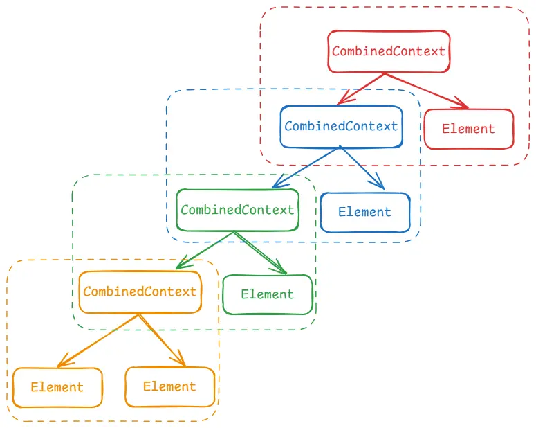
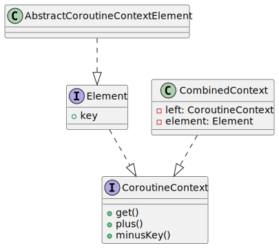

### CoroutineContext

前面我们了解了`Kotlin`协程的使用方式以及一些注意的点，但我们并没有具体查看它的实现细节以及原理。我们知道切换协程执行的线程可以使用`Dispatchers`，我们知道一个协程的引用是一个`Job`，我们也知道协程中遇到异常需要使用`CoroutineExceptionHandler`，如果我们仔细观察它们的父类，最终可以发现它们都继承自`CoroutineContext`。
`CoroutineContext`被称为协程上下文，他是一种独特的结构，除了本身的上下文以外，它还是一种类似`Map`的结构，本文主要分析其结构的组成。

```kotlin
public interface CoroutineContext {
    // 重写get，可以根据key获取对应的上下文
    public operator fun <E : Element> get(key: Key<E>): E?

    // 合并上下文
    public fun <R> fold(initial: R, operation: (R, Element) -> R): R

    // 重写+操作符，可以直接通过+来添加上下文
    public operator fun plus(context: CoroutineContext): CoroutineContext =
        if (context === EmptyCoroutineContext) this else // fast path -- avoid lambda creation
            context.fold(this) { acc, element ->
                val removed = acc.minusKey(element.key)
                if (removed === EmptyCoroutineContext) element else {
                    // make sure interceptor is always last in the context (and thus is fast to get when present)
                    val interceptor = removed[ContinuationInterceptor]
                    if (interceptor == null) CombinedContext(removed, element) else {
                        val left = removed.minusKey(ContinuationInterceptor)
                        if (left === EmptyCoroutineContext) CombinedContext(element, interceptor) else
                            CombinedContext(CombinedContext(left, element), interceptor)
                    }
                }
            }

    // 删除一个上下文
    public fun minusKey(key: Key<*>): CoroutineContext

    // key
    public interface Key<E : Element>

    // 实际的上下文，实现了一些默认方法，我们通常实现Element接口来实现上下文
    public interface Element : CoroutineContext {
        // 对应的key
        public val key: Key<*>

        // 如果key是本身就返回，否则返回空
        public override operator fun <E : Element> get(key: Key<E>): E? =
            @Suppress("UNCHECKED_CAST")
            if (this.key == key) this as E else null

        // 合并上下文
        public override fun <R> fold(initial: R, operation: (R, Element) -> R): R =
            operation(initial, this)

        // 如果key时本身，就返回空上下文，否则返回本身
        public override fun minusKey(key: Key<*>): CoroutineContext =
            if (this.key == key) EmptyCoroutineContext else this
    }
}
```

上面是`CoroutineContext`的定义，从定义我们也可以看出，它本身是属于一个集合类型的定义，它实现了三个重要方法，分别是添加、获取以及查询，刚好是集合最重要的三个方法。为什么说它是类似`Map`结构呢？这是从它的具体实现`Element`看出来的，每个`Element`中有一个`Key`，这是用于明确标识当前`Element`属性的键。
接下来仔细看下它的每个方法，首先是`get`方法：

```kotlin
public override operator fun <E : Element> get(key: Key<E>): E? =
    @Suppress("UNCHECKED_CAST")
    if (this.key == key) this as E else null
```

该方法是在`Element`中实现的，根据`key`进行比对，相同则返回本身，否则返回`null`，同时它还是操作符重载方法，因此我们不仅可以通过`context.get(key)`的方式获取`Element`，还能直接使用`context[key]`的简化方式。
然后就是合并方法`fold`：

```kotlin
public override fun <R> fold(initial: R, operation: (R, Element) -> R): R =
    operation(initial, this)
```

同样也是在`Element`中实现的，但它并没有实现细节，直接执行了其第二个参数，将第一个参数作为表达式的参数传递进来的，因此该方法的实现细节是在表达式中。
再接下来看下删除操作，即`minusKey`方法，根据`Key`删除某个`Element`：

```kotlin
public override fun minusKey(key: Key<*>): CoroutineContext =
    if (this.key == key) EmptyCoroutineContext else this
```

查询和删除都是针对于本身的，即只和本身做对比，好像并没有看出来集合结构，所以接下来我们继续看添加的方法，看它是如何添加上下文的。 也就是`plus`方法，同样这也是一个重载方法，实现了该方法后我们就可以直接通过`+`操作符来将两个上下文相加：

```kotlin
public operator fun plus(context: CoroutineContext): CoroutineContext =
    // 如果加的是一个Empty上下文，则直接返回本身，相当于没加。否则进行合并
    if (context === EmptyCoroutineContext) this else
        // 通过fold进行合并，而fold的实现刚好又是参数的表达式，因此这里通过下面的表达式进行合并
        // 注意acc和element，其中acc是fold的第一个参数也就是this，即+号左侧的上下文，而element则是+号右侧的上下文
        // 例如：context1+context2中，acc就是context1，而element则是context2
        context.fold(this) { acc, element ->
            // 从左侧的context移除key
            val removed = acc.minusKey(element.key)
            // 返回了Empty，说明左侧的context和右侧的context的key一致，所以返回右侧的context，相当于覆盖
            // 即context1+context2 == context2
            if (removed === EmptyCoroutineContext) element else {
                // 查看左侧的context中是否有拦截器
                val interceptor = removed[ContinuationInterceptor]
                // 左侧context中没有拦截器，所以直接通过CombinedContext将左右两个context结合起来返回
                if (interceptor == null) CombinedContext(removed, element) else {
                    // 左侧有拦截器，先移除拦截器
                    val left = removed.minusKey(ContinuationInterceptor)
                    // 移除后上下文为空了，则将右侧上下文和拦截器结合在一起
                    if (left === EmptyCoroutineContext) CombinedContext(element, interceptor) else
                        // 不为空的话，先把移除拦截器后的上下文合并，再与拦截器合并
                        CombinedContext(CombinedContext(left, element), interceptor)
                }
            }
        }
```

该方法是直接在`CoroutineContext`中实现的，这里的逻辑整体理一下，就是如果要添加的`context`的`key`已经存在了，则会删除掉老的`context`并替换成新的。替换后通过`CombinedContext`将两个上下文结合起来，如果上下文中存在拦截器，则将拦截器上下文移出放在最顶层。
同时，`CombinedContext`本身也是一个上下文，它的主要作用就是将两个上下文进行结合。

```kotlin
internal class CombinedContext(
    // left是其中的一个上下文，但通常是CombinedContext
    private val left: CoroutineContext,
    // element是具体的上下文类型
    private val element: Element
) : CoroutineContext, Serializable {

    // 查询
    override fun <E : Element> get(key: Key<E>): E? {
        var cur = this
        // 先从具体的上下文中查，查不到的话找左侧CombinedContext中继续查
        while (true) {
            cur.element[key]?.let { return it }
            val next = cur.left
            if (next is CombinedContext) {
                cur = next
            } else {
                return next[key]
            }
        }
    }

    // 相加的时候会调用这个方法
    public override fun <R> fold(initial: R, operation: (R, Element) -> R): R =
        // 先把左侧结合起来，再与右侧进行结合
        operation(left.fold(initial, operation), element)

    // 删除key
    public override fun minusKey(key: Key<*>): CoroutineContext {
        // 先从具体的上下文删
        element[key]?.let { return left }
        // 没删掉再从左侧的CombinedContext中删
        val newLeft = left.minusKey(key)
        return when {
            // 未删掉，直接返回本身
            newLeft === left -> this
            // 左侧直接删完了，返回右侧上下文
            newLeft === EmptyCoroutineContext -> element
            // 否则的话将左侧和右侧再重新结合起来
            else -> CombinedContext(newLeft, element)
        }
    }
    ...
}
```

所以，`CombinedContext`本身也是一个协程上下文的实现者，只是它的作用是来将多个上下文结合起来，因此说`CoroutineContext`本身除了上下文的作用外，还属于`Map`类型的集合结构。整体结构如下：

也就是说每个协程树中的上下文，都是一个`Map`结构，同时相同`Key`的上下文只能单个存在，例如我们获取协程名称可以通过`coroutineContext[CoroutineName]`来获取。

```kotlin
// 通过构造方法传递Key
public abstract class AbstractCoroutineContextElement(public override val key: Key<*>) : Element

public data class CoroutineName(
    val name: String
    // 注意这里key传的是CoroutineName
) : AbstractCoroutineContextElement(CoroutineName) {

    public companion object Key : CoroutineContext.Key<CoroutineName>

    override fun toString(): String = "CoroutineName($name)"
}
```

`CoroutineName`也是一种上下文，但是它实际作用就是一个标签作用，它继承自`AbstractCoroutineContextElement`，其中`key`的值是`CoroutineName`。注意这是一种缩写方式，因为`CoroutineName`中添加了一个伴生类`Key`，而我们知道在`Kotlin`中课可以直接用类名引用到伴生对象，所以才能这样写。
因此实际上，在构造方法中应该传入`CoroutineName.Key`，并且在获取的时候也通过`coroutineContext[CoroutineName.Key]`来获取，只是通过伴生对象简化了而已，并不是传递的类名作为`Key`的。因此，后续如果我们也需要自定义上下文时，也可以通过这种方式去自定义`Key`。

```kotlin
class MyCoroutineContext(
    val name: Stirng
) : AbstractCoroutineContextElement(MyCoroutineContext) {
    // 这里类名Key是可以省略的
    companion object : CoroutineContext.Key<MyCoroutineContext>
    ...
}
```

最后还有一个`EmptyCoroutineContext`表示的空上下文，实际是个单例对象，本身并没有任何实现，它存在的意义就是避免直接返回`null`，让协程上下文至少存在一个上下文。

```kotlin
public object EmptyCoroutineContext : CoroutineContext, Serializable {
    private const val serialVersionUID: Long = 0
    private fun readResolve(): Any = EmptyCoroutineContext

    public override fun <E : Element> get(key: Key<E>): E? = null
    public override fun <R> fold(initial: R, operation: (R, Element) -> R): R = initial
    public override fun plus(context: CoroutineContext): CoroutineContext = context
    public override fun minusKey(key: Key<*>): CoroutineContext = this
    public override fun hashCode(): Int = 0
    public override fun toString(): String = "EmptyCoroutineContext"
}
```

其所涉及的多个结构均是直接或间接实现了`CoroutineContext`，因此不需要额外的对象来进行引用，直接使用本身即可表示元素又可表示集合，他们的类图如下：



### 总结

到这里基本上协程上下文的结构就已经清晰了，它本身使用`CombinedContext`将多个上下文结合起来，通过`Key`来进行区分。因此它本身就可以作为一个`Map`结构的集合，每次添加上下文实际上就是在自身上面继续包一层`CombinedContext`，因此添加的上下文越多，它本身的结构层级实际越深。