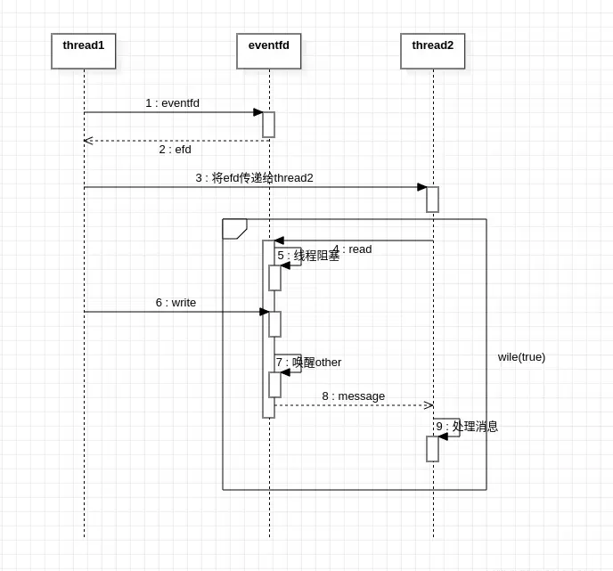
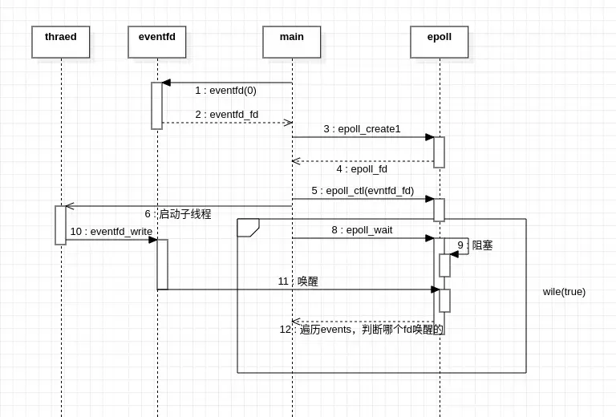

熟悉`Android`应用的我们都知道，每个应用都有一个主线程来处理所有的UI业务，主线程会启用一个`Looper`用于循环从`MessageQueue`中获取消息，而这个死循环之所以不会导致CPU满载，就是他有独特的阻塞机制。当没有可执行的消息时，主线程就会陷入阻塞状态并释放CPU，而这套机制就是通过`Linux`的`eventfd`和`epoll`机制实现的。

## eventfd

`eventfd`是`Linux`中提供的用于事件通知的一种文件描述符，是可以用来实现`wait/notify`的一种工具，用其可以轻易实现线程间或进程间的事件通知。`Looper`就是通过`eventfd`来实现的事件通知。

`eventfd`内部维护了一个`uint64_t`类型的一个计数器，对它读写也只能是对其内部计数器进行读写，甚至可以理解为`eventfd`就是一个数字，对它读写就是对这个数字的赋值和取值。**其计数器为0的时候表示文件不可读，为最大值的时候，表示不可写**。对`eventfd`的写入，实际上并不是一个简单的赋值操作，而是累加操作。例如其内部计数器为1的时候，再写入一个3,此时其内部计数器则会为4。因此当计数器为最大值时，就不可再写入了，因为写入会导致溢出。

### 创建文件描述符

```c
int eventfd(count, flag)
```

该方法用于创建一个文件描述符，其第一个参数是计数器的初始值，第二个参数是对应的`flag`，可以用‘或’操作设置多个`flag`。返回值则是该文件描述符。`flag`取以下三个值：

1. **EFD_NONBLOCK** 使用该`flag`创建的文件描述符，对其读写的时候不会阻塞。默认情况下，对`eventfd`的读写操作是阻塞式的，即`eventfd`不可读写的时候，线程会阻塞在`read、write`方法中。而设置了该`flag`后，若是文件不可读写，则不会阻塞而是直接返回-1。
2. **EFD_SEMAPHORE** 使用该`flag`创建的是属于信号量类型的文件描述符。默认情况下，对`eventfd`的读取操作，会直接读取到内部的计数器的值，**读取后重置计数器为0**，此时`eventfd`被置为不可读的状态。而设置了该`flag`后，读取的时候每次都只能读取到1，并且会将内部计数器值减1，若此时计数器仍不为0，则还是属于可读的。
3. **EFD_CLOEXEC** 当通过exec执行其他程序后，将复制的`eventfd`自动关闭。 

### 标准读写

```c
#include <unistd.h>

ssize_t write (int __fd, const void *__buf, size_t __n)
ssize_t read (int __fd, void *__buf, size_t __nbytes)
```

对`eventfd`的读写就像是对普通文件描述符的读写一样没什么特殊的，但是对其读写的大小只能是`uint64_t`的长度。例如写入内容的话，只能写入`uint64_t`类型的数字，读取的话，也只能通过`uint64_t`类型进行接收，否则会读取或写入失败。返回值也是一样的，若是读写成功，则返回读写的大小，即`sizeof(uint64_t)`，失败则返回-1。

默认情况下，读写都是**阻塞式**的。例如`eventfd`是不可读的时候，即内部计数器值为0,此时`read`方法会阻塞当前线程，直到可读的时候才会返回。可以通过创建`eventfd`的时候传入`EFD_NONBLOCK`的flag，此时则是非阻塞式的，若是不可读写，则并不会阻塞而是直接返回-1。

## eventfd封装的读写

```c
#include <sys/eventfd.h>

typedef uint64_t eventfd_t;

int eventfd_read (int __fd, eventfd_t *__value);
int eventfd_write (int __fd, eventfd_t __value);
```

除了标准`read`、`write`读写，`eventfd`还有一种读写的方式，即上述的两个方法，实际上也是对标准读写的封装。由于`eventfd`要求读写的类型必须是`uint64_t`类型，所以直接使用标准读写可能会出现长度类型的问题。而经过`eventfd`封装后的读写方法，明确指明了数据类型为`eventfd_t`类型（实际也是`uint64_t`类型），避免了写入数据错误的问题。返回值也做了修改，读写成功的话返回值为0,否则为-1。

### 使用方式示例

```c 
#include <sys/eventfd.h>  
#include <unistd.h>  
#include <stdio.h>  
#include <pthread.h>  
/**
* 定义的函数是在子线程中执行的
*/
void *child_write(void *data) {  
    int *efd = data;  
    pthread_t tid = pthread_self();  
    // 子线程负责写入
    for (int i = 0; i < 5; ++i) {  
        eventfd_t number = 3;  
        ssize_t value = write(*efd, &number, sizeof(uint64_t));  
        if (value == sizeof(uint64_t)) {  
             printf("Child Write Success, tid: %lu\n", tid);  
        } else {  
            printf("Child Write Fail, tid: %lu\n", tid);  
        }  
        sleep(1);  
    }  
    return 0;  
}
  
int main(int argc, char *argv[]) {  
    int efd = eventfd(0, EFD_CLOEXEC);  
    if (efd < 0) {  
        printf("create efd error. \n");  
        return -1;  
    }  
    printf("efd: %d,\n", efd);  
    // 创建子线程写入，子线程负责向eventfd中写入数据
    pthread_t child_thread;  
    pthread_create(&child_thread, 0, child_write, &efd);  
    if (child_thread < 0) {  
        printf("create thread error.\n");  
        close(efd);  
        return -1;  
    }  
    int count = 0;
    // 主线程死循环读取数据，实际并不会死循环，因为当fd不可读时会
    // 阻塞在read方法处
    while (1) {  
        uint64_t number = 0;  
        ssize_t len = read(efd, &number, sizeof(uint64_t));  
        if (len == sizeof(uint64_t)) {  
            printf("read success: %lu, len = %zd, count = %d\n", number, len, ++count);  
        } else {  
            printf("read fail.\n");  
        }  
    }
    // 并不会执行到这里，但是用完后需要即使关闭eventfd
    close(efd);  
    return 0;  
}
```

上述代码实现了在主线程循环读取数据，若是`eventfd`不可读的话，则会阻塞在`read`方法中。然后创建了一个子线程每隔1秒会向`eventfd`中写入一个值，写入后主线程会被唤醒，然后读取到这个值后打印并再次阻塞在`read`中等待。



### 小结

`eventfd`是用来实现`wait/notify`机制的，因此不要把它当成一个生产者消费者模型，即不要想着一个线程读取，多个线程写入，**由于eventfd计数器的特性，每次写入的值会被累加，所以不适合多个线程同时写入**。多个线程情况下，可能会出现写入多次，而只读取一次的情况。而若是想实现写入几次读取几次的话，则需要创建时传入`EFD_SEMAPHORE`的flag，但这样的话，每次读取的时候都只能读取到1，就无法区分线程写入的内容了。总而言之，`eventfd`的最佳使用环境就是睡眠唤醒。

## epoll

根据前面了解的`eventfd`，已经可以很容易实现`Looper`了。因为`netive`层的`Looper`就是一个简单的睡眠唤醒机制的实现，而`eventfd`本身来实现这个机制的。所以通过对`eventfd`包装一下就可以实现一个简单的`Looper`了。但`eventfd`还有一些缺陷，当一个线程阻塞在`read`方法中时，会一直阻塞下去，直到另一个线程写入内容。而我们还有超时的诉求，即`read`的时候设定一个超时时间，若是阻塞的时间超过了超时时间，则也唤醒的当前线程。这是考虑到我们会发送延迟消息，所以在延迟的时间到达后唤醒线程去处理事件。

`epoll`是一种事件通知机制，可以用来**监控多个fd的读写状态**。如前面了解的`eventfd`，若是存在多个`eventfd`，有一个线程的需求是监听这多个`fd`，不论哪个可读的时候，都去处理某些事件。我们就很难去做到上述的场景，或许可以创建`eventfd`的时候将其设置为非阻塞式的，然后循环`read`这几个`fd`，若是有可读的就去处理事件，否则继续循环读取。但这样实现有很大的问题，首先是CPU的问题，由于`read`是非阻塞式的，会导致程序在`fd`都不可读的时候一直处于循环中，耗费大量的`CPU`资源。其次，若是`fd`不是当前线程打开的，即无法控制其`read`是否是阻塞式的，上述方案也是不可行的。

`epoll`就是用来应对这种情况的，使用`epoll`可以同时监听多个`fd`，当添加其中的fd可读或者可写后就会唤醒`epoll`。同时也可以设置超时时间，超时后也会返回。

### 创建epoll

```c
#include <sys/epoll.h>

int epoll_create (int __size)
int epoll_create1 (int __flags)
```
创建epoll有两个方法，第一个方法传入了`size`的大小，表示`epoll`可以监听的`fd`的个数，目前已经弃用，若仍使用的话，`size`会被舍弃，但是为了兼容旧版本，`size`的值不能是复数。第二个方法创建`epoll`可以传入`flag`，可以传入`EPOLL_CLOEXEC`.

### 操作注册fd

```c
#include <sys/epoll.h>

#define EPOLL_CTL_ADD 1
#define EPOLL_CTL_DEL 2 
#define EPOLL_CTL_MOD 3 

int epoll_ctl (int __epfd, int __op, int __fd,  struct epoll_event *__event)
```
`epoll`增加、删除、修改`fd`都是通过`epoll_ctl`去操作的，其中参数`__epfd`是`epoll`实例，而参数`__op`代表具体的操作，是定义的三个常量，分别是`EPOLL_CTL_ADD`、`EPOLL_CTL_DEL`、`EPOLL_CTL_MOD`，即当前操作是增加还是删除或者修改。第三个参数是需要操作的文件描述符。
第四个参数`epoll_event`是当前要操作的文件描述符的事件，跟文件描述符绑定的。

### 响应事件
```c
typedef union epoll_data  
{  
    void *ptr;  
    int fd;  
    uint32_t u32;  
    uint64_t u64;  
} epoll_data_t;  
  
struct epoll_event  
{  
    uint32_t events; 
    epoll_data_t data;
} __EPOLL_PACKED;
```
事件收到之后是以`epoll_event`的形式来返回的，如上，其有两个字段。`events`代表的是监听的`fd`的事件操作，定义了一堆的枚举量，最常用的就是`EPOLLIN`(可读时触发)和`EPOLLOUT`（可写时触发）。第二个字段`data`是携带的参数，用于辨别当前触发的是哪个文件描述符。通常会将`data.fd`赋值为对应的`fd`。当`epoll`唤醒的时候，会将注册时传的`event`返回回来，需要通过`event`去判读是哪个`fd`唤醒的。
### 注册事件枚举
```c
enum EPOLL_EVENTS  
{  
    EPOLLIN = 0x001,  // fd可读时触发
    #define EPOLLIN EPOLLIN  
    EPOLLOUT = 0x004,  // fd可写时触发
    #define EPOLLOUT EPOLLOUT  
    EPOLLET = 1u << 31  // 将epoll的触发方式设置为ET模式
    #define EPOLLET EPOLLET  
    ...
};
```
`EPOLL_EVENT`是注册`fd`的时候需要设置的事件，用于设置当前注册的`fd`可以如何被触发唤醒。若是设置为了`EPOLLIN`，当文件可读的时候，会唤醒`EPOLL`。若是设置了`EPOLLOUT`，则当`fd`可写时唤醒`EPOLL`。

事件中还有一个比较重要的值，`EPOLLET`，即将触发方式设置为`ET`模式。`EPOLL`支持两种触发模式，`level-triggeed(LT)`模式和`edge-triggered(ET)`模式，`EPOLL`**默认是LT模式**。
#### LT
`fd`只要可读，就一直触发可读事件。`fd`只要可写入，就会一直触发可写事件。因此若是`fd`可读，需要将缓存区中的所有内容都读完，否则下次循环还会触发可读事件。同理，可写时也是如此。

#### ET
可读事件触发方式：

- `fd`从不可读变为可读时；

- `fd`缓存区内容增多时，即缓存区已有内容，然后又被写入了其他内容的时候会触发；

- `fd`缓存区不为空，并且通过`EPOLL_CTL_MOD`修改后出触发。可写事件的触发方式同理一样。

### 等待返回

```c
#include <sys/epoll.h>

int epoll_wait (int __epfd, struct epoll_event *__events, int __maxevents, int __timeout);
```
`epoll_wait`是阻塞式的，该方法会等待注册的`fd`进行唤醒。例如注册的`fd`是`EPOLLIN`，那么当`fd`可读的时候，`epoll_wait`就会返回。第一个参数是`epoll`实例，第二个参数是一个数组，其中包含的是唤醒的`fd`对应的`poll_event`，因为`epoll`是同时监听多个`fd`的。第三个参数是最大的`event`个数，通常是`events`数组的长度。最后一个参数是超时时间，单位毫秒，超过该时间后会直接唤醒，不论是否有`fd`注册的条件达到，设置为-1的话表示没有超时时间。

返回值是唤醒的`fd`的个数，此时会将`fd`对应的event写入`events`数组中，从第一个开始写入。因此唤醒后，需要根据返回值去遍历`events`，然后查看是哪个`fd`唤醒的。

### 使用示例

```c
#include <stdio.h>  
#include <sys/epoll.h>  
#include <sys/eventfd.h>  
#include <pthread.h>  
#include <unistd.h>  
  
#define MAX_COUNT 10  

// 子线程中写入数据
void *thread_write(void *data) {  
    int *eventfd = (int *) data;  
    eventfd_t ecount = 11;  
    // 子线程每隔1秒向eventfd中写入一个值用于将eventfd唤醒  
    for (int i = 0; i < 3; ++i) {  
        int res = eventfd_write(*eventfd, ecount);  
        if (!res) {  
            printf("write count: %zu\n", ecount);  
        }  
        sleep(1);  
    }  
    return NULL;  
}    
  
int main_epoll() {  
    // 创建epoll实例  
    int epoll_fd = epoll_create1(EPOLL_CLOEXEC);  
    if (epoll_fd == -1) {  
    printf("create epoll error.\n");  
        return -1;  
    }  
    // 创建eventfd，由于使用了epoll实现阻塞，eventfd就不需要再阻塞了  
    int eventfd_fd = eventfd(0, EFD_CLOEXEC | EFD_NONBLOCK);  
    if (eventfd_fd == -1) {  
        printf("create efd error.\n");  
        return -1;  
    }  
    // 注册事件，监听可读事件  
    struct epoll_event event;  
    event.events = EPOLLIN;  
    event.data.fd = eventfd_fd;  
    int res = epoll_ctl(epoll_fd, EPOLL_CTL_ADD, eventfd_fd, &event);  
    if (res) {  
        printf("epoll_ctl error.\n");  
    }   
    // 子线程开始写入
    pthread_t thread; 
    res = pthread_create(&thread, 0, thread_write, &eventfd_fd);  
    if (res) {  
        printf("create thead fail.\n");  
    }  
    // 定义接收事件的event数组  
    struct epoll_event events[MAX_COUNT];  
    while (1) {  
        int count = epoll_wait(epoll_fd, events, MAX_COUNT, -1);  
        printf("wait count: %d\n", count);  
        if (count > 0) {  
            // 遍历唤醒的event，然后去判读是否是我们关注的可读事件  
            for (int i = 0; i < count; ++i) {  
                struct epoll_event tmp = events[i];  
                if (tmp.events == EPOLLIN) {  
                    printf("fd: %d\n", tmp.data.fd);  
                    // 默认时LT模式，所以需要将eventfd中的值读取出来，否则会一直触发可读事件  
                    eventfd_t event_value;  
                    eventfd_read(tmp.data.fd, &event_value);  
                } else {  
                    printf("other event.\n");  
                }
            }  
        } else {  
            printf("wait count zero.\n");  
        }  
    }  
    // 不会执行到这里，不过不要忘记关闭fd  
    close(eventfd_fd);  
    close(epoll_fd);  
    return 0;  
}
```



### 小结

`epoll`类似于一个管家，它可以管理着多个文件描述符，当文件描述符的状态触发某个条件后，就会直接唤醒`eoll`的等待。`epoll`可以添加多个文件描述符，并且支持多种类型的`fd`，不仅仅是`eventfd`，像`file`、`socketfd`、`pipe`等都是可以的，并且可以设置超时唤醒。

## 总结

前面介绍了`eventfd`和`epoll`的功能和使用方式，了解了这两个东西，后面再去看`Android`的`Looper`的时候就能理解它是如何实现的了。`Binder`驱动是`Android`中非常重要的一个东西，跨进程通信全靠它，它也是支持`epoll`机制的，`ServiceManager`中就是使用`epoll`机制来监听`binder`驱动的`fd`是否有消息的。

