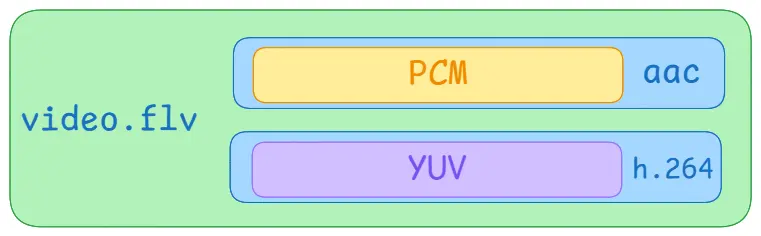
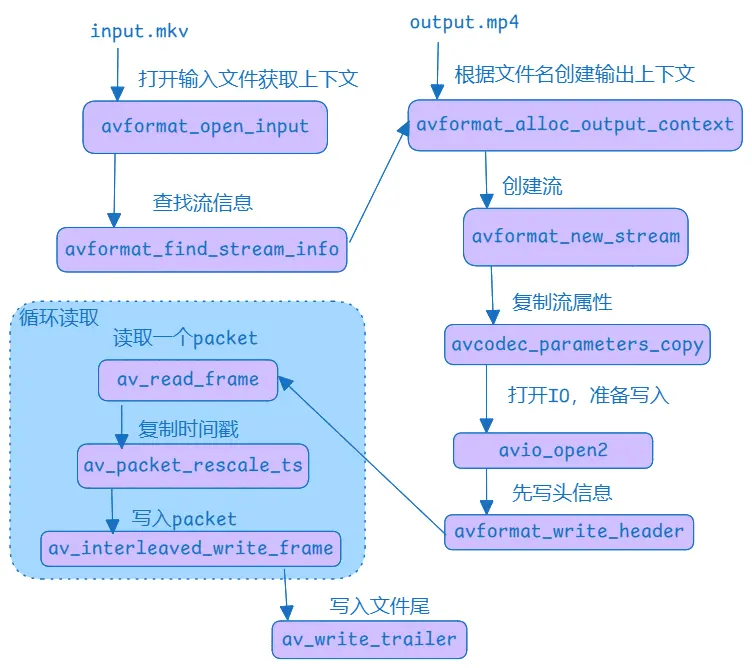

`FFmpeg`有七个模块，在我们的使用中会被编译成七个`so`库文件，其中最重要的就是`avformat`、`avcodec`和`avutil`。

其中`avformat`处理的是对音视频的解封装相关，视频通常至少包含两个数据，音频流和视频流，然后这两个数据会被封装成一个整体，即视频文件，如常见的`mp4`、`flv`等。而`avformat`就是处理这些文件的，它能够将其解封装，拆解出对应的音频流和视频流。当然反过来它也可以将音频流和视频流再重新封装，封装成不同的格式。

解封装后的音频流和视频流还是不能直接播放的，因为它们都是压缩后的。原始的音频流和视频流都是非常大的，直接存储会占用大量的存储空间，因此会将其进行压缩，也称为编码。音频流常用编码`aac`等，视频流常见编码`h264`等，想要播放音频或视频，就必须将其解码成原始数据，如音频流的`pcm`数据，视频流的`yuv`数据等。而`avcodec`就是用来解码的模块，当然返过来他也可以对其进行编码。



而`avutil`就是工具类模块，其中封装了大量的常用的函数，基本上每个模块都会用到它。

### 封装&解封装

封装和解封装是针对视频的，因为视频文件是多路流一起封装起来的。所谓的解封装就是将一个视频文件中的视频流和音频流拆解出来，而封装则是将视频流和音频流合并成一个完整的视频文件。封装和解封装的概念是针对于视频文件的，只有我们需要处理视频文件时，才需要考虑解封装。

`FFmpeg`处理视频文件的流程就是先打开文件，然后查找到对应的流信息，接着就是读取一个个的`Packet`，这些`Packet`就是流数据，不管是视频流还是音频流，都会被读成`AVPacket`。如果仅仅是为了解封装，其实到这里我们就已经做到了，我们完全可以将这些`Packet`重新写入到另一个封装容器中，从而实现换格式的场景。

大概的流程如下：




实际上看到解封装和重新封装的流程很简单，就是不断的读`packet`，再不断地写入到新文件中即可，实际上的编码也是一样的简单。

```c++
// 在C++中引入C的头文件必须要extern
extern "C" {
    #include “libavformat/avformat.h”
}

AVFormatContext *inFormatCtx = nullptr, *outFormatCtx = nullptr;
AVPacket *packet = nullptr;
// 申请的对象都必须要释放掉
void free() {
    if(inFormatCtx != nullptr) {
        avformat_close_input(&inFormatCtx);
        inFormatCtx = nullptr;
    }
    if(outFormatCtx != nullptr) {
        avformat_free_context(outFormatCtx);
        outFormatCtx = nullptr;
    }
    if(packet != nullptr) {
        av_packet_free(&packet);
        packet = nullptr;
    }
}

// 实际的转换函数
int convert(char* inputFile, char* outputFile) {
    int ret;
    // 打开输入文件
    ret = avformat_open_input(&inFormatCtx, inputFile, nullptr, nullptr);
    if(ret) {
        printf("error in open stream");
        free();
        return -1;
    }
    // 查找流
    ret = avformat_find_stream_info(inFormatCtx, nullptr);
    if(ret < 0) {
        printf("find stream error");
        free();
        return -1;
    }
    // 根据文件名的后缀创建输出上下文
    ret = avformat_alloc_output_context2(&outFormatCtx, nullptr, nullptr, outputFile);
    if(ret < 0) {
        printf("error in open output");
        free();
        return -1;
    }
    for(int i = 0; i < inFormatCtx->nb_streams; i++) {
        AVStream *stream = inFormatCtx->streams[i];
        // 输出文件创建对应的流
        AVStream *out = avformat_new_stream(outFormatCtx, nullptr);
        // 复制输入流的参数
        avcodec_parameters_copy(out->codecpar, stream->codecpar);
    }
    // 打开输出流
    ret = avio_open2(&outFormatCtx->pb, outputFile, AVIO_FLAG_WRITE, nullptr, nullptr);
    if(ret < 0) {
        printf("error in open AVIO");
        free();
        return -1;
    }
    // 读取数据
    packet = av_packet_alloc();
    // 1. 写入文件头
    ret = avformat_write_header(outFormatCtx, nullptr);
    // 2. 写入packet
    while (true) {
        ret = av_read_frame(inFormatCtx, packet);
        if(ret < 0) {
            printf("end of file");
            break;
        }
        int index = packet->stream_index;
        AVStream *in = inFormatCtx->streams[index];
        AVStream *out = outFormatCtx->streams[index];
        av_packet_rescale_ts(packet, in->time_base, out->time_base);
        av_interleaved_write_frame(outFormatCtx, packet);
    }
    // 3. 写入文件尾
    av_write_trailer(outFormatCtx);
    free();
    return 0;
}
```

过程并没有什么复杂的，按照流程一步一步来即可。然后是在`Android`中使用，其实方法实现了，我们只需要在`jni`中使用即可：

```c++
extern "C" JNIEXPORT void JNICALL
Java_com_example_ffmpegdemo_MainActivity_convert(
        JNIEnv* env,
        jobject /* this */,
        jstring input,
        jstring output) {

    const char* in = env->GetStringUTFChars(input, nullptr);
    const char* out = env->GetStringUTFChars(output, nullptr);
    convert(in, out);
    env->ReleaseStringUTFChars(input, in);
    env->ReleaseStringUTFChars(output, out);
}
```

然后就是在`MainActivity`中调用即可：

```kotlin
binding.button.setOnClickListener {
    // 注意在子线程中调用
    thread {
        // 输入文件是/data/data/com.example.ffmpegdemo/files/cache/1.mkv
        val inputFile = File(cacheDir, "1.mkv")
        // 输出文件会在该目录下生成一个2.mp4文件
        val outputFile = File(cacheDir, "2.mp4")
        convert(inputFile.absolutePath, outputFile.absolutePath)
    }
}
```

然后找一个`mkv`视频文件，重命名为`1.mkv`，然后`push`到应用的缓存目录中，`/data/data/com.example.ffmpegdemo/files/cache`目录下，再运行即可。

### 总结

视频封装就是将音频流、视频流等封装成一个文件，根据其封装格式其内部有不同的结构，可能是一段音频一段视频这样交错组织，也可能是以别的模式组织。而解封装的意义就是将这些组织在一块的音频和视频分开，我们通过`FFmpeg`读取到的`AVPacket`就代表着这样的一段音频或者视频数据，注意的是，这些数据仍是压缩后的数据，想要播放的话还需要对这些数据进行解码才行。


