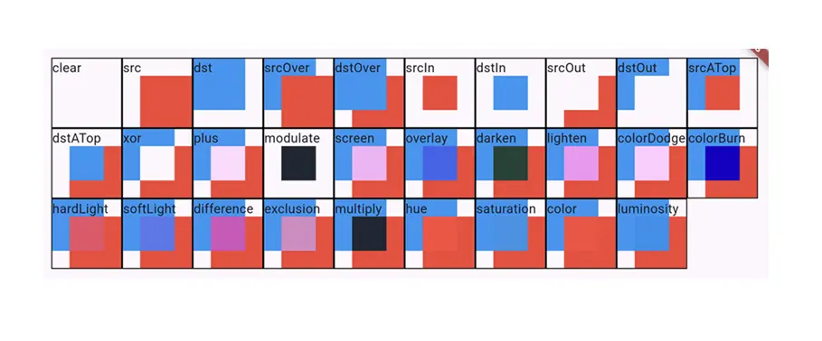

`Flutter`内置了很多的组件，我们可以使用一个有状态或者无状态组件来将这些内置的基础组件进行组合，从而实现我们的布局。但是在实际项目中，这些内置的组件肯定是无法完全满足我们的要求的，因此需要我们自定义组件，一点点绘制出我们想要的结果。

### CustomPaint

在`Android`中自定义`View`通常是继承自一些内置的基础组件或者最顶层的`View\ViewGroup`，然后根据需求实现它的测量布局绘制三个方法。在`Flutter`中稍微有一点不同，就是我们并不是直接继承各种`Widget`，而是通过一个布局容器`CustomPaint`，我们直接在这个容器内进行绘制。

```dart
const CustomPaint({
    super.key,
    this.painter,
    this.foregroundPainter,
    this.size = Size.zero,
    this.isComplex = false,
    this.willChange = false,
    super.child,
})
```

这个`Widget`本身并没有内容，而是提供了`painter`和`foregroundPainter`来供我们自定义绘制。我们一般会在`painter`中进行绘制，如果该组件有其他子组件，即`child`不为空的时候，我们还可以在`foregroundPainter`中绘制前景。

正常就是先在图层上显示`painter`绘制的内容，然后在这些内容上覆盖`child`中的组件内容，最后绘制`foregroundPainter`内容。

其他属性也比较简单，`size`是该组件的大小，`isComplex`表示是否是复杂组件从而决定是否需要加入到缓存中从而避免多次绘制，如果不设置的话则由内置的组合器中的逻辑来决定是否缓存，`willChange`表示下一帧是否会变化，如果设置了则不会进行缓存。

可以看到还是和`Android`中的自定义区别挺大的，在`Flutter`中，直接通过`CustomPaint`组件进行自定义，我们不需要关注组件是如何实现的，如何布局的，只需要实现抽象出来的两个`painter`即可。

#### CustomPainter

注意，`CustomPaint`是一个组件`Widget`，而`CustomPainter`则是一个绘制器，用于在`CustomPaint`中进行布局绘制的。

```dart
abstract class CustomPainter extends Listenable {
    void paint(Canvas canvas, Size size);
    bool shouldRepaint(covariant CustomPainter oldDelegate);
}
```

本身是一个抽象类，一共需要我们实现两个抽象方法，`paint`决定如何绘制，`shouldRepaint`表示是否需要重绘。

在`paint`方法中，参数`canvas`表示画布，和`Android`中的画布一样，这里也是通过`canvas`进行各种绘制工作。例如下面，我们绘制五行的表格：

```dart
class MyPainter extends CustomPainter {
    final Paint _paint = Paint()
      ..color = Colors.black87
      ..isAntiAlias = true;

  @override
  void paint(Canvas canvas, Size size) {
    // 纵向绘制
    final perWidth = size.width / 5;
    for (double i = 0; i <= size.width; i += perWidth) {
      canvas.drawLine(Offset(i, 0), Offset(i, size.height), _paint);
    }
    // 横向绘制
    final perHeight = size.height / 5;
    for (double i = 0; i <= size.height; i += perHeight) {
      canvas.drawLine(Offset(0, i), Offset(size.width, i), _paint);
    }
  }

  @override
  bool shouldRepaint(covariant CustomPainter oldDelegate) => false;
}
```

直接在需要该组件的地方声明即可：

```dart
CustomPaint(size: Size(300, 200), painter: MyPainter()),
```

也就是说，对于普通的自定义组件，我们直接使用`CustomPaint`即可实现我们的需求，当然，这仅限于我们的组件只有自身，而没有子组件。虽然`CustomPaint`给我们提供了一个`child`属性，但实际使用中却是与我们预想的不符。例如前面的例子中，我们绘制了一个5*5的表格，然后有一个需求需要在表格的最中间添加一个文本，按照正常思路：

```dart
CustomPaint(
    size: Size(300, 200),
    painter: MyPainter(),
    child: Center(child: Text('Hello')),
),
```

但实际上效果却不是如我们想的那样，此时`size`失效了，表格的宽度占了整个屏幕，高度为`Text`的高度。如果想要实现我们想要的结果，就不能直接将`Text`放在`CustomPaint`的`child`属性中，而是需要将其提取到外部，使用`Stack`包裹。

```dart
Stack(
  alignment: Alignment.center,
  children: [
    CustomPaint(
      size: Size(300, 200),
      painter: MyPainter(),
    ),
    Center(child: Text('Hello')),
  ],
)
```

#### Paint

绘制方法和安卓中是一致的，需要一个画布`Canvas`和一个画笔`Paint`，来实现绘制。

```dart
final Paint _paint = Paint()
    // 画笔类型，默认填充fill，注意只有绘制一个封闭图形时才生效，
    // 绘制横线时是无效的
    ..style = PaintingStyle.stroke
    ..color = Colors.black87 // 画笔颜色
    ..isAntiAlias = true // 抗锯齿
    ..strokeWidth = 5 // 线宽
    // 端点形状，默认是butt, 普通矩形。
    // 可选round圆形，会凸出来一个半圆，半径是线宽的一半
    // 可选square矩形，会凸出来半个矩形，宽度是线宽的一半
    ..strokeCap = StrokeCap.square
    // 线段交互的角的形状，默认miter是一个尖角
    // 可选round，过渡为平滑的圆角
    // 可选bevel，是一个平角，类似于将miter切掉
    // 仅对于一体的绘制生效，如path和矩形等
    ..strokeJoin = StrokeJoin.bevel
    // 尖角的长度限制，超过长度后会自动变成bevel平角
    ..strokeMiterLimit = 5
    // 反转颜色
    ..invertColors = true;
```

以上是画笔的一些设置，主要就是设置画笔粗细、颜色、圆角等属性。

##### blendMode

同时也有一些比较复杂的属性可以设置，如`blendMode`设置的混入模式，实际上和安卓也是一样的。注意混入模式必须要在图层上进行混入。

```dart
class MyPainter extends CustomPainter {
  final int _index;
  MyPainter(this._index);

  void paint(Canvas canvas, Size size) {
    Paint paint = Paint()..isAntiAlias = true;
    double quarter = size.width / 4;
    // 新建图层，并绘制一个蓝色的矩形，该图层作为dst
    canvas.saveLayer(Offset.zero & size, paint);
    canvas.drawRect(Rect.fromLTRB(0, 0, quarter * 3, quarter * 3), paint..color = Colors.blue);
    // 新建图层，并绘制一个红色的矩形，该图层作为src。注意该图层设置了blendMode
    canvas.saveLayer(
      Offset.zero & size,
      Paint()..blendMode = BlendMode.values[_index],
    );
    canvas.drawRect(Rect.fromLTRB(quarter, quarter, size.width, size.height), paint..color = Colors.red);
    // 恢复图层
    canvas.restoreToCount(2);
  }

  @override
  bool shouldRepaint(covariant CustomPainter oldDelegate) => oldDelegate != this;
}
```

上述代码中，通过`saveLayer`创建了两个图层，第一个图层中在左上角绘制了四分之三大小的矩形，第二个图层在右下角绘制了四分之三的图层。当调用`restore`恢复图层时，就会应用`saveLayer`时传入的那个`paint`的混入模式，此时当前图层作为`src`，前一个图层作为`dst`。

这里我们将所有的混入模式都输出一下看看：

```dart
@override
Widget build(BuildContext context) {
    return Scaffold(
      body: SafeArea(
        child: GridView.builder(
          gridDelegate: SliverGridDelegateWithFixedCrossAxisCount(
            crossAxisCount: 10,
          ),
          itemBuilder: (_, index) {
            return Container(
              decoration: BoxDecoration(border: Border.all(width: 1)),
              child: CustomPaint(
                painter: MyPainter(index),
                child: Text(BlendMode.values[index].name),
              ),
            );
          },
          itemCount: BlendMode.values.length,
          padding: EdgeInsets.all(15),
        ),
      ),
    );
}
```

该代码运行后在手机上跑起来是如下图所示的，可以看到每种的混入模式的效果：



- `clear`：清除`src`和`dst`的内容，表现下来就是什么都没有。
- `src`：只显示`src`图层上的内容
- `dst`：只显示`dst`图层上的内容
- `srcOver`：都显示，但是`src`图层显示在上面
- `dstOver`：都显示，但是`dst`图层显示在上面
- `srcIn`：只显示两个图层相交的部分，并且显示的是相交部分的`src`内容
- `dstIn`：只显示两个图层相交的部分，并且显示的是相交部分的`dst`内容
- `srcOut`：显示`src`图层的内容，但是需要抠出相交的部分
- `dstOut`：显示`dst`图层的内容，但是需要抠出相交的部分
- `srcATop`：显示`dst`图层的内容，但是相交部分显示`src`图层的内容
- `dstATop`：显示`src`图层的内容，但是相交部分显示`dst`图层的内容
- `xor`：两个图层都显示，但是需要抠出相交部分
- `plus`：两个图层都显示，相交部分的颜色进行相加，做图像的渐变时可以使用
- `modulate`：只显示两个图层相交的部分，相交部分的颜色分量进行相乘，只会产生更深的颜色
- `screen`：两个图层都显示，相交部分的颜色分量反转后进行相乘，再将结果反转，只会产生更浅的颜色
- `overlay`：两个图层都显示，相交部分的颜色分量进行相乘，如果`dst`的值较小，则直接相乘；否则反转两个分量的值后进行相乘，再将结果反转。
- `darken`：两个图层都显示，相交部分从每个颜色的通道中选最小的值进行合成
- `lighten`：两个图层都显示，相交部分从每个颜色的通道中选最大的值进行合成
- `colorDodge`：两个图层都显示，相交部分用`dst`的颜色除以反转后的`src`
- `colorBurn`：两个图层都显示，相交部分用反转后的`dst`除以`src`，然后再将结果反转
- `hardLight`：两个图层都显示，相交部分的颜色分量进行相乘，如果`dst`的值较小，则反转两个值后再进行相乘，然后再将结果反转；否则直接相乘（和`overlay`相反）
- `softLight`：两个图层都显示，相交部分中对低于0.5的值使用`colorDodge`模式，高于0.5的值使用`colorBurn`模式
- `difference`：两个图层都显示，相交部分用每个颜色通道值中较大的减去较小的
- `exclusion`：两个图层都显示，相交部分用两个颜色的和减去两个颜色的积的二倍
- `multiply`：两个图层都显示，相交部分的颜色分量进行相乘，也包含了`alpha`通道，只会产生更深的颜色（比`modulate`多一个`alpha`通道）
- `hue`：两个图层都显示，相交部分显示`src`的色调，但是显示`dst`的饱和度和亮度，能看出来覆盖的阴影效果
- `saturation`：两个图层都显示，相交部分显示`dst`的色调，但是显示`src`的饱和度和亮度，能看出来覆盖的阴影效果
- `color`：两个图层都显示，相交部分显示`src`的色调和饱和度，但是显示`dst`的亮度
- `luminosity`：两个图层都显示，相交部分显示`dst`的色度和饱和度，但是显示`src`的亮度


##### shader

图像着色器，用于进行着色，主要是绘制一些封闭图形时填充色，可以是一个图像也可以是一个颜色。如果设置了`shader`，则`color`属性会失效。

```dart
// 水平渐变
Gradient.linear(
    Offset from,// 起始位置
    Offset to, // 结束位置
    List<Color> colors, [ // 渐变的几种颜色
    List<double>? colorStops,// 每种颜色开始的位置，取值0~1之间，表示的是进度
    // clamp: 终点颜色延伸
    // repeated：再次应用渐变
    // mirror：镜像渐变
    // decal: 不着色
    TileMode tileMode = TileMode.clamp,// 超出渐变范围的模式
    Float64List? matrix4,
])

// 雷达样式渐变，从中心往外渐变
Gradient.radial(
    Offset center,// 中心坐标
    double radius,// 渐变的半径
    List<Color> colors, [ 
    List<double>? colorStops,
    TileMode tileMode = TileMode.clamp,
    Float64List? matrix4,
    Offset? focal,
    double focalRadius = 0.0,
])
  // 扫描样式渐变
  Gradient.sweep(
    Offset center,
    List<Color> colors, [ 
    List<double>? colorStops,
    TileMode tileMode = TileMode.clamp,
    double startAngle = 0.0,// 起始角度
    double endAngle = math.pi * 2, // 终止角度
    Float64List? matrix4,
])
```

对于渐变着色器，有三种可以选择，分别是水平渐变、雷达渐变、扫描渐变，这些都是一致的，注意在使用的时候它的名字和`material`包中的渐变的名字是一样的，因此使用时需要加上别名。

```dart
// 需要起个别名
import 'dart:ui' as ui;

Paint paint = Paint()
  ..isAntiAlias = true
  ..shader = ui.Gradient.linear(Offset(0, 0), Offset(50, 50), [
    Colors.blue,
    Colors.green,
  ]);
```

基本上`Paint`就以上这些属性，通过设置对应的属性来实现不同的效果，当然，如果要想进行绘制还需要有`Canvas`画布的配合。

#### Canvas

`Canvas`作为画布是与`Paint`互相配合的，画笔设置的是各种绘制颜色线条粗细等等，而画布则是实际进行绘制的，它提供了大量的方法，基本上都是`draw`开头的。

```dart
// 绘制颜色，通常是绘制背景。注意需要先saveLayer，否则会将整个屏幕都绘制颜色
void drawColor(Color color, BlendMode blendMode);
// 绘制颜色，和drawColor效果一样，也需要先saveLayer
void drawPaint(Paint paint);
// 绘制横线，起始点和终止点确定直线
void drawLine(Offset p1, Offset p2, Paint paint);
// 绘制矩形
void drawRect(Rect rect, Paint paint);
// 绘制圆角矩形
void drawRRect(RRect rrect, Paint paint);
// 绘制同心圆角矩形
void drawDRRect(RRect outer, RRect inner, Paint paint);
// 绘制一个椭圆，实际上和绘制圆角矩形差不多
void drawRSuperellipse(RSuperellipse rsuperellipse, Paint paint);
// 绘制椭圆
void drawOval(Rect rect, Paint paint);
// 绘制圆形，给定中心点和半径
void drawCircle(Offset c, double radius, Paint paint);
// 绘制圆弧
void drawArc(Rect rect, double startAngle, double sweepAngle, bool useCenter, Paint paint);
// 绘制路径
void drawPath(Path path, Paint paint);
// 绘制图片
void drawImage(Image image, Offset offset, Paint paint);
void drawImageRect(Image image, Rect src, Rect dst, Paint paint);
void drawPicture(Picture picture);
// 绘制文字段落
void drawParagraph(Paragraph paragraph, Offset offset);
```

大体上就是上述的一些绘制内容，有一点不同的就是绘制文字的方法，并没有传入`Paint`方法，而是直接传入的`Paragraph`对象即可。

```dart
ui.ParagraphBuilder builder = ui.ParagraphBuilder(ui.ParagraphStyle());
```

首先需要通过`ParagraphBuilder`构建文字段落，构造方法需要传入`ParagraphStyle`样式，主要控制文字的字体、大小、对其方式等等。

```dart
ParagraphStyle({
    TextAlign? textAlign,// 对齐方式
    TextDirection? textDirection, // RTL or LTR
    int? maxLines,// 最大行数
    String? fontFamily,// 字体
    double? fontSize,// 字体大小
    double? height,// 高度
    TextHeightBehavior? textHeightBehavior,// 控制高度如何显示
    FontWeight? fontWeight,// 字重
    FontStyle? fontStyle,//斜体
    StrutStyle? strutStyle,// .
    String? ellipsis,// 超出限制的占位符，通常是...
    Locale? locale,// 语言
})
```

当创建了`ParagraphBuilder`后，就可以往里面添加文案了，通过`addText`进行添加。

```dart
// 入栈文本样式
void pushStyle(TextStyle style);
// 出栈文本样式
void pop();
// 添加文本，文本的样式由栈顶的TextStyle控制
void addText(String text);
```

并且在输出之前，必须要先进行`layout`，完整的绘制文本的逻辑如下：

```dart
// 构建builder
ui.ParagraphBuilder builder = ui.ParagraphBuilder(ui.ParagraphStyle(
  textAlign: TextAlign.left,
  fontSize: 30
));

// 添加文本样式
builder.pushStyle(ui.TextStyle(color: Colors.red));
// 添加文本
builder.addText('hello');
// 构建Paragraph
ui.Paragraph paragraph =  builder.build();
// 绘制前需要layout布局
paragraph.layout(ui.ParagraphConstraints(width: size.width));
// 最后才能进行绘制
canvas.drawParagraph(paragraph, Offset.zero);
```


### 总结

基本上，绘制方面就是这些。其实就是直接使用的`CustomPaint`，然后在需要提供的`CustomPainter`中，使用画笔和画布进行绘制。实际上我们并没有实现自定义组件，而只是实现了自定绘制部分，我们无法控制整个组件的布局操作和测量操作，只能完成绘制部分。


