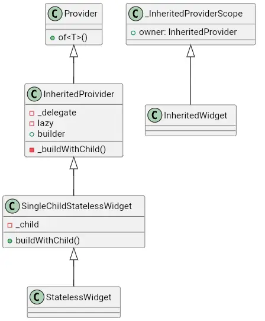
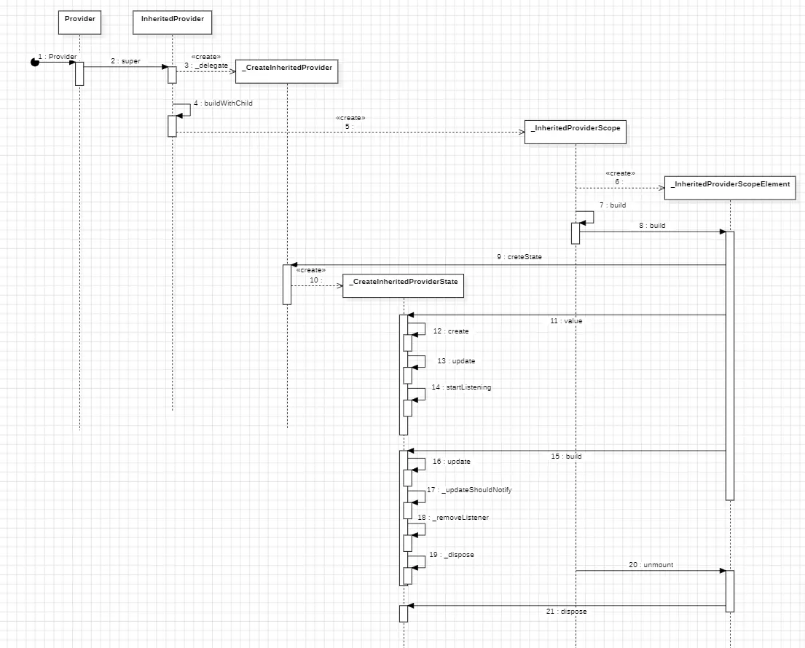

`Provider`是`Flutter`中的一个状态管理框架，也算是入侵性非常小的一个状态管理库。这里说的入侵性小，指的是它并没有引入什么新的概念，完全就是基于`Flutter`内部一些功能所做的封装。

### 数据传递

状态管理的一个基础就是数据共享，而数据共享指的是多个子组件间可以共享状态，也就是进行状态提升。`Provider`用于提供状态的方式有很多，主要用于提供不同的状态类型，他们都是以`Provider`结尾的类。

例如下面通过`Provider`提供一个数据：

```dart
Provider<CircleController>(
  create: (context) => CircleController(),
  child: MyChildWidget(),
)
```

例如上述代码，通过`Provider`提供一个`CircleController`对象，这样在它的子组件`MyChildWidget`，以及更深层级的子组件中都能够获取到`CircleController`，从而使用它内部的状态，或者说它本身也可以是一个状态。

实际上我们是知道在`Flutter`中，想向子组件传递数据，要么通过构造方法层层传入，要么构建一个独立于组件的对象来进行共享，要么就是通过`InheritedWidget`进行传递，`Provider`使用的就是最后一种方式。

```dart
class Provider<T> extends InheritedProvider<T> {
  Provider({
    Key? key,
    required Create<T> create,
    Dispose<T>? dispose,
    bool? lazy,
    TransitionBuilder? builder,
    Widget? child,
  }) : super(
          key: key,
          lazy: lazy,
          builder: builder,
          create: create,
          dispose: dispose,
          debugCheckInvalidValueType: kReleaseMode
              ? null
              : (T value) =>
                  Provider.debugCheckInvalidValueType?.call<T>(value),
          child: child,
        );
 ...
}
```

在剔除掉一些静态方法后，可以看到`Provider`类实际上就是对`InheritedProvider`的一个包装，基本上没有做什么操作，再继续跟踪`InheritedProvider`：

```dart
class InheritedProvider<T> extends SingleChildStatelessWidget {

  InheritedProvider({
    Key? key,
    Create<T>? create,
    T Function(BuildContext context, T? value)? update,
    UpdateShouldNotify<T>? updateShouldNotify,
    void Function(T value)? debugCheckInvalidValueType,
    StartListening<T>? startListening,
    Dispose<T>? dispose,
    this.builder,
    bool? lazy,
    Widget? child,
  })  : _lazy = lazy,
        // 创建了一个代理对象，基本上所有的参数都被代理对象持有
        _delegate = _CreateInheritedProvider(
          create: create,
          update: update,
          updateShouldNotify: updateShouldNotify,
          debugCheckInvalidValueType: debugCheckInvalidValueType,
          startListening: startListening,
          dispose: dispose,
        ),
        super(key: key, child: child);

  final _Delegate<T> _delegate;
  final bool? _lazy;
  final TransitionBuilder? builder;

  @override
  _InheritedProviderElement<T> createElement() {
    return _InheritedProviderElement<T>(this);
  }

  // 构建子组件
  @override
  Widget buildWithChild(BuildContext context, Widget? child) =>
      _buildWithChild(child);

  Widget _buildWithChild(Widget? child, {Key? key}) {
    // 又包了一层_InheritedProviderScope
    return _InheritedProviderScope<T?>(
      owner: this,
      key: key,
      debugType: kDebugMode ? '$runtimeType' : '',
      // 默认使用builder构建
      child: builder != null
          ? Builder(
              builder: (context) => builder!(context, child),
            )
          // 如果没传builder，则直接使用child
          : child!,
    );
  }
}
```

`InheritedProvider`在构造方法中提供了一系列的参数，参数实际上是在不同类型的`Provider`中使用的，这里先不去关注，因为它将这些参数统一打包在了一个代理对象中`_CreateInheritedProvider`，后续如果需要使用，就直接从代理对象中获取。

然后就是`buildWithChild`方法，这是构建布局的一个方法，在`InheritedProvider`中可以看到，它实际上调用的是构造方法传入的`builder`来完成布局的，并且在这个布局外面又套了一层`_InheritedProviderScope`。

```dart
// 继承自InheritedWidget
class _InheritedProviderScope<T> extends InheritedWidget {
  _InheritedProviderScope({
    required this.owner,
    required this.debugType,
    required Widget child,
    Key? key,
  })  : assert(null is T),
        super(
          key: key,
          child: child,
        );

  final InheritedProvider<T> owner;
  final String debugType;

  @override
  bool updateShouldNotify(InheritedWidget oldWidget) {
    // 直接return false
    return false;
  }

  @override
  _InheritedProviderScopeElement<T> createElement() {
    return _InheritedProviderScopeElement<T>(this);
  }
}
```

其中`_InheritedProviderScope`就是继承自`InheritedWidget`的，并且它持有了外部的`InheritedProvider`，也就是间接拿到了构造方法中传入的各种参数。注意在`updateShouldNotify`时，直接返回`false`。因此，但状态发生变化时，它是不会通知依赖的子组件进行更新的。

再回到最初的示例：

```dart
Provider<CircleController>(
  create: (context) => CircleController(),
  child: MyChildWidget(),
)
```

此时组件树是如下所示的：

```
Provider -> _InheritedProviderScope -> MyChildWidget
```

其中`_InheritedProviderScope`是`InheritedWidget`类型，因此它的子组件就能通过`context`获取到`_InheritedProviderScope`，从而可以拿到它提供的状态。

继承关系如下：




对于普通的`Provider`提供状态，我们看到了实际上就是包了一层`InheritedWidget`来提供状态，并且它提供的状态变化时，还不会通知到子组件进行重建，因此我们使用它来提供状态是非常有限的，我们常用的是`ChangeNotifier`，而它是继承自`ListenableProvider`。那把上面的例子替换成`ListenableProvider`：

```dart
ListenableProvider<CircleController>(
  create: (context) => CircleController(),
  child: MyChildWidget(),
)
```

用法上和`Provider`是一致的，包括参数列表也是一样的：

```dart
// 泛型给了限定为Listenable
class ListenableProvider<T extends Listenable?> extends InheritedProvider<T> {

  ListenableProvider({
    Key? key,
    required Create<T> create,
    Dispose<T>? dispose,
    bool? lazy,
    TransitionBuilder? builder,
    Widget? child,
  }) : super(
          key: key,
          // 传入了startLitening的方法
          startListening: _startListening,
          create: create,
          dispose: dispose,
          lazy: lazy,
          builder: builder,
          child: child,
        );

  // 开始监听的方法
  static VoidCallback _startListening(
    InheritedContext<Listenable?> e,
    Listenable? value,
  ) {
    // 添加监听者，回调函数是需要通知依赖组件进行更新
    value?.addListener(e.markNeedsNotifyDependents);
    // 返回值是一个callback，内部是移除监听者
    return () => value?.removeListener(e.markNeedsNotifyDependents);
  }
}
```

`ListenableProvider`也是继承自`InheritedProvider`，它比`Provider`多的一点就是它额外传递了一个`startListening`参数，该参数的内部逻辑是向`Listenable`参数添加监听，并返回一个移除监听的回调，当监听到内容变化后，会通知依赖的子组件进行刷新。

还有`ChangeNotifierProvider`:

```dart
class ChangeNotifierProvider<T extends ChangeNotifier?>
    extends ListenableProvider<T> {

  ChangeNotifierProvider({
    Key? key,
    required Create<T> create,
    bool? lazy,
    TransitionBuilder? builder,
    Widget? child,
  }) : super(
          key: key,
          create: create,
          // 传入了_dispose
          dispose: _dispose,
          lazy: lazy,
          builder: builder,
          child: child,
        );

  // 组件移除时的监听
  static void _dispose(BuildContext context, ChangeNotifier? notifier) {
    notifier?.dispose();
  }
}
```

经过上述三个`Provider`的分析，我们看到他们实际上都是对`InheritedProvider`的包装，主要的区别就是传入的参数不同。其中`Provider`只传入了必要的参数，`ListenableProvider`额外提供了`startLintening`参数，而`ChangeNotifierProvider`又多了一个`_dispose`参数。并且值得注意的是，这些参数并没有直接使用，而是包装在了`_delegate`中。

```dart
abstract class _Delegate<T> {
  // 创建一个代理State
  _DelegateState<T, _Delegate<T>> createState();

  void debugFillProperties(DiagnosticPropertiesBuilder properties) {}
}

// 代理类的状态
abstract class _DelegateState<T, D extends _Delegate<T>> {
  // _InheritedProviderScope所对应的element
  _InheritedProviderScopeElement<T?>? element;
  // Provider提供的值
  T get value;
  // 获取到当前的_delegate对象
  D get delegate => element!.widget.owner._delegate as D;
  // 是否有值
  bool get hasValue;

  bool debugSetInheritedLock(bool value) {
    return element!._debugSetInheritedLock(value);
  }
  // 是否需要更新代理对象
  bool willUpdateDelegate(D newDelegate) => false;
  // 移除时的回调
  void dispose() {}

  void debugFillProperties(DiagnosticPropertiesBuilder properties) {}
  // 构建时调用
  void build({required bool isBuildFromExternalSources}) {}
}
```

代理对象`_delegate`实际是一个`_Dalegate`类型，它内部有个方法用于创建`_DelegateState`，这个`State`类主要作用就是存储需要提供的数据以及响应组件的生命周期，在`InheritedProvider`中它的实现类是`_CreateInheritedProvider`：

```dart
// 构建Provider时传入的数据和方法都在delegate中
class _CreateInheritedProvider<T> extends _Delegate<T> {
  _CreateInheritedProvider({
    this.create,
    this.update,
    UpdateShouldNotify<T>? updateShouldNotify,
    this.debugCheckInvalidValueType,
    this.startListening,
    this.dispose,
  })  : assert(create != null || update != null),
        _updateShouldNotify = updateShouldNotify;
  // 构建状态的代码块
  final Create<T>? create;
  // 更新状态的代码块
  final T Function(BuildContext context, T? value)? update;
  // 判断是否需要通知依赖的子组件刷新
  final UpdateShouldNotify<T>? _updateShouldNotify;
  final void Function(T value)? debugCheckInvalidValueType;
  // 开始监听的代码块
  final StartListening<T>? startListening;
  // 移除时的回调
  final Dispose<T>? dispose;

  @override
  _CreateInheritedProviderState<T> createState() =>
      _CreateInheritedProviderState();
}
```

然后是`_DelegateState`的实现类，这里对应的是`_CreateInheritedProviderState`：

```dart
class _CreateInheritedProviderState<T>
    extends _DelegateState<T, _CreateInheritedProvider<T>> {
  // 移除监听的回调
  VoidCallback? _removeListener;
  // 是否初始化值
  bool _didInitValue = false;
  // 提供的值
  T? _value;
  _CreateInheritedProvider<T>? _previousWidget;
  FlutterErrorDetails? _initError;

  @override
  T get value {
    // 构建值的时候发生了异常
    if (_didInitValue && _initError != null) {
      ...
    }
    ...
    if (!_didInitValue) {
      _didInitValue = true;
      if (delegate.create != null) {
          // 通过create创建值，并赋值给_value
          _value = delegate.create!(element!);
      }
      if (delegate.update != null) {
          // 触发update
          _value = delegate.update!(element!, _value);
      }
    }
    // 调用startListening,实际上就是添加了监听者
    _removeListener ??= delegate.startListening?.call(element!, _value as T);
    return _value as T;
  }

  @override
  void dispose() {
    super.dispose();
    // 移除监听
    _removeListener?.call();
    if (_didInitValue) {
      // 触发dispose
      delegate.dispose?.call(element!, _value as T);
    }
  }

  // 组件构建时触发
  @override
  void build({required bool isBuildFromExternalSources}) {
    var shouldNotify = false;
   
    if (isBuildFromExternalSources &&
        _didInitValue &&
        delegate.update != null) {
      final previousValue = _value;
      // 触发更新
      _value = delegate.update!(element!, _value as T);
      // 如果传入了更新的方法，则调用来决定是否通知子组件更新
      if (delegate._updateShouldNotify != null) {
        shouldNotify = delegate._updateShouldNotify!(
          previousValue as T,
          _value as T,
        );
      } else {
        // 否则默认就比较二者的值是否一致
        shouldNotify = _value != previousValue;
      }
      // 如果需要通知依赖子组件更新
      if (shouldNotify) {
        if (_removeListener != null) {
          // 移除监听
          _removeListener!();
          _removeListener = null;
        }
        // 并且dispose掉
        _previousWidget?.dispose?.call(element!, previousValue as T);
      }
    }
    // 标记需要进行通知依赖子组件更新
    if (shouldNotify) {
      element!._shouldNotifyDependents = true;
    }
    _previousWidget = delegate;
    return super.build(isBuildFromExternalSources: isBuildFromExternalSources);
  }
  // 是否已经初始化值
  @override
  bool get hasValue => _didInitValue;
}
```

`_DelegateState`控制了整个组件的状态逻辑，首先就是在获取值时，使用的是懒加载模式，也就是只有第一次获取值的时候才会触发`ceate`来创建值，并且创建完之后会立即触发一次`update`，然后建立监听。然后就是在`dispose`的时候移除监听并且触发参数传入的`Dispose`。最后是`build`方法，也就是界面构建的时候会再次触发`update`，并且触发`updateShouldNotify`来决定是否需要通知子组件刷新，如果依赖子组件需要刷新，就会先移除掉监听并且`dispose`掉。

也就是说几乎所有的逻辑都发生在`_CreateInheritedProviderState`中，而`_CreateInheritedProviderState`又是发生在`_InheritedProviderScopeElement`中进行关联的：

```dart
class _InheritedProviderScope<T> extends InheritedWidget {
  ...
  // 构建widget对应的element
  @override
  _InheritedProviderScopeElement<T> createElement() {
    return _InheritedProviderScopeElement<T>(this);
  }
}
// _InheritedProviderScope对应的Element
class _InheritedProviderScopeElement<T> extends InheritedElement
    implements InheritedContext<T> {

  // 构建了_DelegateState，并持有了当前element
  late final _DelegateState<T, _Delegate<T>> _delegateState =
      widget.owner._delegate.createState()..element = this;

  @override
  void update(_InheritedProviderScope<T> newWidget) {
    // 更新时触发_delegateState的更新
    _updatedShouldNotify =
        _delegateState.willUpdateDelegate(newWidget.owner._delegate);
    super.update(newWidget);
    _updatedShouldNotify = false;
  }

  @override
  Widget build() {
    // 如果设置了不懒加载，则直接获取值来触发创建状态对象
    if (widget.owner._lazy == false) {
      value;
    }
    // 触发代理类中的build方法
    _delegateState.build(
      isBuildFromExternalSources: _isBuildFromExternalSources,
    );
    return super.build();
  }

  @override
  void unmount() {
    // dispose
    _delegateState.dispose();
    super.unmount();
  }

  @override
  bool get hasValue => _delegateState.hasValue;
  
  // 获取代理类中的值
  @override
  T get value => _delegateState.value;
}
```

到这里基本上所有的逻辑都看完了，`_delegateState`是`_InheritedProviderScopeElement`触发的，如果指定懒加载为`false`，则会在`build`前通过访问代理类中的值来触发加载数据；否则只有在第一次访问值时才会触发`create`来创建数据。

时序图如下：



主要逻辑发生在`_InheritedProviderScopeElement`中，然后触发`_CreateInheritedProviderState`进行更新。

1. 首先就是获取依赖值`value`，只有获取值的时候才会调用`create`来创建值，即实现的懒加载场景，并且同时触发一次`update`。其次就是获取值的时候，如果没有加入监听，则会`startListening`来监听值的变化，当值变化时候回调函数会通知依赖的子组件刷新。
2. `_InheritedProviderScopeElement#build`的时候，如果是非懒加载情况，会直接访问一次`value`来触发创建依赖值。然后调用代理类的`build`，然后调用`update`一次，然后再根据`_updateShouldNotify`来决定是否通知依赖子组件进行更新，如果需要更新就移除监听`removeListener`并`dispose`。
3. `_InheritedProviderScopeElement#unmount`的时候会触发`dispose`和`removeListener`。


### 数据获取

数据获取方式有几种，基本上没啥太大的区别，主要就是是否需要进行依赖而已。

```dart
T watch<T>() {
  return Provider.of<T>(this);
}

T read<T>() {
  return Provider.of<T>(this, listen: false);
}
```

状态的获取有`read`和`watch`两种方式，他们都是定义的`BuildContext`的拓展方法，实际走的逻辑还是`Provider`中的`of`静态方法。

```dart
static T of<T>(BuildContext context, {bool listen = true}) {
    // 根据泛型，获取到_InheritedProviderScope
    final inheritedElement = _inheritedElementOf<T>(context);

    if (listen) {
      // 如果需要监听变化的话，通过dependsOn获取
      context.dependOnInheritedWidgetOfExactType<_InheritedProviderScope<T?>>();
    }
    // 拿到的是_delegate中的数据
    final value = inheritedElement?.value;

    if (_isSoundMode) {
      if (value is! T) {
        throw ProviderNullException(T, context.widget.runtimeType);
      }
      return value;
    }
    return value as T;
}

static _InheritedProviderScopeElement<T?>? _inheritedElementOf<T>(
    BuildContext context,
  ) {
    // 获取到_InheritedProviderScope
    final inheritedElement = context.getElementForInheritedWidgetOfExactType<
        _InheritedProviderScope<T?>>() as _InheritedProviderScopeElement<T?>?;

    if (inheritedElement == null && null is! T) {
      throw ProviderNotFoundException(T, context.widget.runtimeType);
    }
    return inheritedElement;
}
```

获取方式也是我们非常熟悉的方式，注意当我们使用`Provider`时，实际上会在子布局外包裹一层`_InheritedProviderScope`，实际的数据以及回调方法都是由它来提供的，因此我们获取数据时也是通过这个类型来获取的。对于普通获取，直接通过`get`方法拿到数据，对于依赖方式获取，通过`dependOn`方式拿到数据，在通过依赖方式获取状态时，会去将`context`所指向的`element`添加到依赖列表中，这样当`_InheritedProviderScope`发生变化时就能通知到我们进行重建。

还有一个有区别的方法就是`select`，它能够选择性能依赖某几个字段，当固定的字段发生变化时，才会触发重建：

```dart
R select<T, R>(R Function(T value) selector) {
    // get方式获取到_InheritedProviderScopeElement
    final inheritedElement = Provider._inheritedElementOf<T>(this);
    try {
      // 拿到值
      final value = inheritedElement?.value;
      // 将值通过参数selector计算出另一个值
      final selected = selector(value);

      if (inheritedElement != null) {
        // 建立依赖关系
        dependOnInheritedElement(
          inheritedElement,
          aspect: (T? newValue) {
            // 当发生变化时，通过selector计算新值是否与旧值一致，只有不一致时才会通知
            return !const DeepCollectionEquality()
                .equals(selector(newValue), selected);
          },
        );
      } else {
        dependOnInheritedWidgetOfExactType<_InheritedProviderScope<T?>>();
      }
      // 返回计算后的值
      return selected;
    } finally {
      ...
    }
}
```

`select`实际上是将变化的值进行筛选，或者说是做一下`map`的操作，将状态值转换成别的值并返回，后续也是当状态发生变化时，再进行转换，如果转换后的值不一致，则再去进行通知，从而可以避免其他状态值的影响。
