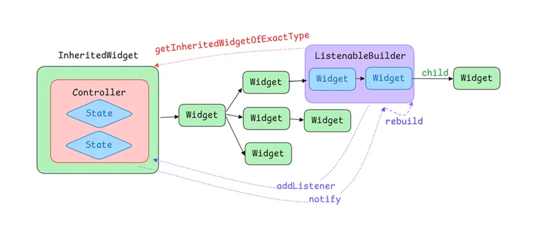

`Flutter`是声明式`UI`框架，不像传统的安卓那样的命令式，我们无法拿到对应的组件然后将其修改。每当界面发生变化时，实际上就是重新创建了一组`Widget`，我们所说的状态管理就是对这样一组控制界面显示的变量做控制。

### StatelessWidget

`StatelessWidget`无状态组件，它不包含任何状态属性，也无法响应状态的变化，仅仅就是一个普通组件，声明成什么样它就是什么样。

```dart
class MyCircle extends StatelessWidget {
  const MyCircle({super.key});

  @override
  Widget build(BuildContext context) {
    return Container(
      width: 100,
      height: 100,
      decoration: ShapeDecoration(color: Colors.red, shape: CircleBorder()),
      child: Center(
        child: TextButton(onPressed: () {
            // 点击事件
        }, child: Text('Click')),
      ),
    );
  }
}
```

例如上述例子，我们声明了一个`100*100`的红色的圆形，并且在圆形中间有一个文本按钮。它就是一个典型的无状态组件，当被声明在界面中后，他就不会变化，一直都是红色的圆形。当然，它本身也是有状态的，例如宽高和颜色都可以说是它的状态，因为它的显示需要依赖这些参数。那么我们将其提取出来，作为状态使用：

```dart
class MyCircle extends StatelessWidget {

  // 将尺寸和颜色提取出来，作为状态使用
  double _size = 100;
  Color _color = Colors.red;

  MyCircle({super.key});

  @override
  Widget build(BuildContext context) {
    return Container(
      width: _size,// 使用提取出的状态
      height: _size,
      // 使用提取出的状态
      decoration: ShapeDecoration(color: _color, shape: CircleBorder()),
      child: Center(
        child: TextButton(onPressed: () {
          // 点击按钮时，修改状态，尺寸+20，颜色改成蓝色
          _size += 20;
          _color = Colors.blue;
        }, child: Text('Click')),
      ),
    );
  }
}
```

我们将尺寸状态和颜色状态提取出去，然后在使用的地方直接使用这两个状态值，并且在点击按钮时修改这两个状态值。但是我们会发现，点击按钮时它并没有变化，还是一个红色的尺寸为100的圆形。

这是因为`Flutter`如果想要刷新界面，必须要重新调用它的`build`方法来创建新的组件。而我们点击按钮时，只是修改了状态值，并不能触发`build`，因此是无法响应变化的。而且作为无状态组件`StatelessWidget`，它也是不能被触发`build`的，只能由它的父组件刷新时，重新构建`MyCicle`，而重新构建又意味着重新创建了一个`MyCicle`，因此它还是一个红色的尺寸100的圆形。

因此，如果想要响应状态的变化，就不能使用`StatelessWidget`，而是要用`StatefulWidget`。

### StatefulWidget

`StatefulWidget`就是`Flutter`中的有状态组件，它会在声明`Widget`时创建一个管理状态的类，当状态发生变化时，通过`setState`触发组件的刷新，实际上就是触发它本身的`build`方法来重新创建子组件。将前面的例子进行修改：

```dart
// 组件比较模板化，暂不需要关注
class MyCircle extends StatefulWidget {
  const MyCircle({super.key});

  @override
  State<MyCircle> createState() => _MyCircleState();
}

// 状态管理类
class _MyCircleState extends State<MyCircle> {
  // 提取出来的状态
  double _size = 100;
  Color _color = Colors.red;

  @override
  Widget build(BuildContext context) {
    return Container(
      width: _size,// 使用状态
      height: _size,
      decoration: ShapeDecoration(color: _color, shape: CircleBorder()),
      child: Center(
        child: TextButton(
          onPressed: () {
            // 点击时修改状态，必须使用setState触发更新
            setState(() {
              _size += 20;
              _color = Colors.blue;
            });
          },
          child: Text('Circle'),
        ),
      ),
    );
  }
}
```

将前面的`MyCircle`组件使用`StatefulWidget`修改如上，它会创建一个状态管理类，然后状态和`UI`都是在状态管理类中声明。其他都没有修改，唯一的改动就是在点击事件中，修改状态值时使用了`setState`方法来修改状态值的。这也是有状态组件的最重要的一个方法，因为这个方法会触发界面的刷新。

实际上，`setState`也并不是触发界面的刷新，而是触发了`build`方法来重新创建组件，注意这里只是重新调用了`build`方法，而不是重新创建了一个`MyCircle`，因此状态值的修改仍是有效的，此时`_size`是130，`_color`被改成了蓝色，因此新创建的组件就是一个尺寸为120的蓝色圆形，表现形式就是点击后尺寸变大20颜色修改为蓝色。

有状态组件会声明一个依赖的状态管理类，所依赖的状态都声明在这里面，当修改时通过`setState`触发重建从而刷新界面，这些状态都可以说是这个组件的内部状态。那么，此时我有两个`MyCircle`，并且我想在点击任意一个圆形时，两个圆形都同时变化，也就是说两个组件共用同一组状态，现有的管理方式就无法实现了。

因此，就引出了状态提升的概念，即将状态向上提升，提到它们共有的父组件中，这样它们就都能使用父组件中的状态值来实现同步变化了。此时，`MyCircle`中就不需要管理状态了，我们也可以将其简写成`StatelessWidget`了，需要的参数通过构造方法传入即可。

```dart
class MyCircle extends StatelessWidget {
  // 状态值通过构造函数传入
  final double size;
  final Color color;
  // 点击事件通过回调传出
  final VoidCallback callback;

  const MyCircle({
    super.key,
    required this.size,
    required this.color,
    required this.callback,
  });

  @override
  Widget build(BuildContext context) {
    return Container(
      // 使用构造方法传入的状态
      width: size,
      height: size,
      decoration: ShapeDecoration(color: color, shape: CircleBorder()),
      child: Center(
        child: TextButton(onPressed: callback, child: Text('Circle')),
      ),
    );
  }
}
```

我们又将`MyCircle`修改为了无状态组件，并且状态值不是内部存储和修改的，而是通过构造方法从外部传入进来的，这样当外部的状态发生变化时，会调用外部的`build`来刷新界面，从而创建新的`MyCircle`，然后完成刷新界面的目的。

```dart
// 状态提升到父组件中
class MyParent extends StatefulWidget {
  const MyParent({super.key});

  @override
  State<MyParent> createState() => _MyParentState();
}

class _MyParentState extends State<MyParent> {
  // 父组件持有状态
  double _size = 100;
  Color _color = Colors.red;

  // 修改状态时仍通过setState修改
  void _callback() {
    setState(() {
      _size += 20;
      _color = Colors.blue;
    });
  }

  @override
  Widget build(BuildContext context) {
    // 父组件的布局内容是一个Column，里面两个MyCircle
    return Column(
      children: [
        // 通过构造方法传入状态
        MyCircle(size: _size, color: _color, callback: _callback),
        MyCircle(size: _size, color: _color, callback: _callback)
      ],
    );
  }
}
```

我们将`MyCircle`的两个状态提升到了共有父组件`MyParent`中，`MyCircle`通过构造方法接收状态值。当状态发生变化时，仍是通过`setState`触发重建，此时会调用`MyParent`的`build`方法重新创建组件，然后就创建了新的两个`MyCircle`，并且构造方法传入的参数还是修改后的状态值，因此实现了同步变化的目的。

以上就是状态提升，也就是状态管理的手段，即将状态提升到足够高的位置，从而使得多个子组件之间可以共享状态。一般来说，只需要提到需要共享状态的子组件的最近共有父组件中就行了，就能实现它们的共享了。但在实际项目中，界面往往是非常复杂的，因此可能需要在多个组件中分别存放不同的状态，这对于管理来说是非常麻烦的 ，非常难进行维护，因此我们会将状态统一提到最顶层的父组件中，这样状态全部统一在一块了，就比较好管理维护了。

但这样带来一个问题，状态在最顶层的父组件中，使用的地方在多个层级以下的子组件中，因此需要通过构造方法一步步得将状态传递到目标子组件中，而中间的组件却根本不需要这些状态，这带来非常严重的耦合问题。当然这还不是最关键的，最关键的是会带来性能问题。

状态修改后是通过`setState`来触发重建的，当我们把状态提到最顶层后，任意一个状态发生变化，都会导致最顶层的父组件的`build`方法被调用，从而重建所有的组件，这是非常损耗性能的。

### ChangeNotifier

最理想的情况是当状态发生变化时，只会重建使用到该状态的组件，而不会影响别的组件，因此就不能直接在父组件中`setState`。我们既想要将状态提升到最顶层父组件中，又想要状态变化时只影响到使用该状态的组件，这就需要用到观察者模式了。子组件观察最顶层父组件中的状态，当状态变化时就能通知到子组件中来，就不需要在父组件中`setState`来全部刷新了。

#### Listenable

`Listenable`就是`Flutter`中用于实现观察者模式的接口，它主要定义了两个方法，分别是添加监听和移除监听。主要原理就是其他组件通过`addListener`添加监听，然后当状态值发生变化时，就能通知到监听者了。

```dart
abstract class Listenable {
  const Listenable();
  factory Listenable.merge(Iterable<Listenable?> listenables) = _MergingListenable;
  void addListener(VoidCallback listener);
  void removeListener(VoidCallback listener);
}
```

#### ChangeNotifier

它的实现类就是`ChangeNotifier`，名字就能表现出它的功能，即发生变化时进行通知。逻辑基本上没什么可说的，就是维护一个集合，当`addListener`时，将监听方法添加到集合中进行存储；当不需要使用时可以通过`removeListener`移除监听；另外额外提供了一个`notifyListeners`方法，会触发所有的监听者的回调。

```dart
mixin class ChangeNotifier implements Listenable {
    // 监听者个数
    int _count = 0;
    // 存放监听者
    List<VoidCallback?> _listeners = _emptyListeners;
    // 添加监听者
    @override
    void addListener(VoidCallback listener) { ... }
    // 移除监听者
    @override
    void removeListener(VoidCallback listener) { ... }
    // 通知所有的监听者
    void notifyListeners() { ... }
}
```

`ChangeNotifier`本身是一个混入类，不仅可以正常继承，也可以进行混入（已经有了继承关系的类使用混入的方式），提高了灵活性。对于前面的例子，我们就可以将`MyCircle`所涉及的状态通过`ChangeNotifier`来进行管理：

```dart
class CircleController extends ChangeNotifier {
   double _size = 100;
   get size => _size;
   // 修改size时，触发notifyListeners
   set size(value) {
     _size = value;
     notifyListeners();
   }
   
   // 修改color时，触发notifyListeners
   Color _color = Colors.red;
   get color => _color;
   set color(value) {
     _color = value;
     notifyListeners();
   }
}
```

当我们的父组件只需要持有状态，而不涉及到状态的修改，即不需要在父组件中`setState`：

```dart
class MyParent extends StatefulWidget {
  const MyParent({super.key});

  @override
  State<MyParent> createState() => _MyParentState();
}

class _MyParentState extends State<MyParent> {

  // 仍是将状态提升到最顶层父组件中
  final controller = CircleController();

  @override
  Widget build(BuildContext context) {
    return Column(
      children: [
        // 子组件仍通过构造方法传入
        MyCircle(controller: controller),
        // 不涉及到状态的组件
        Text('Other Widget'),
        // 需要共用状态的组件
        MyCircle(controller: controller)
      ],
    );
  }
}
```

状态仍然是提升到最顶层，方便各个子组件共用这些状态，当然目前这些状态被封装到了`CircleController`中了，其他没什么变化，对于状态仍是通过构造方法逐层向下传递到目标子组件中。

然后就是子组件了，子组件需要向`CircleController`中添加监听，并且响应变化。而`Flutter`中，想要响应变化，就必须通过`build`构建新的组件，而触发`build`方法又必须用`setState`，因此`MyCircle`又得变回成有状态组件：

```dart
class MyCircle extends StatefulWidget {
  
  // 状态通过构造方法传入
  final CircleController controller;
  const MyCircle({super.key, required this.controller});

  @override
  State<MyCircle> createState() => _MyCircleState();
}

// 对应的状态管理类
class _MyCircleState extends State<MyCircle> {
  @override
  void initState() {
    super.initState();
    // 初始化时添加监听
    widget.controller.addListener(onStateChanged);
  }
  
  @override
  void dispose() {
    // 结束时移除监听
    widget.controller.removeListener(onStateChanged);\
    super.dispose();
  }
  
  // 状态变化时触发setState
  void onStateChanged() {
    setState(() {});
  }
  
  
  @override
  Widget build(BuildContext context) {
    return Container(
      // 使用controller中的参数
      width: widget.controller.size,
      height: widget.controller.size,
      decoration: ShapeDecoration(color: widget.controller.color, shape: CircleBorder()),
      child: Center(
        child: TextButton(onPressed: () {
          // 点击圆圈时，直接修改controller中的内容即可
          widget.controller.size += 20;
          widget.controller.color = Colors.blue;
        }, child: Text('Circle')),
      ),
    );
  }
}
```

这样，当我们点击圆圈时，修改了`controller`中的状态值，此时会将通知发送给所有的监听者，也就是我们多个`MyCircle`组件，而在`MyCircle`组件中，接收到状态变化时直接调用了`setState`触发了重建，因此能够实现状态响应。

#### ValueNotifier

上述我们的`CircleController`中，涉及到了两个状态，一个是`_size`，一个是`_color`。如果只涉及到一个状态的变化，则可以使用`ValueNotifier`，它是`ChangeNotifier`的子类，内部存储了一个泛型状态值。

```dart
class ValueNotifier<T> extends ChangeNotifier implements ValueListenable<T> {
  // 构造方法中传入默认值
  ValueNotifier(this._value) {...}

  // 通过value获取到对应的值
  @override
  T get value => _value;
  T _value;
  set value(T newValue) {
    if (_value == newValue) {
      return;
    }
    _value = newValue;
    notifyListeners();
  }

  @override
  String toString() => '${describeIdentity(this)}($value)';
}
```

可以看到它本身是比较简单的，只在内部包装了一个`value`值并提供对应的`get/set`方法，并且在`set`时触发通知监听。跟我们自己写的`CircleController`逻辑是一样的，只是它用泛型代替了状态，因此用起来更方便一些。

另外就是，`ChangeNotifier`无法针对性的回调相关属性的监听，例如前面我们写的`CircleController`中，不论是`_size`变化还是`_color`变化，都会触发它所有的监听者。那么问题来了，当我们界面中状态很多的时候，组件A使用状态a，组件B使用状态b，组件C使用状态c，然后将他们全部进行状态提升，放在了最顶层父组件中。然后通过`ChangeNotifier`将他们放在同一个类中，此时不论任何一个状态发生变化，都会导致组件A、B、C同时刷新，这显然也是与我们的目标是不一致的。

此时就需要用到了`ValueNotifier`，我们将相关联的状态仍放在同一个`ChangeNotifier`中，如上面的例子中的`CircleController`，不关联的状态封装成单独的`ValueNotifier`，这样就能够实现它们之间互不关联了。这里，我们可以将`CircleController`修改一下：

```dart
// 普通类，没有继承ChangeNotifier
class CircleController {
   // 将两个状态都封装成ValueNotifier
   final size = ValueNotifier<double>(100);
   final color = ValueNotifier<Color>(Colors.red);
}
```

实际上由于`size`和`color`它们是一组的，应该包装成一个整体`ChangeNotifier`，而不是两个`ValueNotifier`，这里只是为了示例，才将他们拆开的。

然后`MyParent`不需要修改，还是持有着`CircleController`，然后通过构造方法传递状态，主要就是`MyCircle`中需要修改下：

```dart
class MyCircle extends StatefulWidget {

  final CircleController controller;

  const MyCircle({super.key, required this.controller});

  @override
  State<MyCircle> createState() => _MyCircleState();
}

class _MyCircleState extends State<MyCircle> {
  @override
  void initState() {
    super.initState();
    // 初始化时添加监听，注意需要将多个属性都添加一次
    widget.controller.size.addListener(onStateChanged);
    widget.controller.color.addListener(onStateChanged);
  }

  @override
  void dispose() {
    // 结束时移除监听，注意需要将多个属性都移除一次
    widget.controller.size.removeListener(onStateChanged);
    widget.controller.color.removeListener(onStateChanged);
    super.dispose();
  }

  // 状态变化时触发setState
  void onStateChanged() {
    setState(() {});
  }


  @override
  Widget build(BuildContext context) {
    return Container(
      // 后缀需要通过value获取到实际的值
      width: widget.controller.size.value,
      height: widget.controller.size.value,
      decoration: ShapeDecoration(color: widget.controller.color.value, shape: CircleBorder()),
      child: Center(
        child: TextButton(onPressed: () {
          print('onPresssed');
          widget.controller.size.value += 20;
          widget.controller.color.value = Colors.blue;
        }, child: Text('Circle')),
      ),
    );
  }
}
```

和原先的逻辑基本上没啥区别，就是在添加监听的时候将每个关联的属性都添加了一次，移除的时候也是一样，然后就是使用状态值的时候，通过`value`属性获取实际的值。另外如果涉及的状态值很多的话，需要添加和移除好几次`listener`，是否有办法简化呢？

```dart
abstract class Listenable {
  // 工厂构造方法
  factory Listenable.merge(Iterable<Listenable?> listenables) = _MergingListenable;
}

// 合并的Listenable
class _MergingListenable extends Listenable {
  _MergingListenable(this._children);

  // 记录需要合并的Listenable
  final Iterable<Listenable?> _children;

  // 添加时，给每个child添加
  @override
  void addListener(VoidCallback listener) {
    for (final Listenable? child in _children) {
      child?.addListener(listener);
    }
  }

  // 移除时，给每个child移除
  @override
  void removeListener(VoidCallback listener) {
    for (final Listenable? child in _children) {
      child?.removeListener(listener);
    }
  }
}
```

我们可以通过`Listenable`的工厂构造方法`merge`来合并多个`Listenable`，其内部逻辑就是一个包装器，将添加进来的监听给同时添加到多个`child`上就行了。下面我们使用这个来简化下我们的`MyCircle`：

```dart
class MyCircle extends StatefulWidget {

  final CircleController controller;
  late Listenable listenable;

  MyCircle({super.key, required this.controller}) {
    // 通过merge构建一个新的Listenable
    listenable = Listenable.merge([
      controller.size,
      controller.color
    ]);
  }

  @override
  State<MyCircle> createState() => _MyCircleState();
}

class _MyCircleState extends State<MyCircle> {

  @override
  void initState() {
    super.initState();
    // 初始化时添加监听,直接使用listenable
    widget.listenable.addListener(onStateChanged);
  }

  @override
  void dispose() {
    // 结束时移除监听,直接使用listenable
    widget.listenable.removeListener(onStateChanged);
    super.dispose();
  }

  ...
  // 其他部分不需要改变
}

```

到这里，基本上就已经能实现我们的目标了：**状态变化只影响到使用该状态的组件**。我们的方案就是使用观察者模式，将状态提升到最顶层父组件后，并不直接触发`setState`，而是在需要使用该状态的地方，包装出一个`StatefulWidget`，然后注册监听，当监听到状态变化时，开始触发重建，从而刷新`UI`。每次都新建一个`StatefulWidiget`未免太过于麻烦，于是我们为了省事，将这部分封装一下：

```dart
class MyListenableBuilder extends StatefulWidget {
  final Widget Function(BuildContext context) builder;
  final Listenable listenable;

  const MyListenableBuilder({
    super.key,
    // 需要监听的状态
    required this.listenable,
    // 构建界面的方法
    required this.builder,
  });

  @override
  State<MyListenableBuilder> createState() => _MyListenableBuilderState();
}

class _MyListenableBuilderState extends State<MyListenableBuilder> {
  @override
  void initState() {
    super.initState();
    // 添加监听
    widget.listenable.addListener(_onStateChanged);
  }

  @override
  void dispose() {
    // 移除监听
    widget.listenable.removeListener(_onStateChanged);
    super.dispose();
  }

  // 触发监听回调时，刷新UI
  void _onStateChanged() {
    setState(() {});
  }

  @override
  Widget build(BuildContext context) {
    // 调用builder方法构建新的组件
    return widget.builder(context);
  }
}
```

此时，我们只需要在需要使用状态的地方直接使用`MyListenableBuilder`包裹即可，然后我们修改下`MyCircle`，因为我们已经使用`MyListenableBuilder`了，所以`MyCircle`又可以回到最初的无状态组件了：

```dart
class MyCircle extends StatelessWidget {
  // 通过构造方法传入状态
  final CircleController controller;

  const MyCircle({super.key, required this.controller});

  @override
  Widget build(BuildContext context) {
    // 使用我们定义的MyListenableBuilder包裹
    return MyListenableBuilder(
      // 因为controller中我们将状态包装成了多个ValueNotifier
      // 这里需要通过merge进行合并，方便我们添加监听
      listenable: Listenable.merge([controller.color, controller.size]),
      builder: (_) => Container(
        // 直接使用状态值即可
        width: controller.size.value,
        height: controller.size.value,
        decoration: ShapeDecoration(
          color: controller.color.value,
          shape: CircleBorder(),
        ),
        child: Center(
          child: TextButton(
            onPressed: () {
              controller.size.value += 20;
              controller.color.value = Colors.blue;
            },
            child: Text('Circle'),
          ),
        ),
      ),
    );
  }
}
```

当我们点击按钮时，会修改`controller`中的尺寸和颜色，此时`MyListenableBuilder`就会触发重建，而它的`build`方法就是简单的调用参数`builder`，因此会通过`builder`重新构建组件。

```
MyCircle--MyListenableBuilder--Container--Center--TextButton--Text
```

现在，我们的`MyCircle`组件的层级是如上所示的，当状态变化时，会触发重建，重建的部分是`Container`，以及它的子组件`Center`和`TextButton`以及`Text`。但我们发现只有`Container`用到了状态，而另外三个组件并没有用到状态，也就是说重建实际上只需要`Container`重建就行了。于是我们修改下`MyListenableBuilder`，引入一个`child`属性来记录不可变的部分：

```dart
class MyListenableBuilder extends StatefulWidget {
  // builder中加入一个参数child
  final Widget Function(BuildContext context, Widget? child) builder;
  final Listenable listenable;
  // 增加一个属性child，通过构造方法传入
  final Widget? child;

  const MyListenableBuilder({
    super.key,
    required this.listenable,
    required this.builder,
    this.child // 构造方法传入
  });

  @override
  State<MyListenableBuilder> createState() => _MyListenableBuilderState();
}

class _MyListenableBuilderState extends State<MyListenableBuilder> {
  @override
  void initState() {
    super.initState();
    widget.listenable.addListener(_onStateChanged);
  }

  @override
  void dispose() {
    widget.listenable.removeListener(_onStateChanged);
    super.dispose();
  }

  void _onStateChanged() {
    setState(() {});
  }

  @override
  Widget build(BuildContext context) {
    // 将child参数传入
    return widget.builder(context, widget.child);
  }
}
```

这样我们加入了一个可空的`child`，这是因为可能有的组件不包含不可变部分，因此不需要通过该参数进行记录。然后修改我们的`MyCircle`:

```dart
class MyCircle extends StatelessWidget {
  final CircleController controller;

  const MyCircle({super.key, required this.controller});

  @override
  Widget build(BuildContext context) {
    return MyListenableBuilder(
      listenable: Listenable.merge([controller.color, controller.size]),
      builder: (_, child) => Container(
        width: controller.size.value,
        height: controller.size.value,
        decoration: ShapeDecoration(
          color: controller.color.value,
          shape: CircleBorder(),
        ),
        // 原来的位置直接引用参数列表中的child即可
        child: child,
      ),
      // 将不可变部分提取到child参数中
      child: Center(
        child: TextButton(
          onPressed: () {
            controller.size.value += 20;
            controller.color.value = Colors.blue;
          },
          child: Text('Circle'),
        ),
      ),
    );
  }
}
```

经过上面的一番改造，我们既保持了`MyCircle`的无状态属性，又能使其可以跟随状态发生变化，同时还控制了刷新的范围，只有用到状态的部分才重建，其他部分保持不变，提升了性能，简化了逻辑。

#### ListenableBuilder

简化整个代码的关键部分就在于我们自定义的`MyListenableBuilder`，它实际上是一个`StatefulWidget`，内部帮我们主动注册和移除监听，以及状态变化时主动帮我们`setState`。使用它，我们甚至可以保持整个编码过程中只使用`StatelessWidget`。

当然，这么有用的组件`Flutter`怎么会想不到呢，所以它其实是被内置到`Flutter`中的一个组件，名字叫做`ListenableBuilder`：

```dart
class ListenableBuilder extends AnimatedWidget {
  const ListenableBuilder({
    super.key,
    required super.listenable,// 监听状态
    required this.builder,// 构建组件
    this.child,// 不变的组件
  });

  @override
  Listenable get listenable => super.listenable;
  final TransitionBuilder builder;
  final Widget? child;

  @override
  Widget build(BuildContext context) => builder(context, child);
}
```

整个逻辑非常简单，主要就是继承自`AnimatedWidget`，而`AnimatedWidget`就是我们实现的第一版的不带`child`的`MyListenableBuilder`。

```dart
abstract class AnimatedWidget extends StatefulWidget {

  const AnimatedWidget({super.key, required this.listenable});

  final Listenable listenable;
  @protected
  Widget build(BuildContext context);

  @override
  State<AnimatedWidget> createState() => _AnimatedState();

}

class _AnimatedState extends State<AnimatedWidget> {
  // 注册监听
  @override
  void initState() {
    super.initState();
    widget.listenable.addListener(_handleChange);
  }

  // 更新时重新注册
  @override
  void didUpdateWidget(AnimatedWidget oldWidget) {
    super.didUpdateWidget(oldWidget);
    if (widget.listenable != oldWidget.listenable) {
      oldWidget.listenable.removeListener(_handleChange);
      widget.listenable.addListener(_handleChange);
    }
  }

  // 移除监听
  @override
  void dispose() {
    widget.listenable.removeListener(_handleChange);
    super.dispose();
  }

  // 状态变化时setState
  void _handleChange() {
    if (!mounted) {
      return;
    }
    setState(() {
    });
  }

  @override
  Widget build(BuildContext context) => widget.build(context);
}
```

整体下来没什么特殊的，和我们自定义的`MyListenableBuidler`是一样的逻辑。使用起来也是一样的，我们直接修改`MyCircle`，将`MyListenableBuilder`替换成内置的`ListenableBuilder`就行，其他一模一样，完全不需要改动。

基于`Listenable`的观察者，实际上还有好几个对应的组件可以使用：

- `ListenableBuilder`

```dart
const ListenableBuilder({
    super.key,
    // 观测的状态，
    required super.listenable,
    // 构建组件的builder
    required this.builder,
    // 不变的部分
    this.child,
});
```

- `AnimatedBuilder`（和`ListenableBuilder`一模一样，就是名字不一样）

```dart
const AnimatedBuilder({
    super.key,
    // 观测的状态
    required Listenable animation,
    // 构建组件的builder
    required super.builder,
    // 不变的部分
    super.child,
  })
```

- `ValueListenableBuilder`

```dart
const ValueListenableBuilder({
    super.key,
    // 注意类型是ValueListenable
    required this.valueListenable,
    // 构建组件的builder，多了一个参数是value
    required this.builder,
    // 不变的部分
    this.child,
});
```

其中`ValueListenableBuilder`在用法上和`ListenableBuilder`稍微有些不同，它接收的状态类型不是普通的`Listenable`，而是`ValueListenable`，也就是对应的类型为`ValueNotifier`。它的局限性就在于只能观测到一个状态的变化，使用方式大概如下：

```dart
// 状态是一个ValueNotifier
final _size = ValueNotifier<double>(100);

ValueListenableBuilder(
  // 观察的状态
  alueListenable: _size,
  // 构建组件，可以直接拿到value
  builder: (context, value, child) {
    return Container(
      // 直接使用value，不需要通过_size.value获取
      // 当然通过_size.value获取也是可以的
      width: value,
      height: value,
      decoration: ShapeDecoration(
        color: Colors.red,
        shape: CircleBorder(),
      ),
      child: child,
    );
  },
  // 不可变部分
  child: TextButton(
    onPressed: () {
      _size.value += 20;
    },
    child: Text('Circle'),
  ),
)
```

实际上我们用这个比较少，毕竟局限性太大，只能观测到一个状态的变化，而方便之处也仅仅是在`builder`中给我们提供了`value`值，使得我们不需要通过`_size.value`获取值了。因此，这个组件只能说是比较鸡肋吧，我直接`ListenableBuilder`一把梭就行了。

### InheritedWidget

为了管理和复用状态，我们使用状态提升的方式，将状态提取到最顶层父组件中，由父组件进行持有，从而可以共享到各个子组件中。但是状态提升带来了两个痛点：一是状态刷新会导致所有界面全部重建，一是状态需要通过构造方法一层一层传递到子组件中。第一个痛点我们使用`ChangeNotifier`和`ListenableBuilder`解决了，接下来就是第二个痛点了，如何将状态传递到子组件中。

我们之所以使用构造方法传递状态，是因为`Flutter`是声明式`UI`，我们不能获取到对应的组件，从而无法从组件中获取到状态。但有一个组件比较例外，就是`InheritedWidget`，它允许我们在子组件中通过`context`获取到它本身，从而获取到它所持有的状态。`InheritedWidget`是一个抽象类，必须要继承它实现相关的方法才可以。

```dart
class CircleControllerProvider extends InheritedWidget {

  final controller = CircleController();

  CircleControllerProvider({super.key, required super.child});

  @override
  bool updateShouldNotify(covariant CircleControllerProvider oldWidget) => false;
}
```

我们定义了一个`CircleControllerProvider`，用于存储我们的状态，它内部也基本上没干啥，就是定义了一个`controller`，然后重写了`updateShouldNotify`方法来判断是否需要通知依赖的子组件。

当它被声明在组件树中的时候，我们就可以通过`context`来获取到它：

```dart
// 使用依赖方式获取InheritedWidget
context.dependOnInheritedWidgetOfExactType<T>();
// 直接获取
context.getInheritedWidgetOfExactType<T>();
```

当状态由`CircleControllerProvider`提供时，我们的`MyParent`也不需要持有状态了，也就是可以改成无状态组件了：

```dart
class MyParent extends StatelessWidget {
  const MyParent({super.key});

  @override
  Widget build(BuildContext context) {
    // 获取到对应的InheritedWidget组件
    final provider = context.dependOnInheritedWidgetOfExactType<CircleControllerProvider>();
    return Column(
      children: [
        // 拿到组件后可以获取到状态值
        MyCircle(controller: provider!.controller),
        Text('Other Widget'),
        MyCircle(controller: provider!.controller),
      ],
    );
  }
}
```

我们是在`MyParent`中获取到的`CircleControllerProvider`，因此我们在声明组件树的时候，必须要将它包在`MyParent`外面。

```dart
Scaffold(
  body: SafeArea(
    // MyParent外面包一层Provider
    child: CircleControllerProvider(child: MyParent())
  ),
);
```

我们在编写代码时，常用的颜色属性会通过`Theme.of(context)`来获取到`ThemeData`，这里其实用的也是`InheritedWidget`实现的，实际上使用`of`的方式获取实例也算是`Flutter`中一个约定俗成的方式。因此我们将其也改一下：

```dart
class CircleControllerProvider extends InheritedWidget {
  final controller = CircleController();

  CircleControllerProvider({super.key, required super.child});

  @override
  bool updateShouldNotify(covariant CircleControllerProvider oldWidget) => false;

  // 静态方法，返回的强制转成非空类型
  static CircleController of(BuildContext context) {
    final provider =  context.dependOnInheritedWidgetOfExactType<CircleControllerProvider>()!;
    return provider.controller;
  }

  // 静态方法，返回的是可空类型
  static CircleController? maybeOf(BuildContext context) {
    final provider = context.dependOnInheritedWidgetOfExactType<CircleControllerProvider>();
    return provider?.controller;
  }

}
```

注意我们通过`context`获取到的是可空类型，这是因为当你没有在界面中使用当前`InheritedWidget`时，肯定是无法获取到的，所以返回值是可空类型。

当使用这种方式时，`MyParent`也不需要通过构造方法来传递`controller`了，让使用状态的组件自己去获取就行了：

```dart
class MyParent extends StatelessWidget {
  const MyParent({super.key});

  @override
  Widget build(BuildContext context) {
    return Column(
      children: [
        // 不需要构造方法传入，直接就一个空参数就行
        MyCircle(),
        Text('Other Widget'),
        MyCircle(),
      ],
    );
  }
}
```

然后修改下`MyCircle`，让他自己去获取状态：

```dart
class MyCircle extends StatelessWidget {

  // 不需要构造方法传入
  const MyCircle({super.key});

  @override
  Widget build(BuildContext context) {
    // 直接通过context获取
    final controller = CircleControllerProvider.of(context);
    // 下面的部分不需要改动
    return ListenableBuilder(
      listenable: Listenable.merge([controller.color, controller.size]),
      builder: (_, child) => Container(
        width: controller.size.value,
        height: controller.size.value,
        decoration: ShapeDecoration(
          color: controller.color.value,
          shape: CircleBorder(),
        ),
        child: child,
      ),
      child: Center(
        child: TextButton(
          onPressed: () {
            controller.size.value += 20;
            controller.color.value = Colors.blue;
          },
          child: Text('Circle'),
        ),
      ),
    );
  }
}
```

到这里基本上就实现了状态管理，我们通过`InheritedWidget`来保存状态，在子组件中通过`context`来获取到状态，然后状态使用`ChangeNotifier`+`ListenableBuilder`实现局部刷新。

接下来在继续看下`InheritedWidget`的`updateShouldNotify`方法，当然前面我们重写时是直接返回了`false`，而它实际的作用是用来通知依赖的组件进行重建的。我们在获取`InheritedWidget`时，是通过`context`获取的，有两种方式，一个是`getInheritedWidgetOfExactType`，一个是`dependOnInheritedWidgetOfExactType`，其中使用`dependOn`开头的方法获取时，会将自身注册到`InheritedWidget`中，而`get`开头的仅仅是获取而不会注册。

`InheritedWidget`实际上本来应该是要配合有状态组件来完成数据传递的，当状态发生变化时，会通知到`InheritedWidget`，然后它再去通知依赖的子组件进行重建，举个例子：

```dart
// 持有状态的InheritedWidget
class StateInheritedWidget extends InheritedWidget {
  final double size;
  final Color color;

  const StateInheritedWidget({
    super.key,
    required super.child,
    required this.size,
    required this.color,
  });

  // 不通知更新
  @override
  bool updateShouldNotify(covariant StateInheritedWidget oldWidget) {
    return false;
  }
}

// 普通的子组件
class ChildWidget extends StatelessWidget {
  const ChildWidget({super.key});

  @override
  Widget build(BuildContext context) {
    // 获取到状态，然后使用
    final state = context
        .dependOnInheritedWidgetOfExactType<StateInheritedWidget>()!;
    return Container(
      width: state.size,
      height: state.size,
      decoration: ShapeDecoration(color: state.color, shape: CircleBorder()),
    );
  }
}

// 父组件，实际的状态持有者
class TopWidget extends StatefulWidget {
  const TopWidget({super.key});

  @override
  State<TopWidget> createState() => _TopWidgetState();
}

class _TopWidgetState extends State<TopWidget> {
  double _size = 100;
  Color _color = Colors.red;

  @override
  Widget build(BuildContext context) {
    return Column(
      children: [
        // 使用InheritedWidget传递状态，实际布局是ChildWidget
        StateInheritedWidget(size: _size, color: _color, child: ChildWidget()),
        ElevatedButton(onPressed: (){
          setState(() {
            _size += 40;
            _color = Colors.blue;
          });
        }, child: Text('Button'))
      ],
    );
  }
}
```

上述代码实际是能正常运行的，并且点击按钮也会响应颜色和尺寸的修改。这是因为当点击按钮时通过`setState`触发了`TopWidget#build`，导致所有的组件都重建了一次，所以是能够正常显示的。如果我们不想让它重建，那么可以将不重建的部分通过`const`修饰。

```dart
class _TopWidgetState extends State<TopWidget> {
  double _size = 100;
  Color _color = Colors.red;

  @override
  Widget build(BuildContext context) {
    return Column(
      children: [
        // 在ChildWidget前面加了const
        StateInheritedWidget(size: _size, color: _color, child: const ChildWidget()),
        ElevatedButton(onPressed: (){
          setState(() {
            _size += 40;
            _color = Colors.blue;
          });
        }, child: Text('Button'))
      ],
    );
  }
}
```

此时点击按钮时，颜色和尺寸虽然改变了，但是由于`ChildWidget`没有重建，因此会导致点击按钮时，界面不会发生变化。如果想要它变化，就需要在`InheritedWidget`中重写`updateShouldNotify`的逻辑。

```dart
// 持有状态的InheritedWidget
class StateInheritedWidget extends InheritedWidget {
  final double size;
  final Color color;

  const StateInheritedWidget({
    super.key,
    required super.child,
    required this.size,
    required this.color,
  });

  @override
  bool updateShouldNotify(covariant StateInheritedWidget oldWidget) {
    // 当新旧InheritedWidget数据不一致时通知依赖的子组件重新build
    return oldWidget.size != size || oldWidget.color != color;
  }
}
```

改成以上的逻辑就可以了，这个方法的作用就是在它发生重建时，决定是否通知依赖的子组件进行重建。而依赖的子组件是在`context.dependOnInheritedWidgetOfExactType`获取时注册进来的，因此即使子组件被声明为`const`，当`InheritedWidget`通知你刷新时，子组件就必须要重新`build`了。

再回到我们最初的例子中，我们的状态使用的是`ChangeNotifier`，观察者使用的是`ListenableBuilder`，也就是我们只需要它传递状态的能力，而不需要它的这一套刷新逻辑，所以我们只需要简单的`return false`即可。并且我们在获取状态时，也直接使用`get`开头的方法就行，而不需要使用`dependOn`开头的方法。

由于`InheritedWidget`是抽象类，所以我们使用时必须要继承它，就像前面我们声明的`CircleControllerProvider`一样。当然这样写不是太合适，毕竟不可能每个`controller`都写一个对应的类吧，因此我们再对他抽象一下，使用泛型声明一个通用的类：

```dart
class MyProvider<T> extends InheritedWidget {
  final T controller;

  const MyProvider({super.key, required this.controller, required super.child});

  static T of<T>(BuildContext context) {
    return context
        .dependOnInheritedWidgetOfExactType<MyProvider<T>>()!
        .controller;
  }

  static T? maybeOf<T>(BuildContext context) {
    return context
        .dependOnInheritedWidgetOfExactType<MyProvider<T>>()
        ?.controller;
  }

  @override
  bool updateShouldNotify(covariant InheritedWidget oldWidget) => false;
}
```

这样，我们就可以直接使用`MyProvider`来传递状态了，而不需要再重新写一遍。

```dart
MyProvider(
  controller: ValueNotifier<double>(100), 
  child: MyProvider(
    controller: ValueNotifier<double>(200), 
    // 包了两层MyProvider
    child: MyChild()
  )
),
```

如果在界面中，用到了多个`InheritedWidget`，并且它们的类型是一样的，这样在子组件中通过`context`获取时，就只会查找到离他最近的那个`InheritedWidget`。例如上面的例子中，`MyChild`在获取状态时，拿到的是200，而不是100。

### 总结

`Flutter`状态管理的实质就是状态提升，将状态提升到一定的高度后，方便对其进行管理以及方便子组件对状态的共享使用。

后面我们所做的一系列操作，都是为了解决状态提升后引入的问题，一是状态传递问题，一是全局刷新问题。针对这两个问题，我们可以引用`InheritedWidget`来解决状态的传递问题，然后在引入`ChangeNotifier`+`ListenableBuilder`解决全局刷新的问题。

整体逻辑如下图：顶层用`InheritedWidget`提供状态，需要使用状态的组件用`ListenableBuilder`包裹，不变的用`child`引用。然后注册监听，当监听到状态变化时，触发`rebuild`刷新界面。




