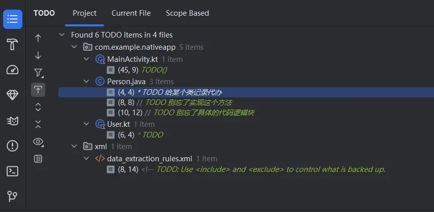
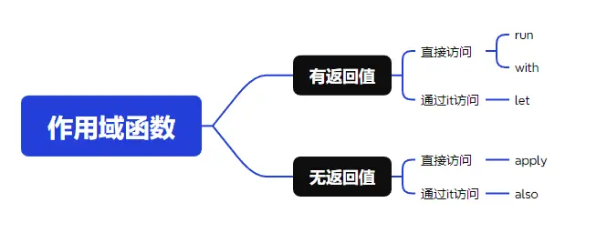

`Kotlin`作为目前开发`Android`的主流，是每个安卓开发者必须学会的语言，但是市面上很多的老项目都还是`Java`语言开发的，正在逐步过渡到`Kotlin`上，这里就涉及了一些`Kotlin`的关注点，尤其是互相交互的关注点，本文主要记录在`Kotlin`中遇到的一些问题。

### 标准语法糖

#### TODO

`TODO`是我们在代码中的代办，通常是我们在快速编码时，需要记录下某个功能需要实现或者修改的，但是想后续再进行修改的，就可以通过`TODO`来进行记录。通常的实现是直接在注释方法中声明，如下：

```java
/**
 * TODO 给某个类记录代办
 */
public class Person {

    // TODO 别忘了实现这个方法
    private void test() {
        // TODO 别忘了具体的代码逻辑块
    }
}
```

这种声明方式不会影响到代码，因为只是在注释中声明的，因此可以在任何有注释的地方加上这个声明，这种方式是不区分`Java`和`Kotlin`的。然后我们可以通过`View -> Tool Windwos -> TODO`，然后就可以看到项目中所有的代办事项了。



在`Kotlin`中，还给了一个方法`TODO`，本身的实现就是直接抛异常，如果我们在`Kotlin`中的代码块中想要添加待办的话，可以通过这种方式来实现。但是注意这个待办是直接抛异常，一定要注意。

```kotlin
public class NotImplementedError(message: String = "An operation is not implemented.") : Error(message)

@kotlin.internal.InlineOnly
public inline fun TODO(): Nothing = throw NotImplementedError()

@kotlin.internal.InlineOnly
public inline fun TODO(reason: String): Nothing = throw NotImplementedError("An operation is not implemented: $reason")
```

我们使用中直接声明这个方法即可，如下代码：

```kotlin
private fun doSomething() {
    TODO()
    // TODO("别忘了实现这个方法")
}
```

既可以使用不带参数的`TODO`方法，也可以使用带参数的，注意注意，声明了这个`TODO`方法后，一定要记得处理并最终删除掉，不然程序运行到这里就闪退了。同样的，这种方式声明的`TODO`也是可以直接通过上面的方法查找到的。

#### 作用域函数

- 标准函数`run`：表示一段代码块，并返回一个返回值，使用场景较低：

```kotlin
private fun doSomething() {
    val user = run { 
        // TODO 获取用户信息
    }
    println(user)
}
```

如上，可以直接将某段代码逻辑包装起来，与整个方法进行分割，当然实际上使用概率并不高，因为用到的基本都是另一个名字也是`run`的拓展函数。

- 拓展函数`run`、`let`：可以访问接收者的方法属性等，使用概率较高：

```kotlin
private fun doSomething() {
    val list = mutableListOf<String>().run {
        // 可以直接调用list的方法
        add("user")
        add("root")
        this
    }
    
    val list1 = mutableListOf<String>().let {
        // 需要通过it调用list的方法 
        it.add("user")
        it.add("root")
        this
    }
}
```

这种方式可以将对于某个对象的操作全部包装在一个代码块中，在作用域内，可以直接访问该对象的属性以及方法等，所以使用场景就是：1.将某个对象的操作包装在一块 2. 避免空指针检查

- 标准函数`with`：可以访问接收者的方法属性等，使用概率较高：

```kotlin
private fun doSomething() {
    val list = mutableListOf<String>()
    with(list){
        // 可以直接调用list的方法
        add("user")
        add("root")
        this
    }
}
```

- 拓展函数`also`、`apply`：无返回值，可以访问接受者的方法属性等，使用概率高：

```kotlin
private fun doSomething() {
    val list = mutableListOf<String>().apply {
        // 可以直接调用list的方法
        add("user")
        add("root")
    }
    
    val list1 = mutableListOf<String>().also { 
        // 需要通过it调用list的方法 
        it.add("user")
        it.add("root")
    }
}
```

总结下，这些作用域函数的作用都是某一段相关联的逻辑包装在同一个作用域内，更加便于阅读以及便于空判断。区分就是`also`和`apply`没有返回值，其他的都有返回值。每个分类下又分为可以直接获取方法属性，以及通过`it`来获取方法属性。




### 方法重载

 做`Android`开发的我们，最离不开的就是`View`，其中`View`一共有四个构造方法，在不同的场景下创建`View`时会调用不同的构造方法，因此我们自定义`View`时通常四个构造方法都要实现。如下：

```kotlin
class MyView(
    context: Context,
    attributeSet: AttributeSet?,
    defStyleStyle: Int,
    defStyleRes: Int
) : View(context, attributeSet, defStyleStyle, defStyleRes) {

    constructor(
        context: Context,
        attributeSet: AttributeSet?,
        defStyleStyle: Int
    ) : this(context, attributeSet, defStyleStyle, 0)

    constructor(
        context: Context,
        attributeSet: AttributeSet?
    ) : this(context, attributeSet, 0)

    constructor(context: Context) : this(context, null)
    ...
}
```

为了方便，我们可以直接给定其他参数默认值，然后通过注解让`Kotlin`帮我们直接生成这四个构造方法，如下代码：

```kotlin
class MyView @JvmOverloads constructor(
    context: Context,
    attributeSet: AttributeSet? = null,
    defStyleStyle: Int = 0,
    defStyleRes: Int = 0
) : View(context, attributeSet, defStyleStyle, defStyleRes)
```

注意构造方法上的注解`@JvmOverloads`，加上这个注解后在字节码层面就可以看到它实际上是有四个构造方法的，与最上面我们直接声明是一样的，这样在`Java`层就可以直接调用了。同样的，不仅仅是在构造方法上可以使用，在任何方法上都是可以用这个注解来生成重载函数的。

如下我们在`kotlin`中声明了某个函数如下：

```kotlin
private fun createPerson(name:String, age:Int = 20)：Person {
     ...
}
```

该函数有两个参数，其中第二个参数有默认值，因此在`kotlin`中我们有两种方式调用这个方法，可以传递`age`属性也可以不传递，如：

```kotlin
private fun doSomething() {
    val person = createPerson("张三")
    val person1 = createPerson("李四", 18)
}
```

但是在`Java`中我们就无法传递一个参数的形式来调用这个方法，而是必须要传递两个参数，想要解决这个问题也是通过`@JvmOverloads`来实现重载方法。

```kotlin
@JvmOverloads
private fun createPerson(name:String, age:Int = 20)：Person {
     ...
}
```

通过这种注解的方式实现重载，这样就保持了`Kotlin`和`Java`的一致性。

### 静态方法

在`Kotlin`中，是没有直接的静态方法的，我们如果要实现工具类方法通常使用其他方式，如直接在`kt`文件中声明顶层函数，如实现单例函数，如在伴生类中声明函数等。

#### 顶层函数方式

顶层函数是我们在`Kotlin`中常用的一种声明工具类的方式，即直接在`kt`文件的顶层声明方法，而不需要创建对应的类，使用时也可以直接使用。

```kotlin
package com.example.demo

fun formatString() { ... }
```

在`kotlin`中直接使用即可，但是在`Java`中并不能直接调用，最终还是通过类名来进行访问的，在字节码层面会生成一个类，该类的类名为`文件名的驼峰形式`加上`Kt`结尾，如文件名为`textutils.kt`，则在`Java`中访问则需要使用`TextUtilsKt.formatString()`来访问。

如果想要修改生成的类名，则需要通过`@file`来修改，需要在文件的第一行加上这个注释：

```kotlin
@file:JvmName("TextUtils")
package com.example.demo

fun formatString() { ... }
```

如上加上注释后并不会影响到`kotlin`的使用，而是在`Java`中访问这个方法时，就可以直接`TextUtils.formatString()`调用了。

注意，顶层函数在字节码层面实际都是**静态方法**的。

#### 单例对象方式

我们也可以通过单例对象来实现工具类，这种方法实现的工具类，他们都包含在同一个类中，比顶层函数有更强的关联性。调用方式也是通过`类名.方法名`来访问的。

```kotlin
object TextUtils {
    fun formatString() { ... }
}
```

这种方式实现的是一个单例对象，使用起来可以作为工具类使用，调用方式在`Kotlin`中为`TextUtils.formatString()`，看起来和`Java`的工具类一样了。但是在`Java`层调用则需要获取到`instance`才能调用，如：`TextUtils.INSTANCE.formatString();`

因为生成的方法并不是静态方法，所以在`Java`层的调用不能直接调用，但是我们却可以通过`@JvmStatic`的注解来让它在字节码层面是静态方法，这样Java层也可以直接调用了，就与`Kotlin`保持一致了。

```kotlin
object TextUtils {
    @JvmStatic
    fun formatString() { ... }
}
```

这样就保持了一致，在`Java`和`Kotlin`中就都可以直接通过`TextUtils.formatString`来直接访问了，保持了一致性。另外就是属性，它在字节码层面也是静态属性，但是它的`getter`和`setter`却不是静态的，因此还是得通过`INSTANCE`访问。但是，我们仍可以通过`@JvmStatic`注解来修饰该属性，这样它的`getter`和`setter`就是静态方法了。另外还有一种方式就是通过`@JvmField`来修饰属性，这样它在字节码层面就是一个普通的静态属性了，而不会为它生成对应的`getter`和`setter`了。

```kotlin
object TextUtils {
    var sex = "男"
    @JvmStatic
    var age = 10
    @JvmField
    var name = "张三"
    
    @JvmStatic
    fun formatString() { ... }
}
```

如上，`age`使用`@JvmStatic`修饰，最终在字节码中该属性就是私有静态的，并且其`getter`和`setter`也是静态的；`name`使用`@JvmField`修饰，最终在字节码中该属性就是公开静态的，不需要`getter`和`setter`。

```java
private void doSomething() {
    // 普通属性通过INSCENCE获取
    String sex = TextUtils.INSTANCE.getSex();
    // JvmStatic属性通过静态getter获取
    int age = TextUtils.getAge();
    // JvmField属性直接获取
    String name = TextUtils.name;
}
```


#### 伴生对象方式

伴生对象方式也是我们常使用的一种方式，我们一般会在伴生对象中定义像`Java`那样的静态属性和方法。如下：

```kotlin
class TextUtils {
    companion object {
        val TAG = "TextUtils"

        fun formatString() {}
    }
}
```

实际上，我们直接看字节码的话可以发现，所谓的伴生对象实际上仍然是一个单例对象，只不过它会变成`TextUtils`的一个静态内部类，然后其定义的属性会变成`TextUtils`的静态属性，其定义的方法还是属于静态内部类的普通方法。

在`Kotlin`中，我们可以直接通过`TextUtils.TAG`以及`TextUtils.formatString()`来访问。但是在`Java`层中需要通过伴生对象来访问，如`TextUtils.Companion.getTAG()`以及`TextUtils.Companion.formatString()`。如果想要保持`Java`和`Kotlin`的访问一致性，仍可以通过`@JvmStatic`和`@JvmField`的注解来实现。

### 可空属性

`Kotlin`是空安全的，而`Java`不是。因此它们互相调用时也是需要注意一些的，从`Kotlin`中调用`Java`方法时是需要关注返回值是否为空的。

```java
public String getName() {
    if (age < 1) {
        return null;
    }
    return name;
}
```

如我们上面的`java`代码获取名称，就有可能返回`null`，如果我们直接在`kotlin`中调用这个方法，获取到的返回值类型默认会推断为不可空的，这就可能会导致我们后续的逻辑出现问题。

```kotlin
val user = User()
// 获取到的name被推断为是不可空的类型
val name = user.name
```

因此，对于需要互相调用的地方，我们就需要注意其是否是可空的了。如上面的例子，我们可以直接声明其为可空类型，这样不论其是否可空都没关系了。

```kotlin
val user = User()
// 将获取到的结果直接显示声明为可空的，不论其是否可空都没影响了
val name:String? = user.name
```

或者修改`Java`代码，通过注解来表示其是否可空：

```java
// 通过注解表明该函数的返回值是可空的，这样kotlin就会自动推断类型为可空的
@Nullable
public String getName() {
    if (age < 1) {
        return null;
    }
    return name;
}

// 通过注解表明该函数返回值不可空，这样kotlin就会自动推断类型为不可空的
@NonNull
public String getNameNoNull() {
	if(name == null) {
	    return "";
	}
	return name;
}
```

### 持续更新

后续遇到值得记录的问题会持续更新...


