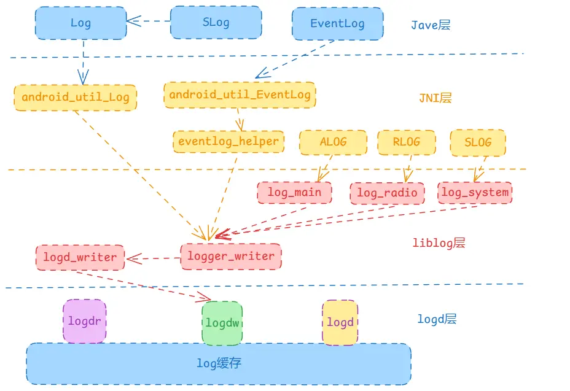

`Android`日志服务是我们接触非常多的一个服务，主要用于调试以及分析`bug`使用，可以记录程序执行的步骤，方便我们对代码进行追踪。它也是通过`rc`文件描述的，由`init`进程解析并启动的，我们知道`init`的`second_stage`阶段解析`rc`文件，其中会按顺序触发三个触发器以触发各个服务的启动，分别是`early_init`、`init`、`late_init`，日志服务在`init`触发器中启动的服务，它是比`ServiceManager`早启动的，因此是无法使用`binder`的。

> 本文基于Android13源码

## Logd

```
# system/logging/logd/logd.rc

service logd /system/bin/logd
    socket logd stream 0666 logd logd
    socket logdr seqpacket 0666 logd logd
    socket logdw dgram+passcred 0222 logd logd
    file /proc/kmsg r
    file /dev/kmsg w
    user logd
    group logd system package_info readproc
    capabilities SYSLOG AUDIT_CONTROL
    priority 10
    task_profiles ServiceCapacityLow
    onrestart setprop logd.ready false
```

`rc`文件中就是基本的启动，首先启动了`logd`服务，然后创建了三个`socket`。因此可以直接回到main方法中去进行查看。这些都是由`init`进程进行解析并执行的，最终通过执行可执行文件`/system/bin/logd`来启动的`logd`服务.

```c++
// system/logging/logd/main.cpp

int main(int argc, char* argv[]) {
    ...
    // 初始化Log
    android::base::InitLogging(
            argv, [](android::base::LogId log_id, android::base::LogSeverity severity,
                     const char* tag, const char* file, unsigned int line, const char* message) {
                if (tag && strcmp(tag, "logd") != 0) {
                    auto prefixed_message = android::base::StringPrintf("%s: %s", tag, message);
                    android::base::KernelLogger(log_id, severity, "logd", file, line,
                                                prefixed_message.c_str());
                } else {
                    android::base::KernelLogger(log_id, severity, "logd", file, line, message);
                }
            });

    ...

    LogTags log_tags;
    PruneList prune_list;

    // 获取系统属性中日志的类型，默认是serialized
    std::string buffer_type = GetProperty("logd.buffer_type", "serialized");

    // Partial (required for chatty) or full logging statistics.
    LogStatistics log_statistics(GetBoolPropertyEngSvelteDefault("logd.statistics"),
                                 buffer_type == "serialized");
 
    LogReaderList reader_list;

    // 根据类型获取不同的日志buffer
    LogBuffer* log_buffer = nullptr;
    if (buffer_type == "chatty") {
        log_buffer = new ChattyLogBuffer(&reader_list, &log_tags, &prune_list, &log_statistics);
    } else if (buffer_type == "serialized") {
        log_buffer = new SerializedLogBuffer(&reader_list, &log_tags, &log_statistics);
    } else if (buffer_type == "simple") {
        log_buffer = new SimpleLogBuffer(&reader_list, &log_tags, &log_statistics);
    } else {
        LOG(FATAL) << "buffer_type must be one of 'chatty', 'serialized', or 'simple'";
    }

    // 监听日志的读取
    LogReader* reader = new LogReader(log_buffer, &reader_list);
    if (reader->startListener()) {
        return EXIT_FAILURE;
    }

    // 监听日志的写入
    LogListener* swl = new LogListener(log_buffer);
    if (!swl->StartListener()) {
        return EXIT_FAILURE;
    }

    // 监听logcat的命令行
    CommandListener* cl = new CommandListener(log_buffer, &log_tags, &prune_list, &log_statistics);
    if (cl->startListener()) {
        return EXIT_FAILURE;
    }

    // 在rc文件中该属性被设置为false，当启动完成后会置为true，表示日志服务的可用
    SetProperty("logd.ready", "true");

    // LogAudit listens on NETLINK_AUDIT socket for selinux
    // initiated log messages. New log entries are added to LogBuffer
    // and LogReader is notified to send updates to connected clients.
    LogAudit* al = nullptr;
    if (auditd) {
        int dmesg_fd = GetBoolProperty("ro.logd.auditd.dmesg", true) ? fdDmesg : -1;
        al = new LogAudit(log_buffer, dmesg_fd, &log_statistics);
    }

    LogKlog* kl = nullptr;
    if (klogd) {
        kl = new LogKlog(log_buffer, fdDmesg, fdPmesg, al != nullptr, &log_statistics);
    }

    readDmesg(al, kl);

    // failure is an option ... messages are in dmesg (required by standard)
    if (kl && kl->startListener()) {
        delete kl;
    }

    if (al && al->startListener()) {
        delete al;
    }

    TrustyLog::create(log_buffer);

    TEMP_FAILURE_RETRY(pause());

    return EXIT_SUCCESS;
}
```

这里一共做了三件事，分别是初始化日志写入、创建日志`buffer`、启动日志`socket`监听。这里分别查看。

### 日志初始化

日志初始化，这里的初始化实际上设置了如何写入日志的过程，当使用方去设置输出日志时，实际上就是通过这里初始化时设置的方法来输出日志的。

```c++
// system/libbase/include/android-base/logging.h

void InitLogging(char* argv[],
                 LogFunction&& logger = INIT_LOGGING_DEFAULT_LOGGER,
                 AbortFunction&& aborter = DefaultAborter);
```

其接收三个参数，后两个参数都有默认值，可以不需要传入，在logd的初始化中，实际上最主要的就是传入第二个参数`logger`，该方法的具体实现是在另一个文件中：

```c++
void InitLogging(char* argv[], LogFunction&& logger, AbortFunction&& aborter) {
  SetLogger(std::forward<LogFunction>(logger));
  SetAborter(std::forward<AbortFunction>(aborter));

  if (gInitialized) {
    return;
  }
  // 标记已初始化过了
  gInitialized = true;

  // 设置默认的tag，这里实际上是/system/bin/logd
  if (argv != nullptr) {
    SetDefaultTag(basename(argv[0]));
  }

  const char* tags = getenv("ANDROID_LOG_TAGS");
  if (tags == nullptr) {
    return;
  }

  std::vector<std::string> specs = Split(tags, " ");
  for (size_t i = 0; i < specs.size(); ++i) {
    // "tag-pattern:[vdiwefs]"
    std::string spec(specs[i]);
    if (spec.size() == 3 && StartsWith(spec, "*:")) {
      switch (spec[2]) {
        case 'v':
          SetMinimumLogSeverity(VERBOSE);
          continue;
        case 'd':
          SetMinimumLogSeverity(DEBUG);
          continue;
        case 'i':
          SetMinimumLogSeverity(INFO);
          continue;
        case 'w':
          SetMinimumLogSeverity(WARNING);
          continue;
        case 'e':
          SetMinimumLogSeverity(ERROR);
          continue;
        case 'f':
          SetMinimumLogSeverity(FATAL_WITHOUT_ABORT);
          continue;
        // liblog will even suppress FATAL if you say 's' for silent, but fatal should
        // never be suppressed.
        case 's':
          SetMinimumLogSeverity(FATAL_WITHOUT_ABORT);
          continue;
      }
    }
    LOG(FATAL) << "unsupported '" << spec << "' in ANDROID_LOG_TAGS (" << tags
               << ")";
  }
}
```

这里最主要的就是`setLogger`设置成新的`logger`，然后就是一些初始化过程，这与`logd`的设计实现是暂时无关的，可以先就到这里。然后看后面的创建日志`buffer`。

### 创建日志buffer

日志`buffer`决定了日志在内存中是如何存储记录的，它分为三种`buffer`，根据系统属性`logd.buffer_type`来决定使用哪种，默认情况下使用`serialized`。

```c++
// system/logging/logd/LogBuffer.h

class LogBuffer {
  public:
    virtual ~LogBuffer() {}
    // 初始化
    virtual void Init() = 0;
    // 写入log
    virtual int Log(log_id_t log_id, log_time realtime, uid_t uid, pid_t pid, pid_t tid,
                    const char* msg, uint16_t len) = 0;

    virtual std::unique_ptr<FlushToState> CreateFlushToState(uint64_t start, LogMask log_mask)
            REQUIRES(logd_lock) = 0;
    virtual bool FlushTo(
            LogWriter* writer, FlushToState& state,
            const std::function<FilterResult(log_id_t log_id, pid_t pid, uint64_t sequence,
                                             log_time realtime)>& filter) REQUIRES(logd_lock) = 0;

    virtual bool Clear(log_id_t id, uid_t uid) = 0;
    virtual size_t GetSize(log_id_t id) = 0;
    virtual bool SetSize(log_id_t id, size_t size) = 0;

    virtual uint64_t sequence() const = 0;
};
```

`LogBuffer`定义了log的一些基本方法，不同的buffer都需要继承自LogBuffer并实现对应的方法。我们从上面的方法中可以看到，基本上每个方法都会有一个`log_id_t`参数，这是日志的分类参数，`Android`将日志按照分类拆分成多种日志，其关键字`log_id_t`。该值是一个枚举值：

```c++
// system/logging/liblog/include/android/log.h
typedef enum log_id {
  LOG_ID_MIN = 0,

  LOG_ID_MAIN = 0,
  LOG_ID_RADIO = 1,
  LOG_ID_EVENTS = 2,
  LOG_ID_SYSTEM = 3,
  LOG_ID_CRASH = 4,
  LOG_ID_STATS = 5,
  LOG_ID_SECURITY = 6,
  LOG_ID_KERNEL = 7,

  LOG_ID_MAX,
  LOG_ID_DEFAULT = 0x7FFFFFFF
} log_id_t;
```

其中就有我们很熟悉的`main`、`event`、`crash`等，其中我们应用中通过`Log.d`、`ALOGD`等打印的日志都是属于`main`分类的，也是最常见的日志。`LogBuffer`就是通过这些分类来将日志进行分类存储的。

#### SimpleLogBuffer

`SimpleLogBuffer`是最基础的`LogBuffer`，几乎不会使用。其对应的文件：`system/logging/logd/SimpleLogBuffer.cpp`和`system/logging/logd/SimpleLogBuffer.h`。

```c++
// system/logging/logd/SimpleLogBuffer.cpp

int SimpleLogBuffer::Log(log_id_t log_id, log_time realtime, uid_t uid, pid_t pid, pid_t tid,
                         const char* msg, uint16_t len) {
    ...
    // log的顺序+1
    auto sequence = sequence_.fetch_add(1, std::memory_order_relaxed);
    // 将log包装成LogBufferElement添加进入
    LogInternal(LogBufferElement(log_id, realtime, uid, pid, tid, sequence, msg, len));
    return len;
}

void SimpleLogBuffer::LogInternal(LogBufferElement&& elem) {
    log_id_t log_id = elem.log_id();
    // 添加到logs_集合中
    logs_.emplace_back(std::move(elem));
    stats_->Add(logs_.back().ToLogStatisticsElement());
    // 查看当前的log_id存储是否满了，满了的话需要删除旧的日志
    MaybePrune(log_id);
    // 通知有新log插入
    reader_list_->NotifyNewLog(1 << log_id);
}
```

`SimpleLogBuffer`的结构比较简单，就是使用了一个简单的`list`集合，每次有新`log`时，都是将其包装成一个`LogBufferElement`然后插入到集合中，并检查对应的`log_id`的日志是否需要删除。


#### SerializedLogBuffer 

`SerializedLogBuffer`是最常用的日志缓存，默认就是使用它来存储系统日志。它与`SimpleLogBuffer`的区别就是它是可压缩的缓存，前面简单的缓存就是将每条日志都包装成`LogBufferElement`保存下来，原打印的内容有多大，就会在内存中占用多少存储空间；而`SerializedLogBuffer`会将保存的日志进行压缩，这样就能存储更多的日志信息。它对应的头文件和实现文件在`system/logging/logd/SerializedLogBuffer.h`和`system/logging/logd/SerializedLogBuffer.cpp`。

```c++
// system/logging/logd/SerializedLogBuffer.cpp

int SerializedLogBuffer::Log(log_id_t log_id, log_time realtime, uid_t uid, pid_t pid, pid_t tid,
                             const char* msg, uint16_t len) {
    ...
    // 每条日志大小有限制，不能超过限制
    if (len > LOGGER_ENTRY_MAX_PAYLOAD) {
        len = LOGGER_ENTRY_MAX_PAYLOAD;
    }
    ...
    // 日志顺序+1
    auto sequence = sequence_.fetch_add(1, std::memory_order_relaxed);
    // 添加到buffer中
    auto entry = LogToLogBuffer(logs_[log_id], max_size_[log_id], sequence, 
                                realtime, uid, pid, tid,msg, len);
    ...
    // 检查对应的log_id存储的数据是否满了，满了的话删除旧日志
    MaybePrune(log_id);
    // 通知有新日志插入
    reader_list_->NotifyNewLog(1 << log_id);
    return len;
}

static SerializedLogEntry* LogToLogBuffer(std::list<SerializedLogChunk>& log_buffer,
                                          size_t max_size, uint64_t sequence, log_time realtime,
                                          uid_t uid, pid_t pid, pid_t tid, const char* msg,
                                          uint16_t len) {
    // 集合为空，说明第一次插入
    if (log_buffer.empty()) {
        // 先往集合中插入一个空的SerializedLogChunk，大小max_size / 4
        // 也就是每个log_id中可以存放四个chunk
        log_buffer.push_back(SerializedLogChunk(max_size / SerializedLogBuffer::kChunkSizeDivisor));
    }

    auto total_len = sizeof(SerializedLogEntry) + len;
    // 集合中的最后一个chunk存不下了，则插入一个新的chunk
    if (!log_buffer.back().CanLog(total_len)) {
        // 结束写入日志，并压缩
        log_buffer.back().FinishWriting();
        log_buffer.push_back(SerializedLogChunk(max_size / SerializedLogBuffer::kChunkSizeDivisor));
    }
    // 将日志插入到集合的最后一个chunk中
    return log_buffer.back().Log(sequence, realtime, uid, pid, tid, msg, len);
}
```

在`SerializedLogBuffer`中，数据并不是直接存储在`log_`中的，而是存在一个新的结构`SerializedLogChunk`中。

```c++
// system/logging/logd/SerializedLogChunk.cpp

// 将contents_中的数据压缩到compressed_log_中
void SerializedLogChunk::FinishWriting() {
    writer_active_ = false;
    CHECK_EQ(compressed_log_.size(), 0U);
    CompressionEngine::GetInstance().Compress(contents_, write_offset_, compressed_log_);
    LOG(VERBOSE) << "Compressed Log, buffer max size: " << contents_.size()
                 << " size used: " << write_offset_
                 << " compressed size: " << compressed_log_.size();
    if (reader_ref_count_ == 0) {
        contents_.Resize(0);
    }
}

SerializedLogEntry* SerializedLogChunk::Log(uint64_t sequence, log_time realtime, uid_t uid,
                                            pid_t pid, pid_t tid, const char* msg, uint16_t len) {
    // 记录新log的地址
    auto new_log_address = contents_.data() + write_offset_;
    // 在该地址上创建一个新的entry存储日志
    auto* entry = new (new_log_address) SerializedLogEntry(uid, pid, tid, sequence, realtime, len);
    memcpy(entry->msg(), msg, len);
    write_offset_ += entry->total_len();
    highest_sequence_number_ = sequence;
    return entry;
}
```

`SerializedLogBuffer`将数据按照`log_id`进行区分，每个`log_id`对应自己的一个数据集合，集合的每个元素中存储自己对应的日志分类数据，当存储满之后进行压缩，后续的新日志存储在新的元素中。


#### ChattyLogBuffer

`ChattyLogBuffer`不是直接继承自`LogBuffer`，而是`SimpleLogBuffer`的一个子类。我们前面看过了`SimpleLogBuffer`的结构，整体就是一个`list`集合，然后所有的日志都会包装成一个`LogBufferElement`然后插入到集合中去。这种存储方式比较全面，能够记录所有的信息，但是比较占用空间。而`ChattyLogBuffer`就是对其的一种优化，它会将连续多次同样的日志进行过滤，只记录一次。从名字看它就是一种非正式的缓存，因此也一般不会使用。它对应的头文件和实现文件在`system/logging/logd/ChattyLogBuffer.h`和`system/logging/logd/ChattyLogBuffer.cpp`。

```c++
// system/logging/logd/ChattyLogBuffer.cpp

void ChattyLogBuffer::LogInternal(LogBufferElement&& elem) {
    // 安全相关的日志不去合并，直接使用默认的记录方式
    if (elem.log_id() == LOG_ID_SECURITY) {
        SimpleLogBuffer::LogInternal(std::move(elem));
        return;
    }
    int log_id = elem.log_id();

    // 如果last_logged_elements_数组中未存储该id的日志，则直接存储
    if (!last_logged_elements_[log_id]) {
        last_logged_elements_[log_id].emplace(elem);
        SimpleLogBuffer::LogInternal(std::move(elem));
        return;
    }

    // 获取到最后一次存储的对应id的element
    LogBufferElement& current_last = *last_logged_elements_[log_id];
    // 比较本次的log和上次记录的log信息是否完全一致
    enum match_type match = Identical(elem, current_last);
    // 和上次打印的数据不一致，说明不需要合并
    if (match == DIFFERENT) {
        // 之前已经有记录的重复的元素存在了
        if (duplicate_elements_[log_id]) {
            // 如果重复数据大于0，则插入一条新的日志信息
            if (duplicate_elements_[log_id]->dropped_count() > 0) {
                SimpleLogBuffer::LogInternal(std::move(*duplicate_elements_[log_id]));
            }
            duplicate_elements_[log_id].reset();
            // 插入上次记录的日志信息
            SimpleLogBuffer::LogInternal(std::move(current_last));
        }
        // 插入新的日志信息
        last_logged_elements_[log_id].emplace(elem);
        SimpleLogBuffer::LogInternal(std::move(elem));
        return;
    }

    // 走到这里说明日志信息与上次的一致，但是重复信息却没有
    if (!duplicate_elements_[log_id]) {
        // 插入重复信息
        duplicate_elements_[log_id].emplace(std::move(current_last));
        // 并更新最新的日志
        last_logged_elements_[log_id].emplace(std::move(elem));
        return;
    }

    // 相同的LIBLOG事件
    if (match == SAME_LIBLOG) {
        const android_log_event_int_t* current_last_event =
                reinterpret_cast<const android_log_event_int_t*>(current_last.msg());
        int64_t current_last_count = current_last_event->payload.data;
        android_log_event_int_t* elem_event =
                reinterpret_cast<android_log_event_int_t*>(const_cast<char*>(elem.msg()));
        int64_t elem_count = elem_event->payload.data;
        // 合并数量
        int64_t total = current_last_count + elem_count;
        // 超过最大限制后直接记录出来
        if (total > std::numeric_limits<int32_t>::max()) {
            SimpleLogBuffer::LogInternal(std::move(current_last));
            last_logged_elements_[log_id].emplace(std::move(elem));
            return;
        }
        // 否则的话更新到last_logged_elements_中
        stats()->AddTotal(current_last.log_id(), current_last.msg_len());
        elem_event->payload.data = total;
        last_logged_elements_[log_id].emplace(std::move(elem));
        return;
    }

    // 完全相同的普通日志信息
    uint16_t dropped_count = duplicate_elements_[log_id]->dropped_count();
    // 超过最大限制后直接记录
    if (dropped_count == std::numeric_limits<uint16_t>::max()) {
        SimpleLogBuffer::LogInternal(std::move(*duplicate_elements_[log_id]));
        dropped_count = 0;
    }
    // 记录新的重复条数并更新信息
    current_last.SetDropped(dropped_count + 1);
    duplicate_elements_[log_id].emplace(std::move(current_last));
    last_logged_elements_[log_id].emplace(std::move(elem));
}
```

`ChattyLogBuffer`最主要的就是重写了`LogInternal`方法，在实际需要记录`log`信息的地方进行了拦截，这也就导致了如果打印的数据是一模一样的话，并不会实际记录，而是设置`SetDropped`重复次数，当下次数据不一致的时候进行输出提示。


### 启用socket

上面初始化完成之后，就是启用三个核心的socket，他们就是日志服务与外界进行交互的通道。

#### logdr

```c++
// system/logging/logd/main.cpp

int main(int argc, char* argv[]) {
    ...
    LogReader* reader = new LogReader(log_buffer, &reader_list);
    if (reader->startListener()) {
        return EXIT_FAILURE;
    }
    ...
}
```

`logdr`是通过`LogReader`来启动的，首先创建了一个`LogReader`，然后通过`startListener`启用监听。它监听的就是`/dev/socket/logdr`也就是读取日志信息的通道，该`socket`是在`rc`文件中创建的。

```c++
// system/logging/logd/LogReader.cpp

LogReader::LogReader(LogBuffer* logbuf, LogReaderList* reader_list)
    // socketListener进行监听套接字
    : SocketListener(getLogSocket(), true), log_buffer_(logbuf), reader_list_(reader_list) {}

// 获取到的是logdr套接字
int LogReader::getLogSocket() {
    static const char socketName[] = "logdr";
    int sock = android_get_control_socket(socketName);

    if (sock < 0) {
        sock = socket_local_server(
            socketName, ANDROID_SOCKET_NAMESPACE_RESERVED, SOCK_SEQPACKET);
    }
    return sock;
}
```

其中`LogReader`是继承自`SocketListener`的，实际的监听也是在`SocketListener`中完成的。

```c++
// system/core/libsysutils/src/SocketListener.cpp

int SocketListener::startListener() {
    return startListener(4);
}

int SocketListener::startListener(int backlog) {
    ...
    // 创建一个线程，然后执行threadStart方法
    if (pthread_create(&mThread, nullptr, SocketListener::threadStart, this)) {
        SLOGE("pthread_create (%s)", strerror(errno));
        return -1;
    }
    return 0;
}

void *SocketListener::threadStart(void *obj) {
    SocketListener *me = reinterpret_cast<SocketListener *>(obj);
	// 最终走到runListener中
    me->runListener();
    pthread_exit(nullptr);
    return nullptr;
}

void SocketListener::runListener() {
    // 死循环，该过程运行在子线程中
    while (true) {
        // 使用poll机制监听管道以及socket和client的变化
        std::vector<pollfd> fds;
        pthread_mutex_lock(&mClientsLock);
        fds.reserve(2 + mClients.size());
        fds.push_back({.fd = mCtrlPipe[0], .events = POLLIN});
        if (mListen) fds.push_back({.fd = mSock, .events = POLLIN});
        for (auto pair : mClients) {
            // NB: calling out to an other object with mClientsLock held (safe)
            const int fd = pair.second->getSocket();
            if (fd != pair.first) SLOGE("fd mismatch: %d != %d", fd, pair.first);
            fds.push_back({.fd = fd, .events = POLLIN});
        }
        pthread_mutex_unlock(&mClientsLock);

        // 进入阻塞，直到监听的文件描述符发生变化后，才会唤醒
        int rc = TEMP_FAILURE_RETRY(poll(fds.data(), fds.size(), -1));
        if (rc < 0) {
            SLOGE("poll failed (%s) mListen=%d", strerror(errno), mListen);
            sleep(1);
            continue;
        }

        // 管道中读取数据，如果是关闭命令，则结束监听
        if (fds[0].revents & (POLLIN | POLLERR)) {
            char c = CtrlPipe_Shutdown;
            TEMP_FAILURE_RETRY(read(mCtrlPipe[0], &c, 1));
            if (c == CtrlPipe_Shutdown) {
                break;
            }
            continue;
        }
        // 从logdr中读取数据
        if (mListen && (fds[1].revents & (POLLIN | POLLERR))) {
            // 创建一个新的套接字描述符
            int c = TEMP_FAILURE_RETRY(accept4(mSock, nullptr, nullptr, SOCK_CLOEXEC));
            if (c < 0) {
                SLOGE("accept failed (%s)", strerror(errno));
                sleep(1);
                continue;
            }
            pthread_mutex_lock(&mClientsLock);
            // 创建一个对应的SocketClient用于进行交互
            mClients[c] = new SocketClient(c, true, mUseCmdNum);
            pthread_mutex_unlock(&mClientsLock);
        }

        // 将所有有消息的mClients添加到pending中
        std::vector<SocketClient*> pending;
        pthread_mutex_lock(&mClientsLock);
        const int size = fds.size();
        for (int i = mListen ? 2 : 1; i < size; ++i) {
            const struct pollfd& p = fds[i];
            if (p.revents & (POLLIN | POLLERR)) {
                auto it = mClients.find(p.fd);
                if (it == mClients.end()) {
                    SLOGE("fd vanished: %d", p.fd);
                    continue;
                }
                SocketClient* c = it->second;
                pending.push_back(c);
                c->incRef();
            }
        } 
        pthread_mutex_unlock(&mClientsLock);

        // 然后在onDataAvailable中进行处理
        for (SocketClient* c : pending) {
            if (!onDataAvailable(c)) {
                release(c, false);
            }
            c->decRef();
        }
    }
}
```

主要逻辑就是通过`SocketListener`进行监听`logdr`套接字的数据信息以及管道数据信息，其中当有人连接到`logdr`后，就会建立连接并获取到`socketFd`，最终创建出一个`SocketClient`，然后在`onDataAvailable`中进行处理。但是该方法是个虚函数，最终的实现是在`LogReader`中处理的。

```c++
// system/logging/logd/LogReader.cpp

bool LogReader::onDataAvailable(SocketClient* cli) {
    ...
    char buffer[255];
    // 读取数据
    int len = read(cli->getSocket(), buffer, sizeof(buffer) - 1);
    if (len <= 0) {
        DoSocketDelete(cli);
        return false;
    }
    buffer[len] = '\0';

    // 每次socket数据只能发送一次数据，发送完之后就结束掉
    if (DoSocketDelete(cli)) {
        return false;
    }

    // 后面就是具体的数据交互部分了
    ...

    return true;
}
```


#### logdw

`logdw`是写入日志信息的`socket`，也是在`rc`文件中启动的。

```c++
// system/logging/logd/main.cpp

int main(int argc, char* argv[]) {
    ...
    LogListener* swl = new LogListener(log_buffer);
    if (!swl->StartListener()) {
        return EXIT_FAILURE;
    }
    ...
}
```

同样的，也是通过listener开启一个线程，然后在单独的线程中处理日志数据。

```c++
// system/logging/logd/LogListener.cpp

LogListener::LogListener(LogBuffer* buf) : socket_(GetLogSocket()), logbuf_(buf) {}

// 获取到logdw
int LogListener::GetLogSocket() {
    static const char socketName[] = "logdw";
    int sock = android_get_control_socket(socketName);

    if (sock < 0) {  // logd started up in init.sh
        sock = socket_local_server(
            socketName, ANDROID_SOCKET_NAMESPACE_RESERVED, SOCK_DGRAM);

        int on = 1;
        if (setsockopt(sock, SOL_SOCKET, SO_PASSCRED, &on, sizeof(on))) {
            return -1;
        }
    }
    return sock;
}
```

注意这里和`LogReader`是不一样，他没有继承自`SocketListener`，就是一个普通的类而已。接着继续看`startListener`。

````c++
// system/logging/logd/LogListener.cpp

bool LogListener::StartListener() {
    if (socket_ <= 0) {
        return false;
    }
    // 创建线程，然后执行ThreadFunction函数
    auto thread = std::thread(&LogListener::ThreadFunction, this);
    thread.detach();
    return true;
}

void LogListener::ThreadFunction() {
    prctl(PR_SET_NAME, "logd.writer");
    // 子线程中运行，循环处理数据
    while (true) {
        HandleData();
    }
}

// 处理日志数据，每次处理一条，循环执行
void LogListener::HandleData() {
    // + 1 to ensure null terminator if MAX_PAYLOAD buffer is received
    __attribute__((uninitialized)) char
            buffer[sizeof(android_log_header_t) + LOGGER_ENTRY_MAX_PAYLOAD + 1];
    struct iovec iov = {buffer, sizeof(buffer) - 1};

    alignas(4) char control[CMSG_SPACE(sizeof(struct ucred))];
    struct msghdr hdr = {
        nullptr, 0, &iov, 1, control, sizeof(control), 0,
    };

    // 从socket中读取数据
    ssize_t n = recvmsg(socket_, &hdr, 0);
    if (n <= (ssize_t)(sizeof(android_log_header_t))) {
        return;
    }

    ...
    // 中间的一大截就是解析数据，最终获取到对应的日志信息，然后记录在LogBuffer中

    logbuf_->Log(logId, header->realtime, cred->uid, cred->pid, header->tid, msg,
                 ((size_t)n <= UINT16_MAX) ? (uint16_t)n : UINT16_MAX);
}
````

最终的结果就是其他地方通过`logdw`写入日志数据，最终由`logd`存储在的对应的缓存结构中。

#### logd

`logd`套接字是负责命令相关的，最主要的用途就是`logcat`了，每次通过`logcat`发出命令后，都会给`logd`发送对应的数据，最终解析出来并进行处理。

```c++
// system/logging/logd/main.cpp

int main(int argc, char* argv[]) {
    ...
    CommandListener* cl = new CommandListener(log_buffer, &log_tags, &prune_list, &log_statistics);
    if (cl->startListener()) {
        return EXIT_FAILURE;
    }
    ...
}
```

和前面一样，都是通过创建`Listener`并开启监听，最终来到子线程中进行处理。

```c++
// system/logging/logd/CommandListener.cpp

CommandListener::CommandListener(LogBuffer* buf, LogTags* tags, PruneList* prune,
                                 LogStatistics* stats)
    : FrameworkListener(getLogSocket()), buf_(buf), tags_(tags), prune_(prune), stats_(stats) {
    registerCmd(new ClearCmd(this));
    registerCmd(new GetBufSizeCmd(this));
    registerCmd(new SetBufSizeCmd(this));
    registerCmd(new GetBufSizeReadableCmd(this));
    registerCmd(new GetBufSizeUsedCmd(this));
    registerCmd(new GetStatisticsCmd(this));
    registerCmd(new SetPruneListCmd(this));
    registerCmd(new GetPruneListCmd(this));
    registerCmd(new GetEventTagCmd(this));
    registerCmd(new ReinitCmd(this));
    registerCmd(new ExitCmd(this));
}

// 获取到logd的socket
int CommandListener::getLogSocket() {
    static const char socketName[] = "logd";
    int sock = android_get_control_socket(socketName);

    if (sock < 0) {
        sock = socket_local_server(
            socketName, ANDROID_SOCKET_NAMESPACE_RESERVED, SOCK_STREAM);
    }

    return sock;
}
```

构造方法中注册了多个命令，后续就会解析套接字中的命令数据，然后交给对应的命令进行处理，这里就不在展开了。其中`CommandListener`是继承自`FrameworkListener`的，然后在`FrameworkListener`又继承自`SocketListener`，因此它和前面的`LogReader`是有些相似的。

当`CommandListener`启动之后，就代表了`logd`服务已经完成了启动，此时会在系统属性中写入`SetProperty("logd.ready", "true");`。

### 使用

`logdr`和`logdw`提供了对日志的读写功能，是通过`socket`进行交互的，但是实际上我们肯定不可能直接对其进行操作，一方面是权限问题，另一方面则是协议问题。直接交互无法保障数据格式以及交互方的身份情况，因此提供了一系列的方法供我们使用。

在`Java`层，`log`的写入是通过一系列的静态方法去写入的，如`Log.d`等，我们直接通过这些静态方法打印日志即可，不需要关注身份以及格式问题。

```java
// frameworks/base/core/java/android/util/Log.java
public final class Log {
    // MAIN类型的日志
    public static int d(@Nullable String tag, @NonNull String msg) {
        return println_native(LOG_ID_MAIN, DEBUG, tag, msg);
    }
     public static int v(@Nullable String tag, @NonNull String msg) {
        return println_native(LOG_ID_MAIN, VERBOSE, tag, msg);
    }
    ...
    // RADIO类型的日志
    @SystemApi(client = SystemApi.Client.MODULE_LIBRARIES)
    public static int logToRadioBuffer(@Level int priority, @Nullable String tag,
            @Nullable String message) {
        return println_native(LOG_ID_RADIO, priority, tag, message);
    }
}
```

可以看到，我们正常通过`Log`打印的日志都是通过`println_native`走到`native`层进行打印的，并且分类是`LOG_ID_MAIN`。分类`id`是固定的，不允许指定，如果想要打印别的`id`，则需要使用其他工具类进行打印。如`SLog`打印的是`SYSTEM`类型的日志。

```java
// frameworks/base/core/java/android/util/Slog.java

public final class SLog {
    @UnsupportedAppUsage
    public static int v(@Nullable String tag, @NonNull String msg) {
        return Log.println_native(Log.LOG_ID_SYSTEM, Log.VERBOSE, tag, msg);
    }
    @UnsupportedAppUsage
    public static int d(@Nullable String tag, @NonNull String msg) {
        return Log.println_native(Log.LOG_ID_SYSTEM, Log.DEBUG, tag, msg);
    }
    ...
}
```

实际上还是走到了`Log`类中进行的打印，只是换了个`ID`而已。注意`SLog`在普通的应用中是不允许使用的，应该是在系统组件中使用。`EVENT`类型的日志是在另外一个文件中打印的。

```java
// frameworks/base/core/java/android/util/EventLog.java
public final class EventLog {
    public static native int writeEvent(int tag, int value);
    public static native int writeEvent(int tag, long value);
    public static native int writeEvent(int tag, String str);
    ...
}
```

主要分为了两个部分进入到`native`层进行打印，一个是`println_native`一个是`writeEvent`，接下来继续看这两个方法的实现。因为这两个方法都是在`Java`层中的，对于`framework`层的`jni`方法都是动态注册的，他们对应的文件都在`frameworks/base/core/jni/`目录下，因此我们如果想要找对应的`jni`文件，则可以直接在该目录下搜`包名_类名.cpp`文件，如这里我们就应该找`android.util.Log.cpp`。

```c++
// native对应的方法
static const JNINativeMethod gMethods[] = {
    /* name, signature, funcPtr */
    { "isLoggable",      "(Ljava/lang/String;I)Z", (void*) android_util_Log_isLoggable },
    { "println_native",  "(IILjava/lang/String;Ljava/lang/String;)I", (void*) android_util_Log_println_native },
    { "logger_entry_max_payload_native",  "()I", (void*) android_util_Log_logger_entry_max_payload_native },
};

static jint android_util_Log_println_native(JNIEnv* env, jobject clazz,
        jint bufID, jint priority, jstring tagObj, jstring msgObj)
{
    const char* tag = NULL;
    const char* msg = NULL;

    if (msgObj == NULL) {
        jniThrowNullPointerException(env, "println needs a message");
        return -1;
    }

    if (bufID < 0 || bufID >= LOG_ID_MAX) {
        jniThrowNullPointerException(env, "bad bufID");
        return -1;
    }

    if (tagObj != NULL)
        tag = env->GetStringUTFChars(tagObj, NULL);
    msg = env->GetStringUTFChars(msgObj, NULL);
    // 写入log。该方法对应的头文件是log/log.h，实际声明是在android/log.h中
    int res = __android_log_buf_write(bufID, (android_LogPriority)priority, tag, msg);

    if (tag != NULL)
        env->ReleaseStringUTFChars(tagObj, tag);
    env->ReleaseStringUTFChars(msgObj, msg);

    return res;
}
```

`jni`层中的方法只是一个转发，实际上还是走到了`liblog`中的方法，该方法定义在`system/logging/liblog/include/android/log.h`中，然后被包含在了`system/logging/liblog/include/log/log.h`中，实际的实现文件在`system/logging/liblog/logger_write.cpp`。

```c++
// system/logging/liblog/logger_write.cpp

int __android_log_buf_write(int bufID, int prio, const char* tag, const char* msg) {
  ...
  // 将打印的数据包装成log_message，然后写入
  __android_log_message log_message = {
      sizeof(__android_log_message), bufID, prio, tag, nullptr, 0, msg};
  __android_log_write_log_message(&log_message);
  return 1;
}

void __android_log_write_log_message(__android_log_message* log_message) {
  ...
  // logger_function是定义的宏，实际对应于方法__android_log_logd_logger
  logger_function(log_message);
}

// 该宏定义实际在文件的最前面，这里放到下边方便查看
static __android_logger_function logger_function = __android_log_logd_logger;

void __android_log_logd_logger(const struct __android_log_message* log_message) {
  int buffer_id = log_message->buffer_id == LOG_ID_DEFAULT ? LOG_ID_MAIN : log_message->buffer_id;

  struct iovec vec[3];
  vec[0].iov_base =
      const_cast<unsigned char*>(reinterpret_cast<const unsigned char*>(&log_message->priority));
  vec[0].iov_len = 1;
  vec[1].iov_base = const_cast<void*>(static_cast<const void*>(log_message->tag));
  vec[1].iov_len = strlen(log_message->tag) + 1;
  vec[2].iov_base = const_cast<void*>(static_cast<const void*>(log_message->message));
  vec[2].iov_len = strlen(log_message->message) + 1;
  // 写入日志文件
  write_to_log(static_cast<log_id_t>(buffer_id), vec, 3);
}

static int write_to_log(log_id_t log_id, struct iovec* vec, size_t nr) {
  int ret;
  ...
  // 最终的打印log的地方
  ret = LogdWrite(log_id, &ts, vec, nr);
  PmsgWrite(log_id, &ts, vec, nr);

  return ret;
}
```

反正就是经过一系列的方法调用以及数据和权限检测等，最后走到的是`LogdWrite`来实际进行打印。

```c++
// system/logging/liblog/logd_writer.cpp

int LogdWrite(log_id_t logId, struct timespec* ts, struct iovec* vec, size_t nr) {
  ...
  // 向/dev/socket/logdw中写入日志
  ret = TEMP_FAILURE_RETRY(writev(logd_socket.sock(), newVec, i));
  if (ret < 0 && errno != EAGAIN) {
    logd_socket.Reconnect();

    ret = TEMP_FAILURE_RETRY(writev(logd_socket.sock(), newVec, i));
  }
  ...
}  
```

最终实际上还是往`/dev/socket/logdw`中写入的数据，然后经由`logd`服务的处理，最终存储在日志缓存中。以上的整个链路就是`Java`层打印普通`log`的一个流程，而对应`EVENT`类型的日志，走的是另一条路，我们重新回过头看`android_utils_EventLog.cpp`。

```c++
// frameworks/base/core/jni/android_util_EventLog.cpp

static const JNINativeMethod gRegisterMethods[] = {
    /* name, signature, funcPtr */
    { "writeEvent", "(II)I", (void*) ELog::writeEventInteger },
    { "writeEvent", "(IJ)I", (void*) ELog::writeEventLong },
    { "writeEvent", "(IF)I", (void*) ELog::writeEventFloat },
    { "writeEvent", "(ILjava/lang/String;)I", (void*) ELog::writeEventString },
    { "writeEvent", "(I[Ljava/lang/Object;)I", (void*) ELog::writeEventArray },
    { "readEvents",
      "([ILjava/util/Collection;)V",
      (void*) android_util_EventLog_readEvents
    },
    { "readEventsOnWrapping",
      "([IJLjava/util/Collection;)V",
      (void*) android_util_EventLog_readEventsOnWrapping
    },
};
```

对应的`native`方法被映射到了`ELog`类中去了，该类是在`eventlog_helper.h`中定义的。它不像`MAIN`类型的日志那样全部当成了字符串，而是将打印的日志根据数据类型进行区分了，对应的方法也有好几个方法，不过都基本上差不多，我们看一个即可。

```c++
// frameworks/base/core/jni/eventlog_helper.h

class EventLogHelper {
public:
    static jint writeEventInteger(JNIEnv* env ATTRIBUTE_UNUSED, jobject clazz ATTRIBUTE_UNUSED,
            jint tag, jint value) {
        android_log_event_list ctx(tag);
        ctx << (int32_t)value;
        return ctx.write(LogID);
    }
    ...
}
```

看流程就是构建了一个`ctx`的`list`，然后写入了一个`int`值，在然后通过`write`写入。

```c++
// system/logging/liblog/include/log/log_event_list.h

class android_log_event_list {
 ...
 public:
  ...
  android_log_event_list& operator<<(int32_t value) {
    int retval = android_log_write_int32(ctx, value);
    if (retval < 0) ret = retval;
    return *this;
  }
  ...
  int write(log_id_t id = LOG_ID_EVENTS) {
    /* facilitate -EBUSY retry */
    if ((ret == -EBUSY) || (ret > 0)) ret = 0;
    int retval = android_log_write_list(ctx, id);
    /* existing errors trump transmission errors */
    if (!ret) ret = retval;
    return ret;
  }
  ...
}
```

继续跟踪，这两个方法实际调用的方法实现不在头文件中，而是在对应的实现文件中，继续追踪即可查看。

```c++
// system/logging/liblog/log_event_list.cpp

int android_log_write_int32(android_log_context context, int32_t value) {
  ...
  // 将记录的数据存储起来
  context->count[context->list_nest_depth]++;
  auto* event_int = reinterpret_cast<android_event_int_t*>(&context->storage[context->pos]);
  event_int->type = EVENT_TYPE_INT;
  event_int->data = value;
  context->pos += needed;
  return 0;
}


int android_log_write_list(android_log_context context, log_id_t id) {
  const char* msg;
  ssize_t len;
  ...
  // 最终通过__android_log_bwrite写入数据
  return (id == LOG_ID_EVENTS)
             ? __android_log_bwrite(context->tag, msg, len)
             : ((id == LOG_ID_STATS) ? __android_log_stats_bwrite(context->tag, msg, len)
                                     : __android_log_security_bwrite(context->tag, msg, len));
}
```

最终还是走到了`logger_write`中，与前面的保持了一致。

```c++
// system/logging/liblog/logger_write.cpp

int __android_log_bwrite(int32_t tag, const void* payload, size_t len) {
  ErrnoRestorer errno_restorer;

  struct iovec vec[2];

  vec[0].iov_base = &tag;
  vec[0].iov_len = sizeof(tag);
  vec[1].iov_base = (void*)payload;
  vec[1].iov_len = len;

  return write_to_log(LOG_ID_EVENTS, vec, 2);
}
```

也就是说，实际上在`Java`层的几种的类型的日志，实际上都会通过`jni`走到`native`层，然后最终汇聚在`logger_write`中，由其向`/dev/socket/logdw`写入数据，最终在`logd`服务中保存。实际上，`logger`就是`logd`提供的给外界其他应用或进程使用的一个日志接口。

那么我们在开发`jni`层面的代码时，打印`log`也需要引入`logger`吗？当然可以：

```c++
#include<log/log.h>

// 通过这种方式打印log，可以指定bufID
__android_log_buf_write(bufID, priority, tag, msg);

// 通过这种方式打印log，默认的bufID是MAIN
__android_log_write(int priority, tag, msg)
```

但是我们实际上不这么用，而是使用给定的打印日志的宏来进行日志打印，如我们熟悉的`ALOG`，它是定义的一系列宏，可以帮助我们快速打印日志。

```c++
// system/logging/liblog/include/log/log_main.h

#ifndef ALOGD
#define ALOGD(...) ((void)ALOG(LOG_DEBUG, LOG_TAG, __VA_ARGS__))
#endif

#ifndef ALOG
#define ALOG(priority, tag, ...) LOG_PRI(ANDROID_##priority, tag, __VA_ARGS__)
#endif

#ifndef LOG_PRI
#define LOG_PRI(priority, tag, ...) android_printLog(priority, tag, __VA_ARGS__)
#endif

// 最终通过这种方式打印的日志
#define android_printLog(prio, tag, ...) \
  __android_log_print(prio, tag, __VA_ARGS__)
```

该方法定义在`android/log.h`，实际实现在`logger_writer.cpp`中。具体就不再看了，最终还是走到了同样的逻辑中，只是使用这种方式，我们写起来比较简单，还可以使用占位符来生成字串等信息。同时也帮我们省去了`priority`和`tag`参数，我们只需要关注后面的`message`即可。如我们想打印`DEBUG`类型的日志，就可以使用`ALOGD`；若是打印`ERROR`类型的日志，就可以使用`ALOGE`。如下：

```c++
#include <log/log.h>
#define LOG_TAG "MyTAG"

ALOGD("打印日志");
ALOGI("打印日志：%d", 20);
```

其他的如`SLOG`、`RLOG`等打印的是对应其他ID的日志信息，使用方式上和`ALOG`一模一样，这里不在多赘述了。当然，对于应用层的`jni`开发，我们可能会无法引入`log/log.h`头文件，我们只能引入`android/log.h`头文件，因此我们只能使用`__android_log_print`来打印日志，或者模仿`ALOG`去自己定义一些宏。

但是，在最新的`NDK`中，已经集成了`android/log_macros.h`头文件，因此我们引入该头文件后就可以使用`ALOG`了。

### 总结

至此，我们基本上看完了`logd`的实现以及使用，实际上我们最主要关注的就是`logd`的实现以及日志的写入，对于日志的读取基本上没怎么查看。这是因为在我们大多数的场景下，我们都不需要直接读取日志信息，而是通过`logcat`等方式去查看日志内容。

`logd`作为`init`进程中较早启动的进程，它是在`ServiceManager`前启动的，因此也没有采用`binder`的方式进行跨进程（后面又引入了`binder`，只是在比较晚的时候才去注册了自身的服务），而是使用了`socket`的方式。一共提供了三个套接字，分别是`logdr`负责读取日志，`logdw`负责写入日志，`logd`负责处理`logcat`命令等。




