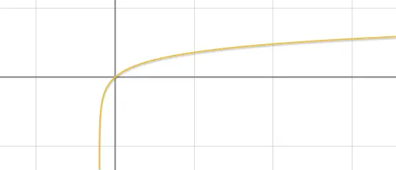

`Android`中默认是没有弹性滑动的，当发生了`overscroll`的时候，会在`View`的边界处显示一个弧状的动效。然而动效要求要和`iOS`保持一致，当过度滑动时，会整个界面向下滑动，然后松手后再回弹到原点。

### 效果分析

我们可以先去在苹果手机上大致上手查看下，当触发了过度滑动时，整个界面的滑动并不是跟随手指的，而是有一个逐渐递减的过程，例如手指滑动了`100`的距离，然后界面实际滑动了`60`的距离这样，并且随着过度滑动距离的增大，界面滑动的距离逐渐衰减，因此我们需要找到这个映射关系。

当然，这个映射关系分析肯定是分析不出来的，直接找动效工程师索要即可，至于它怎么得到就不是我们要关心的了。万一是小公司，没有动效工程师呢？所以这里我们得先动用自己所学的知识去大概模拟下。首先根据分析这个映射关系或者说映射函数应该是个递增的函数，并且增长的速率是递减的。

最简单的就是对数函数`f(x) = log(x)`即可满足我们的要求，但是它的增长速度有点太慢了，因此我们可以简单修饰下，例如我们想要的是当`x`为0时取值也是0，当x为N时，取值大概为N/2。就可以将函数修改为`f(x) = logN(x+1)*N/2`。



另外指数函数也能满足我们的要求，直接找个在线绘图的网站然后调参数即可，这里直接给出函数`f(x) = N*(1-2^(-x/N))`。

_
[coroutine-2.md](coroutine-2.md)


### 代码实现

拿到了映射函数之后，代码实现就比较简单了，主要的逻辑就是将滑动的距离通过刚才的映射函数处理后，得到实际应该滑动的距离。

```kotlin
class MyViewGroup @JvmOverloads constructor(
    context: Context,
    attributeSet: AttributeSet? = null,
     def: Int = 0
) FrameLayout(context, attributeSet, def){

    // 300dp，函数中的常量N
    private val max = TypedValue.applyDimension(TypedValue.COMPLEX_UNIT_DIP, 300F, context.resources.displayMetrics)

    // 手指按下的坐标
    private var downY  = 0F
    // 应当滚动的距离
    private var scrollTop = 0F

    override fun onTouchEvent(event: MotionEvent?): Boolean {
        when(event?.actionMasked) {
            // 按下时记录坐标
            MotionEvent.ACTION_DOWN -> downY = event.y
            MotionEvent.ACTION_MOVE -> {
                // 当前滚动的距离
                val deltaY = event.y - downY
                // 计算deltaY对应的实际滚动距离
                scrollTop = scrollTop + compute(scrollTop + deltaY) - compute(scrollTop)
                // 滚动到对应的位置
                scrollTo(scrollX, -scrollTop.toInt())
                // 本次滑动结束，更新坐标
                downY = event.y
            }
            MotionEvent.ACTION_UP -> {
                // 手指抬起时恢复到初始位置
                ValueAnimator.ofFloat(scrollTop, 0F).also {
                    it.interpolator = DecelerateInterpolator()
                    it.addUpdateListener { anim->
                        scrollTop = anim.animatedValue as Float
                        scrollTo(scrollX, -scrollTop.toInt())
                    }
                    it.start()
                }
            }
        }
        return true
    }

	// 映射函数：f(x) = N * (1 - 2^(-x/N))
    private fun compute(x: Float): Float {
        return max * (1 - 2F.pow(-x/max))
    }

}
```

主要逻辑就是在每段的滚动中，计算该段滚动实际应该对应滚动多远，然后将布局进行滚动即可，整体逻辑还是比较简单的，然后就是将该布局跑到界面上查看效果了。

```xml
<?xml version="1.0" encoding="utf-8"?>
<com.study.androidbehavior.widget.MyViewGroup xmlns:android="http://schemas.android.com/apk/res/android"
    android:id="@+id/main"
    android:layout_width="match_parent"
    android:layout_height="match_parent"
    android:orientation="vertical">

    <View
        android:background="#FF0"
        android:layout_width="match_parent"
        android:layout_height="match_parent"/>
</com.study.androidbehavior.widget.MyViewGroup>
```

父布局是我们自定义的用户过度滚动的布局`MyViewGroup`，子布局是一个最基础的`View`，然后设置了黄色的背景方便进行观察，最后的运行效果是这样的：


大体上的效果是已经满足我们过度滑动的效果了，当我们下拉时整个界面也跟随手指的移动，并且不是线性移动，当我们手指松开之后界面又回弹到原来的位置。但是还有一些细节没有处理，如当前的这种效果只支持单指的滑动，当一根手指滑动时，是不会去响应另一根手指的，这是因为我们在`onTouch`中并没有去做处理。

### 优化多指滑动

以上的示例在单指下使用是可以的，但是多指不会识别，另外当A指滑动，B指再按下去，然后再抬起A指时，会导致滑动位置突变，这才是主要的问题。这里我们回忆下正常的触碰操作：一个`DOWN`，多个`MOVEW`，一个`UP`，我们上述逻辑也是按这个表现进行处理的。

然后多指操作呢，就是在另一根手指按下时会触发`POINTER_DOWN`，然后移动仍是多个`MOVE`，抬起时是`POINTER_UP`。可以看出多指时，只有按下和抬起是有区分的。这里注意一点：`DOWN`是第一根手指按下时的事件，`UP`是最后一根手指抬起时的事件，`POINTER_DOWN`和`POINTER_UP`是中间手指按下和抬起时的事件，`MOVE`不区分手指。例如：A手指按下去，触发的是`DOWN`，然后移动触发`MOVE`，此时B手指按下去触发的是`POINTER_DOWN`，然后移动触发`MOVE`，然后A手指抬起，触发的是`POINTER_UP`，然后B手指抬起触发的是`UP`。

因此要适配多指操作，就不能单独的根据这几个key的类型来处理，需要找到对应手指的事件。而`event`中就是通过`pointerId`来进行区分手指的。所以我们应该在按下时记录不同手指的位置，然后滑动时计算不同手指的滑动。

```kotlin
class MyViewGroup @JvmOverloads constructor(
    context: Context,
    attributeSet: AttributeSet? = null,
    def: Int = 0
) : FrameLayout(context, attributeSet, def){

    // 300dp，函数中的常量N
    private val max = TypedValue.applyDimension(TypedValue.COMPLEX_UNIT_DIP, 300F, context.resources.displayMetrics)

    // 手指按下的坐标
    private val downY  = SparseArray<Float>()
    // 应当滚动的距离
    private var scrollTop = 0F

    override fun onTouchEvent(event: MotionEvent?): Boolean {
        when(event?.actionMasked) {
            // 按下时记录坐标
            MotionEvent.ACTION_DOWN, MotionEvent.ACTION_POINTER_DOWN -> {
                downY[event.getPointerId(event.actionIndex)] = event.getY(event.actionIndex)
            }
            MotionEvent.ACTION_MOVE -> {
                // 当前滚动的距离
                for (i in 0 until event.pointerCount) {
                    val id = event.getPointerId(i)
                    val deltaY = event.getY(i) - downY[id]
                    // 计算deltaY对应的实际滚动距离
                    scrollTop = scrollTop + compute(scrollTop + deltaY) - compute(scrollTop)
                    // 滚动到对应的位置
                    scrollTo(scrollX, -scrollTop.toInt())
                    // 本次滑动结束，更新坐标
                    downY[id] = event.getY(i)
                }
            }
            MotionEvent.ACTION_UP -> {
                // 手指抬起时恢复到初始位置
                ValueAnimator.ofFloat(scrollTop, 0F).also {
                    it.interpolator = DecelerateInterpolator()
                    it.addUpdateListener { anim->
                        scrollTop = anim.animatedValue as Float
                        scrollTo(scrollX, -scrollTop.toInt())
                    }
                    it.start()
                }
            }
        }
        return true
    }

    // 映射函数：f(x) = N * (1 - 2^(-x/N))
    private fun compute(x: Float): Float {
        return max * (1 - 2F.pow(-x/max))
    }

}
```

改动点有三处，首先是将记录按下位置的属性`downY`改成了一个集合，用于保存不同手指按下的位置。第二点修改是在`DOWN`事件以及`POINTER_DOWN`事件时，记录手指的按下坐标，这里通过`event.getY()`来获取对应的坐标。第三点是在`MOVE`时，由于滑动是不区分多指的，统一使用一个`EVENT`来表示，因此我们需要通过`pointerCount`获取到所有的手指`index`进行遍历，分别对每根手指做滑动逻辑。最终效果如下：


### 优化向上滑动

到这里我们都是针对的向下滑动，包括我们的函数也是一样。如果向下滑动的话就会出问题，因为我们的函数，当`x<0`的时候，`f(x)`也是小于0的，并且随着`x`的减少，`f(x)`减少的速度是逐渐增大的。因此，我们只需要正向和反向都保持一致即可，如下，直接修改映射函数：

```kotlin
    // 映射函数：f(x) = N * (1 - 2^(-x/N))
    private fun compute(x: Float): Float {
        var signal = 1
        if (x < 0) {
            signal = -1
        }
        return max * (1 - 2F.pow(-abs(x)/max)) * signal
    }
```

至此，上下滑动我们都是保持一致的了，都实现了过度滑动的弹性效果。
