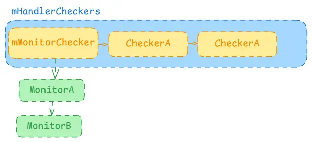

`system_server`进程管理着`Java`世界的服务，主要分为`boot`服务、核心服务以及其他服务。开机时由`init`进程拉起`zygote`，最终走到`java`世界的`zygote`。后续所有的`java`进程都是由`zygote`直接或间接孵化而出，而`system_server`就是`zygote`孵化出的第一个进程。这个流程可以查看前面的[Java进程祖先-zygote服务](https://pgaofeng.github.io/2022/08/12/zygote/)，后续其他服务就是由`system_server`启动的。

> 源码基于Android 13

## system_server

它是`zygote`孵化出的第一个进程，当`system_server`被`fork`出之后，`zygote`就不再直接`fork`其他进程了，而是进入循环阻塞状态，等待`socket`的消息来决定什么时候`fork`新进程。而`system_server`进程启动后，就走到其主函数中开始了它自己的流程。

```java
// frameworks/base/services/java/com/android/server/SystemServer.java

public final class SystemServer implements Dumpable {
    // dump服务
    private final SystemServerDumper mDumper = new SystemServerDumper();
    
    public static void main(String[] args) {
        new SystemServer().run();
    }
    ...
    private void run() {
        try {
            t.traceBegin("InitBeforeStartServices");
            ...
            // 开启Looper机制
            Looper.prepareMainLooper();
            ...
            // 初始化systemContext
            createSystemContext();
            ...
            // 加入dumper服务，该服务用于adb shell dumpsys命令
            ServiceManager.addService("system_server_dumper", mDumper);
            mDumper.addDumpable(this);

            // 系统服务管理者
            mSystemServiceManager = new SystemServiceManager(mSystemContext);
            mSystemServiceManager.setStartInfo(mRuntimeRestart,
                    mRuntimeStartElapsedTime, mRuntimeStartUptime);
            // 加入到dumper中
            mDumper.addDumpable(mSystemServiceManager);
            // 加入到本地service中
            LocalServices.addService(SystemServiceManager.class, mSystemServiceManager);
            // 初始化线程池
            SystemServerInitThreadPool tp = SystemServerInitThreadPool.start();
            mDumper.addDumpable(tp);
        } finally {
            t.traceEnd();  // InitBeforeStartServices
        }

        try {
            // 启动主要的一些服务
            startBootstrapServices(t);
            startCoreServices(t);
            startOtherServices(t);
            startApexServices(t);
        } catch (Throwable ex) {
            throw ex;
        } finally {
            t.traceEnd(); // StartServices
        }
        ...
        // 进入死循环等待，后续由handler机制唤醒执行操作
        Looper.loop();
        throw new RuntimeException("Main thread loop unexpectedly exited");
    }
}
```

整个`system_server`进程也是通过`Looper`机制进入循环等待的，关于Looper的可以查看[Handler从Java到Native](https://pgaofeng.github.io/2022/03/07/handler/)。它在启动中做了很多的操作，其中几乎都是我们需要关注的，如创建上下文以及注册`dump`等，我们一点一点的查看。

### 注册dump

```java
// frameworks/base/services/java/com/android/server/SystemServer.java

public final class SystemServer implements Dumpable {
    ...
	private final class SystemServerDumper extends Binder {

        // 存放多Dumpable，这些是具体用来打印输入信息的
        @GuardedBy("mDumpables")
        private final ArrayMap<String, Dumpable> mDumpables = new ArrayMap<>(4);

        @Override
        protected void dump(FileDescriptor fd, PrintWriter pw, String[] args) {
            final boolean hasArgs = args != null && args.length > 0;

            synchronized (mDumpables) {
                // adb shell dumpsys system_server_dumper --list
                // 列出system_server_dumper的所有Dumpable
                if (hasArgs && "--list".equals(args[0])) {
                    final int dumpablesSize = mDumpables.size();
                    for (int i = 0; i < dumpablesSize; i++) {
                        pw.println(mDumpables.keyAt(i));
                    }
                    return;
                }

                // adb shell dumpsys system_server_dumper --name SystemServer
                // --name后面跟具体的Dumpable
                if (hasArgs && "--name".equals(args[0])) {
                    if (args.length < 2) {
                        pw.println("Must pass at least one argument to --name");
                        return;
                    }
                    final String name = args[1];
                    final Dumpable dumpable = mDumpables.get(name);
                    if (dumpable == null) {
                        pw.printf("No dummpable named %s\n", name);
                        return;
                    }

                    try (IndentingPrintWriter ipw = new IndentingPrintWriter(pw, "  ")) {
                        // Strip --name DUMPABLE from args
                        final String[] actualArgs = Arrays.copyOfRange(args, 2, args.length);
                        dumpable.dump(ipw, actualArgs);
                    }
                    return;
                }

                // adb shell dumpsys system_server_dumper
                // 后后缀会dump出所有的信息
                final int dumpablesSize = mDumpables.size();
                try (IndentingPrintWriter ipw = new IndentingPrintWriter(pw, "  ")) {
                    for (int i = 0; i < dumpablesSize; i++) {
                        final Dumpable dumpable = mDumpables.valueAt(i);
                        ipw.printf("%s:\n", dumpable.getDumpableName());
                        ipw.increaseIndent();
                        dumpable.dump(ipw, args);
                        ipw.decreaseIndent();
                        ipw.println();
                    }
                }
            }
        }

        // 添加新的dumpable
        private void addDumpable(@NonNull Dumpable dumpable) {
            synchronized (mDumpables) {
                mDumpables.put(dumpable.getDumpableName(), dumpable);
            }
        }
    }
}
```

`dump`服务是有多个的，用于我们的命令`adb shell dump`，后面跟的就是`dump`服务的名字，我们可以从`dump`服务中查询各种信息。如在`system_server`进程启动中，注册的就是名为`system_server_dumper`的一个服务，从类中可以看到它是`SystemServer`的内部类，但是它继承自`Binder`，也就是说它是一个`Binder`服务，是可以注册到`ServiceManager`中的。

```java
// frameworks/base/core/java/android/os/ServiceManager.java

public final class ServiceManager {
    // 包装了从native层的ServiceManager到Java层的过程，包括查询服务，注册服务等
    ...
}
```

这里的`ServiceManager`是封装了`native`层的`ServiceManager`，使得我们可以直接使用而不用关注`native`层是如何实现的。这里主要就是通过`ServiceManager`注册了`system_server_dumper`服务就结束了。

#### SystemServiceManager

在注册了`system_server_dumper`后，紧接着又创建了一个`SystemServiceManager`，并加入到了本地的服务中。注意这里只是加入到了本地的服务列表中，并没有通过`ServiceManager`去注册服务，因为它并不是`Binder`，因此也就无法注册。

```java
// frameworks/base/services/core/java/com/android/server/SystemServiceManager.java
public final class SystemServiceManager implements Dumpable {
    ...
}

// frameworks/base/core/java/com/android/server/LocalServices.java
public final class LocalServices {
    private LocalServices() {}
    // 存放本地服务，注意key是class
    private static final ArrayMap<Class<?>, Object> sLocalServiceObjects =
            new ArrayMap<Class<?>, Object>();

    // 获取服务
    @SuppressWarnings("unchecked")
    public static <T> T getService(Class<T> type) {
        synchronized (sLocalServiceObjects) {
            return (T) sLocalServiceObjects.get(type);
        }
    }

    // 添加服务
    public static <T> void addService(Class<T> type, T service) {
        synchronized (sLocalServiceObjects) {
            if (sLocalServiceObjects.containsKey(type)) {
                throw new IllegalStateException("Overriding service registration");
            }
            sLocalServiceObjects.put(type, service);
        }
    }

    // 移除服务
    @VisibleForTesting
    public static <T> void removeServiceForTest(Class<T> type) {
        synchronized (sLocalServiceObjects) {
            sLocalServiceObjects.remove(type);
        }
    }
}
```

因为不是远程的`Binder`服务，因此无法注册到`ServiceManager`中，所以这里注册到`LocalServices`中。这里的`LocalServices`维护了一个静态`map`用于存储本地服务，注意这里的**`SystemServiceManager`**服务的`key`是**`SystemServer.class`**。该服务的主要作用就是维护其他服务，以及启动其他服务等，这里后面我们再继续查看。

### 批量启动服务

最后也就是`system_server`的最主要的流程了，就是启动各种服务，注意这里的服务并不是Binder服务，而是Java层中定义的服务，它们并不能注册到`ServiceManager`中的。

#### bootstrap服务

这里启动的是系统启动引导服务，是非常重要的一系列服务。

```java
// frameworks/base/services/java/com/android/server/SystemServer.java

public final class SystemServer implements Dumpable {

    private void startBootstrapServices(@NonNull TimingsTraceAndSlog t) {
        t.traceBegin("startBootstrapServices");

        // 看门狗服务，该服务用于保障其他服务的正常运行
        final Watchdog watchdog = Watchdog.getInstance();
        watchdog.start();
        ...
        ActivityTaskManagerService atm = mSystemServiceManager.startService(
                ActivityTaskManagerService.Lifecycle.class).getService();
        mActivityManagerService = ActivityManagerService.Lifecycle.startService(
                mSystemServiceManager, atm);
        mActivityManagerService.setSystemServiceManager(mSystemServiceManager);
        ...
        mPowerManagerService = mSystemServiceManager.startService(PowerManagerService.class);
        ...
        mActivityManagerService.initPowerManagement();
        ...
        IPackageManager iPackageManager;
        t.traceBegin("StartPackageManagerService");
        try {
            Watchdog.getInstance().pauseWatchingCurrentThread("packagemanagermain");
            Pair<PackageManagerService, IPackageManager> pmsPair = PackageManagerService.main(
                    mSystemContext, installer, domainVerificationService,
                    mFactoryTestMode != FactoryTest.FACTORY_TEST_OFF, mOnlyCore);
            mPackageManagerService = pmsPair.first;
            iPackageManager = pmsPair.second;
        } finally {
            Watchdog.getInstance().resumeWatchingCurrentThread("packagemanagermain");
        }
        ...
    }
}
```

这里启动和很多的服务，也有很多我们常见的一些服务，这里先不去关注这些服务具体做了什么，我们先看两点，一是如何启动的服务，另外就是看门狗是怎么保证这些服务的正常运行的。

```java
// frameworks/base/services/core/java/com/android/server/SystemServiceManager.java
public final class SystemServiceManager implements Dumpable {
    // 启动服务
    public <T extends SystemService> T startService(Class<T> serviceClass) {
        try {
            final String name = serviceClass.getName();
            // 反射调用构造方法获取service实例
            final T service;
            try {
                Constructor<T> constructor = serviceClass.getConstructor(Context.class);
                service = constructor.newInstance(mContext);
            }...

            startService(service);
            return service;
        } finally {
            Trace.traceEnd(Trace.TRACE_TAG_SYSTEM_SERVER);
        }
    }
    
    public void startService(@NonNull final SystemService service) {
        // 已经启动过了就不需要再启动一份了
        String className = service.getClass().getName();
        if (mServiceClassnames.contains(className)) {
            Slog.i(TAG, "Not starting an already started service " + className);
            return;
        }
        // 将服务名字添加到集合中
        mServiceClassnames.add(className);
        // 将服务添加到集合中
        mServices.add(service);

        long time = SystemClock.elapsedRealtime();
        try {
            // 执行onStart
            service.onStart();
        } catch (RuntimeException ex) {
            throw new RuntimeException("Failed to start service " + service.getClass().getName()
                    + ": onStart threw an exception", ex);
        }
        warnIfTooLong(SystemClock.elapsedRealtime() - time, service, "onStart");
    }
}
```

因为这些服务都是继承自`SystemService`的，所以启动服务就是通过`class`反射调用构造方法，获取到实例，并加入到本地的一个集合中保存用于避免重复启动服务，而实际的启动服务就是执行其`onStart`方法而已，因此，对应的服务应该在`onStart`中处理自己的逻辑，完成服务的启动。

##### WatchDog

`WatchDog`看门狗是用于保障服务的正常运行的，它在启动`boot`服务的最开始就已经通过`start`启动了，它本身也可以算是一个独立运行的服务或线程，其他服务如果想要接入的话，则需要在其`onStart`中将其自身添加进来。如下面的下面我们用`PowerMS`作为示例查看下：

```java
// frameworks/base/services/core/java/com/android/server/power/PowerManagerService.java
public final class PowerManagerService extends SystemService
        implements Watchdog.Monitor {
    
    @Override
    public void onStart() {
        // 注册了一个远程服务，一个本地服务
        publishBinderService(Context.POWER_SERVICE, mBinderService, /* allowIsolated= */ false,
                DUMP_FLAG_PRIORITY_DEFAULT | DUMP_FLAG_PRIORITY_CRITICAL);
        publishLocalService(PowerManagerInternal.class, mLocalService);
        // 将自己添加到看门狗中
        Watchdog.getInstance().addMonitor(this);
        Watchdog.getInstance().addThread(mHandler);
    }
    
    @Override // Watchdog.Monitor implementation
    public void monitor() {
        // Grab and release lock for watchdog monitor to detect deadlocks.
        synchronized (mLock) {
        }
    }
}
```

我们可以看到，在`PowerManagerService`中，继承自`WatchDog.Monitor`，然后在启动时先添加了`monitor`，再添加了一个线程，该线程就是`Handler`线程。我们一步一步往下看，先是添加`Monitor`：

```java
// frameworks/base/services/core/java/com/android/server/Watchdog.java

public class Watchdog implements Dumpable {

    private final HandlerChecker mMonitorChecker;
    private final ArrayList<HandlerCheckerAndTimeout> mHandlerCheckers = new ArrayList<>();
    
    private Watchdog() {
        // 启动线程，当WatchDog启动时实际就是启动该线程
        mThread = new Thread(this::run, "watchdog");
        // 前台线程
        mMonitorChecker = new HandlerChecker(FgThread.getHandler(),"foreground thread");
        mHandlerCheckers.add(withDefaultTimeout(mMonitorChecker));
    	...
    }
    
    // 添加到前台检测中，这里是PowerMS的主线程
    public void addMonitor(Monitor monitor) {
        synchronized (mLock) {
            mMonitorChecker.addMonitorLocked(monitor);
        }
    }
    // 添加到检测集合中，这里是PowerMS的Handler线程
    public void addThread(Handler thread) {
        synchronized (mLock) {
            final String name = thread.getLooper().getThread().getName();
            mHandlerCheckers.add(withDefaultTimeout(new HandlerChecker(thread, name)));
        }
    }
}
```

从这里可以看出，在`WatchDog`中有一个集合常量，里面存储的全都是需要检测的线程，然后在构造方法中会提前创建一个检测线程即前台线程，当`addMonitor`实际就是添加到前台线程检测中，而`addThread`则是添加到检测集合中，与前台线程是同一级别的。看下`Ha`的结构：

```java
// frameworks/base/services/core/java/com/android/server/Watchdog.java

public class Watchdog implements Dumpable {

    public final class HandlerChecker implements Runnable {
        // 待检测的线程    
        private final Handler mHandler;
        // 线程的名字
        private final String mName;
        // 检测开始时，会将待检测的Monitor添加到这里面进行检测，避免
        // 检测时再添加Monitor导致多线程的异常
        private final ArrayList<Monitor> mMonitors = new ArrayList<Monitor>();
        // 待检测的Monitor
        private final ArrayList<Monitor> mMonitorQueue = new ArrayList<Monitor>();
        // 最大等待时长
        private long mWaitMax;
        // 是否检测完毕
        private boolean mCompleted;
        private Monitor mCurrentMonitor;
        private long mStartTime;
        private int mPauseCount;

        HandlerChecker(Handler handler, String name) {
            mHandler = handler;
            mName = name;
            mCompleted = true;
        }
    }
}
```

`HandlerChecker`是`WatchDog`的一个内部类，其内也有一个集合用于存放各种`Monitor`，实际上检测就是去执行各个`HandlerChecker`中的`Monitor`集合。至于我们通过`addThread`添加进来的会被包装成`HandlerCheckerAndTimeout`实际就是多了一个自定义的超时时间而已。




接下来就是`WatchDog`的启动了，注意这里的启动是在服务启动之前就已经启动了的，然后服务启动时会将自身添加到`WatchDog`中：

```java
// frameworks/base/services/core/java/com/android/server/Watchdog.java

public class Watchdog implements Dumpable {
    // 超时时间，debug模式下是10秒，否则是60秒
    private static final long DEFAULT_TIMEOUT = DB ? 10 * 1000 : 60 * 1000;
    ...
    
    // 开启看门狗后线程执行的方法
    private void run() {
        boolean waitedHalf = false;

        while (true) {
            List<HandlerChecker> blockedCheckers = Collections.emptyList();
            String subject = "";
            boolean allowRestart = true;
            int debuggerWasConnected = 0;
            boolean doWaitedHalfDump = false;
            // 超时时间以及检测间隔
            final long watchdogTimeoutMillis = mWatchdogTimeoutMillis;
            final long checkIntervalMillis = watchdogTimeoutMillis / 2;
            final ArrayList<Integer> pids;
            synchronized (mLock) {
                // 30秒
                long timeout = checkIntervalMillis;
                // 遍历所有的Checkers，包括前台线程以及通过addThread添加的Handler线程
                for (int i=0; i<mHandlerCheckers.size(); i++) {
                    HandlerCheckerAndTimeout hc = mHandlerCheckers.get(i);
                    // 执行方法，参数时长还是60秒
                    hc.checker().scheduleCheckLocked(hc.customTimeoutMillis()
                            .orElse(watchdogTimeoutMillis * Build.HW_TIMEOUT_MULTIPLIER));
                }
                ...
            }
        }
    }
}
```

从上面代码可以看出，`WatchDog`在运行时会遍历所有的`Checker`，然后执行其`scheduleCheckLocked`方法，然后再通过`wait`方法等待，我们先看下`Checker`做了什么：

```java
// frameworks/base/services/core/java/com/android/server/Watchdog.java

public class Watchdog implements Dumpable {

    public final class HandlerChecker implements Runnable {
        public void scheduleCheckLocked(long handlerCheckerTimeoutMillis) {
            // 最大等待时长60秒
            mWaitMax = handlerCheckerTimeoutMillis;
            // 当前状态是已完成状态，说明是重新开始的，这里将monitor加入到待执行的集合中
            if (mCompleted) {
                mMonitors.addAll(mMonitorQueue);
                mMonitorQueue.clear();
            }
            // 待检测的monitor为空并且handler处于空闲状态，或者当前Checker的检测被暂停了
            // 就直接返回并结束
            if ((mMonitors.size() == 0 && mHandler.getLooper().getQueue().isPolling())
                    || (mPauseCount > 0)) {
                mCompleted = true;
                return;
            }
            // 此时已经在执行中了，不需要再次执行
            if (!mCompleted) {
                return;
            }
            // 标记当前状态
            mCompleted = false;
            mCurrentMonitor = null;
            mStartTime = SystemClock.uptimeMillis();
            // 开始执行检测
            mHandler.postAtFrontOfQueue(this);
        }
        
        // Checker实际执行的逻辑
        @Override
        public void run() {
            // 遍历自身的Monitor集合，执行其monitor方法
            final int size = mMonitors.size();
            for (int i = 0 ; i < size ; i++) {
                synchronized (mLock) {
                    mCurrentMonitor = mMonitors.get(i);
                }
                mCurrentMonitor.monitor();
            }
            // 全部执行完就返回了
            synchronized (mLock) {
                mCompleted = true;
                mCurrentMonitor = null;
            }
        }
    }
}
```

使`Checker`开始执行，最后实际是往其对应的`Handler`中发送消息，在其`Handler`的线程中执行它里面的`Monitor`。而在`PowerMS`中，它的`monitor()`方法什么都没做，只是获取锁再释放锁而已。其实默认情况下很多的服务的检测方法都是仅仅获取并是否锁来判断前台线程是否发生死锁的。

```java
// frameworks/base/services/core/java/com/android/server/power/PowerManagerService.java
public final class PowerManagerService extends SystemService
        implements Watchdog.Monitor {
    @Override // Watchdog.Monitor implementation
    public void monitor() {
        // 当前台线程发生死锁时，这里获取不到锁会一直卡在这里
        synchronized (mLock) {
        }
    }
}
```

如果我们自己的服务，就可以在`monitor`中做一些自己的检测逻辑。继续回到`WatchDog`的`run`中往下看：

```java
// frameworks/base/services/core/java/com/android/server/Watchdog.java

public class Watchdog implements Dumpable {
    
    private int evaluateCheckerCompletionLocked() {
        int state = COMPLETED;
        // 遍历所有的Checker，找出等待状态
        for (int i=0; i<mHandlerCheckers.size(); i++) {
            HandlerChecker hc = mHandlerCheckers.get(i).checker();
            state = Math.max(state, hc.getCompletionStateLocked());
        }
        return state;
    }
    
    private void run() {
        boolean waitedHalf = false;

        while (true) {
            ...
            synchronized (mLock) {
                // 前半部分的逻辑就是调用所有的Checker，然后执行其内部的Monitor
                // 这些monitor默认的实现大部分都是获取锁再释放锁
                ...
                long start = SystemClock.uptimeMillis();
                while (timeout > 0) {
                    // 等待30秒并释放掉锁，这样monitor才能执行
                    try {
                        mLock.wait(timeout);
                    } catch (InterruptedException e) {
                        Log.wtf(TAG, e);
                    }
                    // 计算等待时间是否是30秒，如果不是30秒说明当前线程被异常中断唤醒了
                    // 因此需要继续等待
                    timeout = checkIntervalMillis - (SystemClock.uptimeMillis() - start);
                }
                // 30秒后开始计算当前的等待状态
                final int waitState = evaluateCheckerCompletionLocked();
                if (waitState == COMPLETED) {
                    // 所有的Checker都是正常完成了的，标记状态后再次进入检测
                    waitedHalf = false;
                    continue;
                } else if (waitState == WAITING) {
                    // 还有任务未完成，并且等待时间未超过一半的超时时间，再次进入检测
                    continue;
                } else if (waitState == WAITED_HALF) {
                    // 还有任务未完成，并且此时时间已经超过一半的超时时间了
                    if (!waitedHalf) {
                        // 标记已经等了一半的时间了
                        waitedHalf = true;
                        // 获取超过一半时间的Checker
                        blockedCheckers = getCheckersWithStateLocked(WAITED_HALF);
                        // 记录这些Checker的信息，后面会打印出来
                        subject = describeCheckersLocked(blockedCheckers);
                        pids = new ArrayList<>(mInterestingJavaPids);
                        doWaitedHalfDump = true;
                    } else {
                        // 已经标记过等了一半时间了，继续循环执行等待
                        continue;
                    }
                } else {
                    // 有Checker超时了，获取到这些Checker并记录信息，后面打印
                    blockedCheckers = getCheckersWithStateLocked(OVERDUE);
                    subject = describeCheckersLocked(blockedCheckers);
                    // 标记为true，后续会重启
                    allowRestart = mAllowRestart;
                    pids = new ArrayList<>(mInterestingJavaPids);
                }
            }// END synchronized (mLock)
            
            // 打印日志，这里会打印超过一半超时时间的Checker信息，以及完全超时的Checker信息
            logWatchog(doWaitedHalfDump, subject, pids);
            // 如果打印的是超过一半超时时间的信息，则继续循环等待
            if (doWaitedHalfDump) {
                continue;
            }

            IActivityController controller;
            synchronized (mLock) {
                controller = mController;
            }
            if (controller != null) {
                try {
                    Binder.setDumpDisabled("Service dumps disabled due to hung system process.");
                    // 由IActivityController来检测下是否需要重启系统
                    // 1:继续等待，-1：杀死进程
                    int res = controller.systemNotResponding(subject);
                    if (res >= 0) {
                        Slog.i(TAG, "Activity controller requested to coninue to wait");
                        waitedHalf = false;
                        continue;
                    }
                } catch (RemoteException e) {
                }
            }

            if (Debug.isDebuggerConnected()) {
                debuggerWasConnected = 2;
            }
            if (debuggerWasConnected >= 2) {
                Slog.w(TAG, "Debugger connected: Watchdog is *not* killing the system process");
            } else if (debuggerWasConnected > 0) {
                Slog.w(TAG, "Debugger was connected: Watchdog is *not* killing the system process");
            } else if (!allowRestart) {
                Slog.w(TAG, "Restart not allowed: Watchdog is *not* killing the system process");
            } else {
                Slog.w(TAG, "*** WATCHDOG KILLING SYSTEM PROCESS: " + subject);
                WatchdogDiagnostics.diagnoseCheckers(blockedCheckers);
                Slog.w(TAG, "*** GOODBYE!");
                if (!Build.IS_USER && isCrashLoopFound()
                        && !WatchdogProperties.should_ignore_fatal_count().orElse(false)) {
                    breakCrashLoop();
                }
                // 杀死system_server进程手机
                Process.killProcess(Process.myPid());
                System.exit(10);
            }
            waitedHalf = false;
        }
    }
}
```

`WatchDog`设置超时时长为60秒，系统或卡顿，或阻塞，或死锁等超过了60秒(`debug`下是10秒)就会直接杀死`system_server`进程重启手机。整体流程：`WatchDog`触发添加到它内部的所有的`Checker`执行，而`Checker`又会向它内部的`Handler`发消息以执行它内部的`Monitor`集合，然后`WatchDog`等待30秒，查看是否有`Checker`未完成，如果已完成则再次循环触发检测，如果未完成并且阻塞了也未超过30秒则再次循环继续等待，如果未完成超过了30秒，则打印这些`Checker`的信息，如果未完成并且超过了60秒，则杀死进程并重启手机。

`WatchDog`检测的是添加的`Handler`线程是否阻塞，以及`system_server`的`Handler`线程以及运行在其线程上的对应的服务是否阻塞。

#### 核心服务和其他服务

核心服务与`bootstrap`服务的逻辑差不多，都是通过`SystemServiceManager`启动的，区别就是核心服务不会加入到`WatchDog`中。其他服务`startOtherServices`中启动的是更低一级的服务，它更不会加入到`WatchDog`中了，如我们非常熟悉的`WindowManagerService`就属于其他服务，正常如果我们自定义服务的话，都可以加在其他服务中。

### 总结

到这里我们基本上看完了`system_server`进程，它作为`zygote`的第一个`java`进程，主要作用就是启动各种服务进程。它首先是注册了`dump`服务用于命令行进行调试，然后通过`SystemServiceManager`启动各种我们常见的服务，按照服务的重要性分类，其中`bootstrap`类型的服务最为重要，在这些服务上使用了`WatchDog`进行监测，一旦这些服务或者`system_server`卡死，就会直接杀死进程。所以，我们熟悉的`AMS`、`PMS`都是运行在`system_server`进程的。


